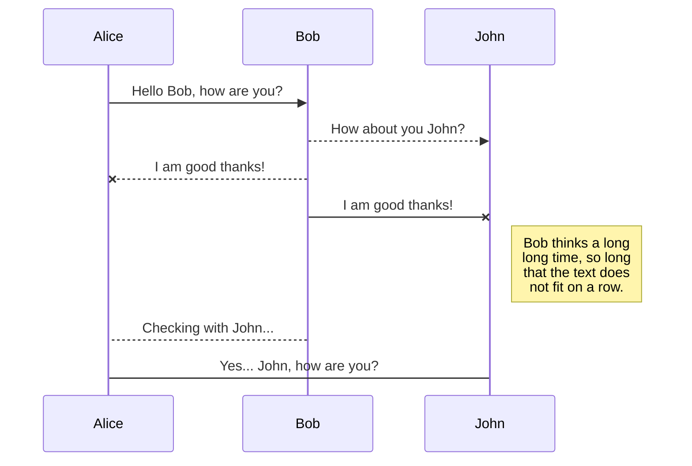
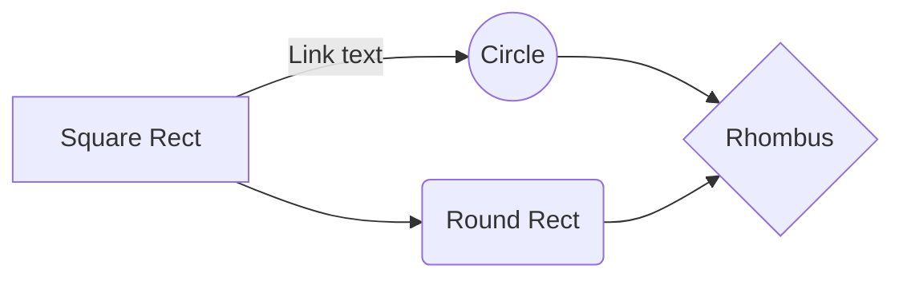
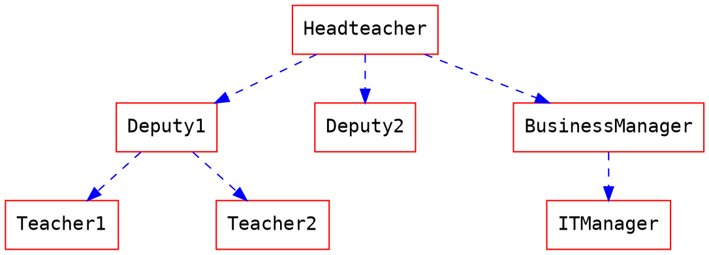
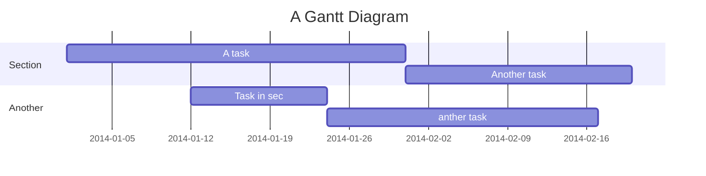

<style>


  /*--------------- view ---------------*/
  body[style],
  body[style*="background-color: white;"] {
    background-color: #444444 !important;
  }

  body {
    color: #abb2bf;
  }

}

  .ui-view-area,
  .markdown-body,
  .ui-content {
    background: #444444;
    color: #abb2bf;
  }
  


  h1,
  h2,
  h3,
  h4,
  h5,
  h6,
  p {
    color: #ddd;
  }

  hr  {
    border-color: #6d6d6d;
  }
  .part code{
    background-color: #999900;
  }

  /* form */
  .form-control {
    background: #333;
    color: #fff;

  }

  .form-control::placeholder,
  .form-control::-webkit-input-placeholder,
  .form-control:-moz-placeholder,
  .form-control::-moz-placeholder,
  .form-control:-ms-input-placeholder {
    color: #eee;
  }

  /*--------------- navbar ---------------*/
  .header,
  .navbar {
    background-color: #0e0e0e;
    border-color: #0e0e0e;
  }

  .navbar a {
    color: #eee !important;
  }

  .navbar .btn-group label {
    background-color: #0e0e0e;
    color: #eee;
    border-color: #555;
  }

  .navbar .btn-group label.btn-default:focus,
  .navbar .btn-group label.btn-default:hover {
    background-color: #2a2a2a;
    color: #eee;
    border-color: #555;
  }


  .navbar .btn-group label.active,
  .navbar .btn-group label.active:focus,
  .navbar .btn-group label.active:hover {
    background-color: #555;
    color: #eee;
    border-color: #555;
  }

  .navbar-default .btn-link:focus,
  .navbar-default .btn-link:hover {
    color: #eee;
  }

  .navbar-default .navbar-nav>.open>a,
  .navbar-default .navbar-nav>.open>a:focus,
  .navbar-default .navbar-nav>.open>a:hover {
    background-color: #555;
  }

  .dropdown-header {
    color: #aaa;
  }

  .dropdown-menu {
    background-color: #222;
    border: 1px solid #555;
    border-top: none;
  }

  .dropdown-menu>li>a {
    color: #eee;
  }

  .dropdown-menu>li>a:focus,
  .dropdown-menu>li>a:hover {
    background-color: #555555;
    color: #eee;
  }

  .dropdown-menu .divider {
    background-color: #555;
  }

  .header .open .dropdown-menu {
    background-color: #202020;
  }

  .navbar .announcement-popover {
    background: #4F4F4F;
  }

  .navbar .announcement-popover .announcement-popover-header {
    background: #2e2e2e;
    border-bottom: 1px solid #2e2e2e;
  }

  .navbar .announcement-popover .announcement-popover-body {
    background: #4F4F4F;
    color: #eee;
  }

  .navbar .announcement-popover .announcement-popover-footer {
    background: #4F4F4F;
  }

  .navbar .announcement-area .caption.inverse {
    color: #eee;
  }

  .label-warning {
    background-color: #ffc107;
    color: #212529;
  }

  /*--------------- history / recent ---------------*/
  .list.row-layout li .item {
    border-color: #696c7d;
  }

  .list.row-layout li:nth-last-of-type(1) .item {
    border-bottom: none;
  }

  .list li .item {
    background: #1c1c1c;
  }

  .list li:hover .item,
  .list li:focus .item {
    background: #404040;
  }

  .list li .item h4 {
    color: #fff;
  }

  .list li p {
    color: #ccc;
  }

  .list li p i {
    font-style: normal;
  }

  .list li .item .content .tags span {
    background: #555;
  }

  .list li .item.wide .content .title a,
  .list li .item.wide .content .title a:focus,
  .list li .item.wide .content .title a:hover {
    color: #ddd;
  }

  .ui-item {
    color: #fff;
    opacity: 0.7;
  }

  .ui-item:hover,
  .ui-item:focus {
    opacity: 1;
    color: #fff;
  }

  .list li .item.wide hr {
    border-color: #6d6d6d;
  }

  .overview-widget-group .btn,
  .multi-select-dropdown-menu .ui-dropdown-label,
  .multi-select-dropdown-menu .dropdown-options,
  .form-control {
    border-color: #6d6d6d;
  }

  .multi-select-dropdown-menu .dropdown-options .ui-option:hover {
    background-color: #4d4d4d;
    color: #eee;
  }

  #overview-control-form #overview-keyword-input-container .select2-container {
    background-color: #3e4045 !important;
  }

  #overview-control-form #overview-keyword-input-container .select2-container .select2-choices {
    background-color: #3e4045;
  }

  .search {
    background-color: #3e4045;
    color: #eee;
  }

  .btn.btn-gray {
    background: #1b1b1b;
  }

  .btn.btn-gray:hover {
    background: #4d4d4d;
    color: #eee;
  }

  .search::placeholder,
  .search::-webkit-input-placeholder,
  .search:-moz-placeholder,
  .search::-moz-placeholder,
  .search:-ms-input-placeholder {
    color: #eee;
  }

  .btn.btn-gray {
    border-color: #6d6d6d;
    background: #333;
    color: #eee;
  }

  .select2-default {
    color: #eee !important;
  }

  .select2-results .select2-highlighted {
    background: #4d4d4d;
    color: #eee;
  }

  .select2-container-multi .select2-choices {
    background: #3e4045;
  }

  .select2-container-multi .select2-choices .select2-search-choice {
    background: #131313;
    color: #eee;
    border-color: #555;
    box-shadow: none;
  }

  .btn-default,
  .btn-default:focus {
    color: #eee;
    background-color: #2e2e2e;
    border-color: #6a6a6a;
  }

  .btn-default.active.focus,
  .btn-default.active:focus,
  .btn-default.active:hover,
  .btn-default:active.focus,
  .btn-default:active:focus,
  .btn-default:active:hover,
  .open>.dropdown-toggle.btn-default.focus,
  .open>.dropdown-toggle.btn-default:focus,
  .open>.dropdown-toggle.btn-default:hover {
    background: #737373;
  }

  .btn-default:hover {
    color: #fff;
    background-color: #7d7d7d;
    border-color: #6a6a6a;
  }

  .overview-widget-group .btn.active {
    background-color: #6a6a6a;
    color: #eee;
  }

  .overview-widget-group .btn:hover {
    background-color: #7d7d7d;
    color: #eee;
    border-color: #636363;
  }

  .overview-widget-group .slider.round {
    border-color: #ccc;
  }

  .overview-widget-group .slider.round:before {
    border-color: #ccc;
  }

  .overview-widget-group input:checked+.slider {
    background-color: #ccc;
  }

  .ui-category-description-icon a {
    color: #eee;
  }

  .item .ui-history-pin.active {
    color: #f00;
  }

  .ui-history-close {
    color: #eee;
    opacity: 0.5;
  }

  .pagination>li>a,
  .pagination>li>span {
    color: #eee;
    background-color: #2e2e2e;
    border-color: #6a6a6a;
  }

  .pagination>li>a:hover {
    color: #fff;
    background-color: #7d7d7d;
    border-color: #6a6a6a;
  }

  .pagination>.disabled>a,
  .pagination>.disabled>a:focus,
  .pagination>.disabled>a:hover,
  .pagination>.disabled>span,
  .pagination>.disabled>span:focus,
  .pagination>.disabled>span:hover {
    color: #eee;
    background-color: #2e2e2e;
    border-color: #6a6a6a;
  }

  .pagination.dark>li>a,
  .pagination.dark>li>span {
    color: #aaa;
  }

  /*--------------- settings ---------------*/
  .section .form-horizontal .form-group .btn-default {
    font-size: 16px;
    border-color: #6d6d6d;
    background-color: #333;
    color: #FFF;
  }

  .section .form-horizontal .form-group .btn-default:hover,
  .section .form-horizontal .form-group .btn-default:focus {
    background-color: #737373;
    color: #FFF;
  }

  .section .form-horizontal .form-control:focus {
    border-color: #bbb;
  }

  /*--------------- share view ---------------*/
  #notificationLabel,
  .ui-infobar .btn.ui-edit {
    color: #eee;
    border-color: #6a6a6a;
  }

  .ui-infobar__user-info li {
    color: #bbb;
  }

  footer {
    background: #101010;
    color: #bbb;
    border-top: 1px solid #454545;
  }

  footer a {
    color: #bbb;
  }

  /*--------------- doc view ---------------*/
  .markdown-body h1,
  .markdown-body h2,
  .markdown-body h3,
  .markdown-body h4,
  .markdown-body h5,
  .markdown-body h6,
  .markdown-body hr,
  #doc>h1 {
    color: #ddd;
    border-color: #777 !important;
  }

  .h1 .small,
  .h1 small,
  .h2 .small,
  .h2 small,
  .h3 .small,
  .h3 small,
  .h4 .small,
  .h4 small,
  .h5 .small,
  .h5 small,
  .h6 .small,
  .h6 small,
  h1 .small,
  h1 small,
  h2 .small,
  h2 small,
  h3 .small,
  h3 small,
  h4 .small,
  h4 small,
  h5 .small,
  h5 small,
  h6 .small,
  h6 small {
    color: #ddd;
  }

  .markdown-body p {
    color: #ddd;
  }

  .markdown-body a {
    color: #7bf;
  }

  .markdown-body a code {
    color: #7bf !important;
  }

  .markdown-body ul li,
  .markdown-body ol li {
    color: #ddd;
  }

  .markdown-body blockquote {
    color: #ddd;
    border-left-color: #777;
    font-size: 16px;
  }

  <--.markdown-body code,
  code {
    color: #dfdfdf !important;
    background-color: #424a55;
  }-->

  .markdown-body pre {
    background-color: #1e1e1e;
    border: 1px solid #555 !important;
    color: #dfdfdf;
  }

  blockquote .small,
  blockquote footer,
  blockquote small {
    color: #bbb;
  }

  .mark,
  mark {
    background-color: rgba(255, 255, 0, 0.32) !important;
    color: #ddd;
    margin: .1em;
    padding: .1em .2em;
  }

  /* Todo list */
  .task-list-item-checkbox {
    margin: 0.18em 0 0.2em -1.3em !important;
  }

  .task-list-item input[type=checkbox] {
    -webkit-appearance: none;
    -moz-appearance: none;
    appearance: none;
    position: relative;
    top: -1px;
    margin: 0 1rem 0 0;
    cursor: pointer;
  }

  .task-list-item input[type=checkbox]::before {
    -webkit-transition: all 0.1s ease-in-out;
    -moz-transition: all 0.1s ease-in-out;
    transition: all 0.1s ease-in-out;
    content: "";
    position: absolute;
    left: 0;
    z-index: 1;
    width: 16px;
    height: 16px;
    border: 2px solid #F44336;
  }

  .task-list-item input[type=checkbox]:checked::before {
    -webkit-transform: rotate(-48deg);
    -moz-transform: rotate(-48deg);
    -ms-transform: rotate(-48deg);
    -o-transform: rotate(-48deg);
    transform: rotate(-48deg);
    height: 9px;
    border-color: #00E676;
    border-top-style: none;
    border-right-style: none;
  }

  .task-list-item input[type=checkbox]::after {
    content: "";
    position: absolute;
    top: -0.125rem;
    left: 0;
    width: 16px;
    height: 16px;
    background: #333;
    cursor: pointer;
  }

  /* table */
  .markdown-body table tr {
    background-color: #1e1e1e;
    border-top: none;
    border-bottom: 1px solid rgba(255, 255, 255, 0.3);
  }

  .markdown-body table tr:first-child {
    border-top: 1px solid rgba(255, 255, 255, 0.2);
  }

  .markdown-body table tr:nth-child(2n) {
    background-color: #333;
  }

  .markdown-body table tr th {
    color: #64B5F6;
  }

  .markdown-body table th,
  .markdown-body table td {
    border: none;
  }

  .markdown-body table tr th:first-child,
  .markdown-body table tr td:first-child {
    border-left: 1px solid rgba(255, 255, 255, 0.1);
  }

  .markdown-body table tr th:last-child,
  .markdown-body table tr td:last-child {
    border-right: 1px solid rgba(255, 255, 255, 0.1);
  }

  .markdown-body table tr td {
    color: #ddd;
  }


  .markdown-body pre.flow-chart,
  .markdown-body pre.sequence-diagram,
  .markdown-body pre.graphviz,
  .markdown-body pre.mermaid,
  .markdown-body pre.abc {
    background-color: #1e1e1e;
    color: #ddd;


  }
              .markdown-body pre.gri {
                stroke: lightgrey;
                opacity: 0.3;
                shape-rendering: crispEdges;
            }
            .markdown-body pre.grid path {
                stroke-width: 0;
            }
  


  /* alert */
  .alert h1,
  .alert h2,
  .alert h3,
  .alert h4,
  .alert h5,
  .alert h6,
  .alert p,
  .alert ul li,
  .alert ol li {
    color: #31708f;
  }

  .alert a {
    color: #002752;
    font-weight: 700;
  }

  .alert h1:first-child,
  .alert h2:first-child,
  .alert h3:first-child,
  .alert h4:first-child,
  .alert h5:first-child,
  .alert h6:first-child {
    margin-top: 0;
  }

  .markdown-body .alert>p {
    margin-top: 0px;
    margin-bottom: 10px;
  }

  .markdown-body .alert>ul,
  .markdown-body .alert>ol {
    margin-bottom: 16px;
  }

  .markdown-body .alert>*:last-child {
    margin-bottom: 0;
  }

  .alert-warning {
    background-color: #fff3cd;
    border-color: #ffeeba;
  }

  /* scroll bar */
  .ui-edit-area .ui-resizable-handle.ui-resizable-e {
    background-color: #303030;
    border: 1px solid #303030;
    box-shadow: none;
  }

  /* info bar */
  .ui-infobar {
    color: #999;
  }

  /* permission */
  .permission-popover-btn-group .btn.focus,
  .permission-popover-btn-group .btn:active,
  .permission-popover-btn-group .btn:focus,
  .permission-popover-btn-group .btn.active {
    background-color: #6a6a6a !important;
    color: #eee !important;
    border-color: #555 !important;
  }

  .permission-popover-btn-group .btn:hover,
  .permission-popover-btn-group .btn.active:hover {
    background-color: #7d7d7d !important;
    color: #eee !important;
    border-color: #636363 !important;
  }

  .ui-delete-note a:hover,
  .ui-delete-note a:focus,
  .ui-delete-note a:active {
    background-color: #dc3545 !important;
  }

  .ui-invitee-invite {
    border-color: #6a6a6a !important;
  }

  .ui-invitee-invite:hover,
  .ui-invitee-invite:focus {
    background-color: #737373;
    color: #eee !important;
  }

  .ui-invitee.ui-invitee-list .ui-invitee-remove,
  .ui-invitee.ui-invitee-list .ui-invitee-remove:hover,
  .ui-invitee.ui-invitee-list .ui-invitee-remove:focus,
  .ui-invitee.ui-invitee-list .ui-invitee-remove:active {
    background-color: #dc3545;
    border: 1px solid #dc3545;
  }

  .select2-container {
    background: #202020;
  }

  .select2-container-multi .select2-choices .select2-search-field input {
    color: #eee;
  }

  .select2-container-multi .select2-choices .select2-search-field input.select2-active {
    color: #000;
  }

  .select2-drop {
    background: #202020;
    color: #eee;
  }

  .select2-results .select2-no-results,
  .select2-results .select2-searching,
  .select2-results .select2-ajax-error,
  .select2-results .select2-selection-limit {
    background: #202020;
  }

  /* table of contents block*/
  .ui-toc-dropdown {
    width: 42vw;
    max-height: 90vh;
    overflow: auto;
    text-align: inherit;
  }

  /* table of contents text*/
  .ui-toc-dropdown .nav>li>a {
    font-size: 14px;
    font-weight: bold;
    color: #ddd;
  }

  /* table of contents text: active*/
  .ui-toc-dropdown .nav>.active:focus>a,
  .ui-toc-dropdown .nav>.active:hover>a,
  .ui-toc-dropdown .nav>.active>a {
    color: #7bf;
    border-left-color: #7bf;
  }

  /* table of contents text: focus, hover*/
  .ui-toc-dropdown .nav>li>a:focus,
  .ui-toc-dropdown .nav>li>a:hover {
    color: #7bf;
    border-left-color: #7bf;
  }

  /* drop down floating table of contents */
  .ui-toc-dropdown.dropdown-menu {
    background: #333;
  }

  .toc-menu a {
    color: #ddd;
  }

  .toc-menu a:focus,
  .toc-menu a:hover {
    color: #7bf;
  }


  /*--------------- editor ---------------*/
  .cm-m-markdown {
    color: #ddd;
  }

  .cm-s-one-dark .cm-header,
  .cm-m-xml.cm-attribute {
    color: #ffa653;
  }

  .cm-s-one-dark .cm-string,
  .cm-s-one-dark .cm-variable-2 {
    color: #7bf;
  }

  .cm-m-markdown.cm-variable-3 {
    color: #ff7e7e;
  }

  .cm-s-one-dark .cm-link {
    color: #b0ee83;
  }

  .cm-s-one-dark .CodeMirror-linenumber {
    color: #666;
  }

  .cm-strong {
    color: #f4511e;
  }

  .cm-s-one-dark .cm-comment {
    color: #a9a9a9;
  }

  .cm-matchhighlight {
    color: #ffea00;
  }

  .cm-positive {
    color: #11bf64;
  }

  .cm-negative {
    color: #ff3e3e;
  }

  .dropdown-menu.CodeMirror-other-cursor {
    border: 2px solid #4d4d4d;
    background-color: #202020;
  }

  .dropdown-menu.CodeMirror-other-cursor li a {
    color: #ececec;
  }

  /*--------------- book mode ---------------*/
  .topbar {
    background: #1e1e1e;
  }

  .btn.focus,
  .btn:focus,
  .btn:hover {
    color: #aaa;
  }

  .summary {
    background: #1e1e1e;
  }

  .summary,
  .toolbar {
    background: #1e1e1e !important;
    border-color: #4d4d4d !important;
  }

  .toolbar i {
    color: #fff;
  }

  .summary h1,
  .summary h2,
  .summary h3 .summary hr {
    color: #ddd;
    border-color: #777 !important;
  }

  .summary .nav>li>a {
    color: #7bf;
  }

  .summary .nav-pills>li.active>a,
  .summary .nav-pills>li.active>a:focus,
  .summary .nav-pills>li.active>a:hover {
    color: #ff9100;
  }

  .ui-summary-search {
    font-size: 16px;
    border: 1px solid #6D6D6D;
    background-color: #333;
    color: #FFF;
  }

  .summary h1,
  .summary h2,
  .summary h3,
  .summary h4,
  .summary h5,
  .summary h6 {
    border-color: #454545;
  }

  /* fix body background color to dark */
  div[class$=container-mask] {
    background: #1e1e1e;
    z-index: 1;
    display: block;
  }

  /* notification */
  .dropdown.ui-notification .ui-notification-label,
  .dropdown.ui-invitee .ui-invitee-label {
    color: #eee;
    border-color: #6a6a6a;
  }

  .ui-notification .dropdown-menu {
    border-top: 1px solid #555;
  }

  /*--------------- help ---------------*/
  .modal-header {
    background-color: #2a2a2a;
  }

  .panel-default {
    border-color: #6d6d6d;
  }

  .panel-default>.panel-heading {
    background-color: #2a2a2a;
    color: #eee;
    border-color: #6d6d6d;
  }

  .panel-body {
    background: #2e2e2e;
  }

  .panel-body a {
    color: #7bf;
  }

  .table>tbody>tr>td,
  .table>tbody>tr>th,
  .table>tfoot>tr>td,
  .table>tfoot>tr>th,
  .table>thead>tr>td,
  .table>thead>tr>th {
    border-color: #6d6d6d;
  }

  /*--------------- comment ---------------*/
  .ui-comment-container .ui-comment-header {
    background-color: #2a2a2a;
    color: #eee;
    border-color: #6d6d6d;
  }

  .ui-comment-container {
    background-color: #2e2e2e;
    border-color: #6d6d6d;
  }

  .ui-comment-container .ui-comments-container .ui-comment .comment-author {
    color: #eee;
  }

  .ui-comment-container .ui-comments-container .ui-comment .timestamp {
    color: #aaa;
  }

  .ui-comment-container .ui-comments-container .ui-comment .comment-content {
    color: #eee;
  }

  .ui-comment-container .ui-comments-container .ui-comment .comment-menu {
    color: #eee;
  }

  .ui-comment-container .ui-comments-container .ui-comment .comment-menu .comment-dropdown-menu {
    background: #222;
    color: #eee;
    border-color: #555;
  }

  .ui-comment-container .ui-comments-container .ui-comment .comment-menu .comment-dropdown-menu>div:hover {
    background-color: #555555;
    color: #eee;
  }

  .ui-comment-container .ui-comments-container .ui-comment .comment-menu:hover,
  .ui-comment-container .ui-comments-container .ui-comment .comment-menu:active,
  .ui-comment-container .ui-comments-container .ui-comment .comment-menu.active {
    background-color: #737373;
    color: #eee;
  }

  .ui-comment-container .ui-comment-input-container {
    background-color: #3c3c3c;
  }

  .ui-comment-container textarea {
    background-color: #3e4045;
    color: #eee;
    border: 1px solid #6d6d6d;
  }

  .ui-comment-container textarea::placeholder,
  .ui-comment-container textarea::-webkit-input-placeholder,
  .ui-comment-container textarea:-moz-placeholder,
  .ui-comment-container textarea::-moz-placeholder,
  .ui-comment-container textarea:-ms-input-placeholder {
    color: #eee;
  }

  @keyframes highlight {
    0% {
      background-color: #3c3c3c;
    }

    30% {
      background-color: #3c3c3c;
    }

    100% {
      background-color: transparent;
    }
  }

  /*--------------- template ---------------*/
  .template-content .modal-header {
    background: #2a2a2a;
  }

  .template-content .close {
    color: #fff;
  }

  .template-content .modal-title {
    color: #eee;
  }

  .template-content .ui-templates-container {
    border-color: #6d6d6d;
  }

  .ui-templates-container .ui-create-template-btn {
    background: #446fab;
    color: #fff;
  }

  .ui-template-list-filter .ui-template-list-filter-label,
  .ui-template-list-filter .ui-template-list-filter-label:hover {
    color: #eee;
  }

  .ui-template-list .list-group-item.active {
    background: #4d4d4d;
  }

  .ui-template-list .list-group-item.active:focus {
    background: #4d4d4d !important;
  }

  .list-group-item.active,
  .list-group-item.active:focus,
  .list-group-item.active:hover {
    color: #eee;
  }

  .ui-template-list .list-group-item .list-group-item-heading {
    color: #eee;
  }

  .ui-template-list .list-group-item.active .list-group-item-heading {
    color: #eee;
  }

  .ui-template-list .list-group-item:hover {
    background: #4d4d4d !important;
  }

  .ui-template-item-menu {
    color: #eee !important;
  }

  .ui-template-list .list-group-item {
    color: #fff;
  }

  .ui-template-list .list-group-item .dropdown-container.open {
    background-color: #2a2a2a;
  }

  .ui-template-list .list-group-item .dropdown-container:hover {
    background-color: #2a2a2a !important;
  }

  .template-menu .more-template {
    border-color: #6d6d6d;
  }

  .template-menu .more-template:hover {
    color: #eee;
    border-color: #6d6d6d;
  }

  /*--------------- code mirror ---------------*/
  .modal-content {
    background: #1f2226;
  }

  .modal-header {
    border-bottom: 1px solid #46484f;
  }

  .modal-footer {
    border-top: 1px solid #46484f;
  }

  a.list-group-item {
    background: #1f2226;
    color: #ddd;
    border: 1px solid #46484f;
  }

  a.list-group-item .list-group-item-heading {
    color: #ddd;
  }

  a.list-group-item:focus,
  a.list-group-item:hover {
    background: #434651;
    color: #ddd;
  }

  button.close {
    color: #ddd;
    opacity: .5;
  }

  .close:focus, .close:hover {
    color: #fff;
    opacity: .8;
  }

  .CodeMirror {
    background: #1f2226;
  }

  .CodeMirror-gutters {
    background: #1f2226;
    border-right: 1px solid rgba(204, 217, 255, 0.1);
  }

  .cm-s-default .cm-comment {
    color: #888;
  }

  .cm-s-default .cm-quote {
    color: #ddd;
  }

  .cm-s-default .cm-header {
    color: #ffa653;
  }

  .cm-s-default .cm-link {
    color: #b0ee83;
  }

  .cm-s-default .cm-string,
  .cm-s-default .cm-variable-2 {
    color: #7bf;
  }

  .cm-s-default .cm-def {
    color: #c678dd;
  }

  .cm-s-default .cm-number,
  .cm-s-default .cm-attribute,
  .cm-s-default .cm-qualifier,
  .cm-s-default .cm-plus,
  .cm-s-default .cm-atom {
    color: #eda35e;
  }

  .cm-s-default .cm-property,
  .cm-s-default .cm-variable,
  .cm-s-default .cm-variable-3,
  .cm-s-default .cm-operator,
  .cm-s-default .cm-bracket {
    color: #f76e79;
  }

  .cm-s-default .cm-keyword,
  .cm-s-default .cm-builtin,
  .cm-s-default .cm-tag {
    color: #98c379;
  }

  .modal-title {
    color: #ccc;
  }

  .modal-body {
    color: #ccc !important;
  }

  div[contenteditable]:empty:not(:focus):before {
    color: #aaa;
  }

  .CodeMirror pre {
    color: #ddd;
  }

  .CodeMirror pre span[style^="background-color: rgb(221, 251, 230)"] {
    background-color: #288c27 !important;
  }

  .CodeMirror pre span[style^="background-color: rgb(249, 215, 220)"] {
    background-color: #a52721 !important;
  }

  /*------- code highlight: Visual Stutdio Code theme for highlight.js -------*/
  .hljs {
    background: #1E1E1E;
    color: #DCDCDC;
  }

  .hljs-keyword,
  .hljs-literal,
  .hljs-symbol,
  .hljs-name {
    color: #569CD6;
  }

  .hljs-link {
    color: #569CD6;
    text-decoration: underline;
  }

  .hljs-built_in,
  .hljs-type {
    color: #4EC9B0;
  }

  .hljs-number,
  .hljs-class {
    color: #B8D7A3;
  }

  .hljs-string,
  .hljs-meta-string {
    color: #D69D85;
  }

  .hljs-regexp,
  .hljs-template-tag {
    color: #d16969;
  }

  .hljs-title {
    color: #dcdcaa;
  }

  .hljs-subst,
  .hljs-function,
  .hljs-formula {
    color: #DCDCDC;
  }

  .hljs-comment,
  .hljs-quote {
    color: #57A64A;
  }

  .hljs-doctag {
    color: #608B4E;
  }

  .hljs-meta,
  .hljs-meta-keyword,
  .hljs-tag {
    color: #9B9B9B;
  }

  .hljs-variable,
  .hljs-template-variable {
    color: #BD63C5;
  }

  .hljs-params,
  .hljs-attr,
  .hljs-attribute,
  .hljs-builtin-name {
    color: #9CDCFE;
  }

  .hljs-section {
    color: gold;
  }

  .hljs-emphasis {
    font-style: italic;
  }

  .hljs-strong {
    font-weight: bold;
  }

  /*
  .hljs-code {
    font-family:'Monospace';
  }
  */

  .hljs-bullet,
  .hljs-selector-tag,
  .hljs-selector-id,
  .hljs-selector-class,
  .hljs-selector-attr,
  .hljs-selector-pseudo {
    color: #D7BA7D;
  }

  .hljs-addition {
    background-color: #155a36;
    color: #dfdfdf;
    display: inline-block;
    width: 100%;
  }

  .hljs-deletion {
    background-color: #872e2e;
    color: #dfdfdf;
    display: inline-block;
    width: 100%;
  }

  /*---------- code highlight: Visual Stutdio Code theme for Prism.js ----------*/
  code[class*="language-"],
  pre[class*="language-"] {
    color: #DCDCDC;
  }

  :not(pre)>code[class*="language-"],
  pre[class*="language-"] {
    background: #1E1E1E;
  }

  .token.comment,
  .token.block-comment,
  .token.prolog,
  .token.cdata {
    color: #57A64A;
  }

  .token.doctype,
  .token.punctuation {
    color: #9B9B9B;
  }

  .token.tag,
  .token.entity {
    color: #569CD6;
  }

  .token.attr-name,
  .token.namespace,
  .token.deleted,
  .token.property,
  .token.builtin {
    color: #9CDCFE;
  }

  .token.function,
  .token.function-name {
    color: #dcdcaa;
  }

  .token.boolean,
  .token.keyword,
  .token.important {
    color: #569CD6;
  }

  .token.number {
    color: #B8D7A3;
  }

  .token.class-name,
  .token.constant {
    color: #4EC9B0;
  }

  .token.symbol {
    color: #f8c555;
  }

  .token.rule {
    color: #c586c0;
  }

  .token.selector {
    color: #D7BA7D;
  }

  .token.atrule {
    color: #cc99cd;
  }

  .token.string,
  .token.attr-value {
    color: #D69D85;
  }

  .token.char {
    color: #7ec699;
  }

  .token.variable {
    color: #BD63C5;
  }

  .token.regex {
    color: #d16969;
  }

  .token.operator {
    color: #DCDCDC;
    background: transparent;
  }

  .token.url {
    color: #67cdcc;
  }

  .token.important,
  .token.bold {
    font-weight: bold;
  }

  .token.italic {
    font-style: italic;
  }

  .token.entity {
    cursor: help;
  }

  .token.inserted {
    color: green;
  }

  /*---------- code highlight: dark theme for Gist ----------*/
  .gist .gist-file {
    border: 1px solid #555;
  }

  .gist .gist-data {
    background-color: #1e1e1e;
    border-bottom: 1px solid #555;
  }

  .gist .gist-meta {
    background-color: #424a55;
    color: #eee;
  }

  .gist .gist-meta a {
    color: #eee;
  }

  .gist .highlight {
    color: #eee;
    background-color: #1e1e1e;
  }

  .gist .blob-num {
    color: #afafaf;
  }

  .gist .blob-code-inner {
    color: #dfdfdf;
  }

  .pl-mb {
    color: #fff !important;
  }

  .pl-c {
    color: #57A64A !important;
  }

  /* comment */
  .pl-ent {
    color: #569CD6 !important;
  }

  /* entity */
  .pl-e {
    color: #9CDCFE !important;
  }

  .pl-en {
    color: #4EC9B0 !important;
  }

  /* entity attribute */
  .pl-smi {
    color: #9CDCFE !important;
  }

  .pl-k {
    color: #569cd6 !important;
  }

  .pl-c1,
  .pl-s .pl-v {
    color: #4EC9B0 !important;
  }

  .pl-pds,
  .pl-s,
  .pl-s .pl-pse .pl-s1,
  .pl-sr,
  .pl-sr .pl-cce,
  .pl-sr .pl-sra,
  .pl-sr .pl-sre,
  .pl-s .pl-s1 {
    color: #D69D85 !important;
  }

  .pl-s .pl-s1 .pl-pse {
    color: #c5dbff !important;
  }

  /* strings */
  .diff-table .pl-c,
  .diff-table .pl-ent,
  .diff-table .pl-e,
  .diff-table .pl-en,
  .diff-table .pl-pds,
  .diff-table .pl-s,
  .diff-table .pl-s .pl-s1,
  .diff-table .pl-s .pl-pse .pl-s1,
  .diff-table .pl-sr,
  .diff-table .pl-sr .pl-cce,
  .diff-table .pl-sr .pl-sra,
  .diff-table .pl-sr .pl-sre,
  .diff-table .pl-k,
  .diff-table .pl-smi,
  .diff-table .pl-c1,
  .diff-table .pl-v {
    color: #eee !important;
  }

 </style>

`123`
:::warning
> 一維陣列的宣告方式如下: 
> >  **<span style="color: DeepSkyBlue">var </span><span style="color: DodgerBlue">陣列名稱</span> = [<span style="color: lightgreen">陣列長度</span>]<span style="color: lightgreen">元素型別</span>{<span style="color: yellow">元素初始值1</span>,<span style="color: yellow">元素初始值2</span>}** 
> > *陣列長度可以使用 ==``[...]``== 讓編譯器自動計算長度
> > *元素型別可為資料型別的 ==``邏輯值、數值、字串``==???引用類型?
> > *元素初始值若不賦予則為元素型別的預設值
> > *元素初始值可以依序使用 ==``,``== 分隔並可以向右增加元素，或是直接指定元素位置賦值 
> >　例如 : **<span style="color: LemonChiffon">ar := [...]int{</span><span style="color: Orange">0</span><span style="color: LemonChiffon">:99}</span>** 其中<span style="color: Orange">0</span>表示為第一個元素
>
:::


<div class="panel-body">

>
> >  **<span style="color: DeepSkyBlue">var </span><span style="color: DodgerBlue">陣列名稱</span> = [<span style="color: lightgreen">陣列長度</span>]<span style="color: lightgreen">元素型別</span>{<span style="color: yellow">元素初始值1</span>,<span style="color: yellow">元素初始值2</span>}** 
> > *陣列長度可以使用 ==``[...]``== 讓編譯器自動計算長度
> > *元素型別可為資料型別的 ==``邏輯值、數值、字串``==???引用類型?
> > *元素初始值若不賦予則為元素型別的預設值
> > *元素初始值可以依序使用 ==``,``== 分隔並可以向右增加元素，或是直接指定元素位置賦值 
> >　例如 : **<span style="color: LemonChiffon">ar := [...]int{</span><span style="color: Orange">0</span><span style="color: LemonChiffon">:99}</span>** 其中<span style="color: Orange">0</span>表示為第一個元素
>
</div>


# #HackerMD_DarkMode

Hi! I'm your first Markdown file in **StackEdit**. If you want to learn about StackEdit, you can read me. If you want to play with Markdown, you can edit me. Once you have finished with me, you can create new files by opening the **file explorer** on the left corner of the navigation bar.

## 標籤
如同以下方式來使用標籤，它們會顯示在您的 **歷史紀錄**
###### tags: `Markdown Demo` `範例`

# Files

StackEdit stores your files in your browser, which means all your files are automatically saved locally and are accessible **offline!**

## Create files and folders

The file explorer is accessible using the button in left corner of the navigation bar. You can create a new file by clicking the **New file** button in the file explorer. You can also create folders by clicking the **New folder** button.

## Switch to another file

All your files are listed in the file explorer. You can switch from one to another by clicking a file in the list.

## Rename a file

You can rename the current file by clicking the file name in the navigation bar or by clicking the **Rename** button in the file explorer.

## Delete a file

You can delete the current file by clicking the **Remove** button in the file explorer. The file will be moved into the **Trash** folder and automatically deleted after 7 days of inactivity.

## Export a file

You can export the current file by clicking **Export to disk** in the menu. You can choose to export the file as plain Markdown, as HTML using a Handlebars template or as a PDF.


# Synchronization

Synchronization is one of the biggest features of StackEdit. It enables you to synchronize any file in your workspace with other files stored in your **Google Drive**, your **Dropbox** and your **GitHub** accounts. This allows you to keep writing on other devices, collaborate with people you share the file with, integrate easily into your workflow... The synchronization mechanism takes place every minute in the background, downloading, merging, and uploading file modifications.

There are two types of synchronization and they can complement each other:

- The workspace synchronization will sync all your files, folders and settings automatically. This will allow you to fetch your workspace on any other device.
	> To start syncing your workspace, just sign in with Google in the menu.

- The file synchronization will keep one file of the workspace synced with one or multiple files in **Google Drive**, **Dropbox** or **GitHub**.
	> Before starting to sync files, you must link an account in the **Synchronize** sub-menu.

## Open a file

You can open a file from **Google Drive**, **Dropbox** or **GitHub** by opening the **Synchronize** sub-menu and clicking **Open from**. Once opened in the workspace, any modification in the file will be automatically synced.

## Save a file

You can save any file of the workspace to **Google Drive**, **Dropbox** or **GitHub** by opening the **Synchronize** sub-menu and clicking **Save on**. Even if a file in the workspace is already synced, you can save it to another location. StackEdit can sync one file with multiple locations and accounts.

## Synchronize a file

Once your file is linked to a synchronized location, StackEdit will periodically synchronize it by downloading/uploading any modification. A merge will be performed if necessary and conflicts will be resolved.

If you just have modified your file and you want to force syncing, click the **Synchronize now** button in the navigation bar.

> **Note:** The **Synchronize now** button is disabled if you have no file to synchronize.

## Manage file synchronization

Since one file can be synced with multiple locations, you can list and manage synchronized locations by clicking **File synchronization** in the **Synchronize** sub-menu. This allows you to list and remove synchronized locations that are linked to your file.


# Publication

Publishing in StackEdit makes it simple for you to publish online your files. Once you're happy with a file, you can publish it to different hosting platforms like **Blogger**, **Dropbox**, **Gist**, **GitHub**, **Google Drive**, **WordPress** and **Zendesk**. With [Handlebars templates](http://handlebarsjs.com/), you have full control over what you export.

> Before starting to publish, you must link an account in the **Publish** sub-menu.

## Publish a File

You can publish your file by opening the **Publish** sub-menu and by clicking **Publish to**. For some locations, you can choose between the following formats:

- Markdown: publish the Markdown text on a website that can interpret it (**GitHub** for instance),
- HTML: publish the file converted to HTML via a Handlebars template (on a blog for example).

## Update a publication

After publishing, StackEdit keeps your file linked to that publication which makes it easy for you to re-publish it. Once you have modified your file and you want to update your publication, click on the **Publish now** button in the navigation bar.

> **Note:** The **Publish now** button is disabled if your file has not been published yet.

## Manage file publication

Since one file can be published to multiple locations, you can list and manage publish locations by clicking **File publication** in the **Publish** sub-menu. This allows you to list and remove publication locations that are linked to your file.


# Markdown extensions

StackEdit extends the standard Markdown syntax by adding extra **Markdown extensions**, providing you with some nice features.

> **ProTip:** You can disable any **Markdown extension** in the **File properties** dialog.


## SmartyPants

SmartyPants converts ASCII punctuation characters into "smart" typographic punctuation HTML entities. For example:

|                |ASCII                          |HTML                         |
|----------------|-------------------------------|-----------------------------|
|Single backticks|`'Isn't this fun?'`            |'Isn't this fun?'            |
|Quotes          |`"Isn't this fun?"`            |"Isn't this fun?"            |
|Dashes          |`-- is en-dash, --- is em-dash`|-- is en-dash, --- is em-dash|

ｓ----
## KaTeX

You can render LaTeX mathematical expressions using [KaTeX](https://khan.github.io/KaTeX/):

The *Gamma function* satisfying $\Gamma(n) = (n-1)!\quad\forall n\in\mathbb N$ is via the Euler integral

$$
\Gamma(z) = \int_0^\infty t^{z-1}e^{-t}dt\,.
$$

> You can find more information about **LaTeX** mathematical expressions [here](http://meta.math.stackexchange.com/questions/5020/mathjax-basic-tutorial-and-quick-reference).


## UML diagrams

You can render UML diagrams using [Mermaid](https://mermaidjs.github.io/). For example, this will produce a sequence diagram:



And this will produce a flow chart:


<!--stackedit_data:
eyJoaXN0b3J5IjpbNzg3MTkzOTJdfQ==
-->


簡介
===
<i class="fa fa-file-text"></i> **HackMD** 是個跨平台的 Markdown 即時協作筆記
所以您可以在**電腦、平板甚至是手機**與其他人做筆記！
同時也可以在 **[首頁](/)** 透過 **Facebook、Twitter、GitHub、Dropbox** 登入

如有任何問題或是狀況，請至 [GitHub](https://github.com/hackmdio/hackmd-io-issues/issues/new) 回報問題
如果需要即時支援，請使用 [Facebook message](https://www.messenger.com/t/hackmdio)
**謝謝您！**

工作區
===
## 模式
**電腦 & 平板**

<i class="fa fa-edit fa-fw"></i> 編輯：只看到編輯器
<i class="fa fa-eye fa-fw"></i> 檢視：只看到結果
<i class="fa fa-columns fa-fw"></i> 同時：同時看到兩邊

**手機**

<i class="fa fa-toggle-on fa-fw"></i> 檢視：只看到結果
<i class="fa fa-toggle-off fa-fw"></i> 編輯：只看到編輯器

## 上傳圖片
只要按下這個按鈕 <i class="fa fa-camera"></i>
或是 **拖放** 圖片到編輯器，甚至 **貼上** 圖片也可以喔！
這會自動上傳圖片至 **[imgur](http://imgur.com)**，啥都不必煩惱了 :tada:


## 分享筆記
如果您想分享 **可編輯的** 筆記，複製這份文件的網址就好
如果您想分享 **只可讀的** 筆記，按下這個按鈕 <i class="fa fa-share-alt"></i> 然後複製網址

## 儲存
目前可以儲存至 **Dropbox** <i class="fa fa-dropbox"></i> 或是存放 **.md** <i class="fa fa-file-text"></i> 到您的本機

## 匯入
就像上面的儲存功能，您可以從 **Dropbox** <i class="fa fa-dropbox"></i> 匯入 **.md** <i class="fa fa-file-text"></i>
或是從 **剪貼簿** <i class="fa fa-clipboard"></i> 匯入，而且這可以轉換 **html** 喔 :smiley:

## 權限
檢視右上方有個小按鈕可以修改筆記權限，目前有六種選項：

|                              |擁有者 可讀/寫|已登入者 可讀|已登入者 可寫|訪客 可讀|訪客 可寫|
|:-----------------------------|:--------------:|:------------:|:-------------:|:--------:|:---------:|
|<span class="text-nowrap"><i class="fa fa-leaf fa-fw"></i> **Freely**</span>               |✔|✔|✔|✔|✔|
|<span class="text-nowrap"><i class="fa fa-pencil fa-fw"></i> **Editable**</span>           |✔|✔|✔|✔|✖|
|<span class="text-nowrap"><i class="fa fa-id-card fa-fw"></i> **Limited**</span>           |✔|✔|✔|✖|✖|
|<span class="text-nowrap"><i class="fa fa-lock fa-fw"></i> **Locked**</span>               |✔|✔|✖|✔|✖|
|<span class="text-nowrap"><i class="fa fa-umbrella fa-fw"></i> **Protected**</span>        |✔|✔|✖|✖|✖|
|<span class="text-nowrap"><i class="fa fa-hand-stop-o fa-fw"></i> **Private**</span>       |✔|✖|✖|✖|✖|

**只有筆記的擁有者可以更改權限**

## 嵌入
```xml
<iframe width="100%" height="500" src="https://hackmd.io/features" frameborder="0"></iframe>
```

## [簡報模式](/slide-example)
您可以使用一些語法將您的筆記分成投影片
然後用 **簡報模式** <i class="fa fa-tv"></i> 來展示，詳細請至上連結

## [書籍模式](/book-example)
您可以將您的筆記彙整成一本書
請將您的筆記連結列成清單
然後用 **書籍模式** <i class="fa fa-book"></i> 來展示，詳細請至上連結

檢視
===
## 目錄
在右下角有個目錄的小按鈕 <i class="fa fa-bars"></i>
按下它會顯示目前的目錄，而且會標明你所在的區塊
支援到**第三階段的標頭**

## 永久連結
每個標頭都會在右側自動加上永久連結
您可以在滑到上面並且按 <i class="fa fa-chain"></i> 去移到那個錨點

編輯
===
## 快速鍵
跟又快又方便的Sublime text很像
> 更多訊息請至 [這裡](https://codemirror.net/demo/sublime.html)

## 自動完成
提供完整的 Markdown 自動完成與提示
- 表情符號：輸入 `:` 顯示提示
- 程式碼區塊：輸入 ` ``` ` 加上一個字元 顯示提示 <i hidden>```</i>
- 標頭：輸入 `#` 顯示提示
- 參考：輸入 `[]` 顯示提示
- 外部：輸入 `{}` 顯示提示
- 圖片：輸入 `!` 顯示提示

## 標題
會使用 **第一個第一級標頭** 作為筆記標題


## [YAML metadata](/yaml-metadata)
提供描述筆記的資訊，以進階設定瀏覽行為，詳細請至上連結
- robots: 設定網路機器人 meta
- lang: 設定瀏覽器顯示語言
- dir: 設定文字方向
- breaks: 設定是否使用分行
- GA: 設定 Google Analytics
- disqus: 設定 Disqus
- slideOptions: 設定簡報模式的選項

## ToC:
請使用此語法 `[TOC]` 將目錄嵌入到您的筆記之中

[TOC]

## 表情符號
您可以像是這樣使用表情符號 :smile: :smiley: :cry: :wink:
> 完整的表情符號列表 [在這裡](http://www.emoji-cheat-sheet.com/)

## 待辦清單
- [ ] 待辦
	- [x] 買些沙拉
    - [x] 刷牙
	- [x] 喝水

## 程式碼區塊
我們支援非常多程式語言，使用自動完成來看看有些什麼
```javascript
var s = "JavaScript syntax highlighting";
alert(s);
function $initHighlight(block, cls) {
  try {
    if (cls.search(/\bno\-highlight\b/) != -1)
      return process(block, true, 0x0F) + 
             ' class=""';
  } catch (e) {
    /* handle exception */
  }
  for (var i = 0 / 2; i < classes.length; i++) {
    if (checkCondition(classes[i]) === undefined)
      return /\d+[\s/]/g;
  }
}
```
> 如果想要 **行號**，在表明程式語言之後輸入 `=`
> 您也可以指定開始行號，如下所示，行號從101開始

```javascript=101
var s = "JavaScript syntax highlighting";
alert(s);
function $initHighlight(block, cls) {
  try {
    if (cls.search(/\bno\-highlight\b/) != -1)
      return process(block, true, 0x0F) + 
             ' class=""';
  } catch (e) {
    /* handle exception */
  }
  for (var i = 0 / 2; i < classes.length; i++) {
    if (checkCondition(classes[i]) === undefined)
      return /\d+[\s/]/g;
  }
}
```

> 或是可以接續上一個程式碼區塊的行號，使用 `=+`

```javascript=+
var s = "JavaScript syntax highlighting";
alert(s);
```

## 引用區塊標籤
> 您可以使用以下語法，表明自己的 **姓名、時間與顏色** 並與其他的引用區塊做區別
> [name=ChengHan Wu] [time=Sun, Jun 28, 2015 9:59 PM] [color=#907bf7]
> > 也支援巢狀引用區塊喔！
> > [name=ChengHan Wu] [time=Sun, Jun 28, 2015 10:00 PM] [color=red]

## 外部

### Youtube


### Vimeo


### Gist


### SlideShare


### Speakerdeck


### PDF
**注意：請使用 https 的網址，否則可能會被您的瀏覽器阻擋載入**


## MathJax

您可以使用 **MathJax** 語法 來產生 *LaTeX* 數學表達式，如同 [math.stackexchange.com](http://math.stackexchange.com/)，但是開始的 `$` 後面以及結尾的 `$` 前面不能有空白：

The *Gamma function* satisfying $\Gamma(n) = (n-1)!\quad\forall n\in\mathbb N$ is via the Euler integral

$$
x = {-b \pm \sqrt{b^2-4ac} \over 2a}.
$$

$$
\Gamma(z) = \int_0^\infty t^{z-1}e^{-t}dt\,.
$$

> 更多關於 **LaTeX** 數學表達式 [請至這裡](http://meta.math.stackexchange.com/questions/5020/mathjax-basic-tutorial-and-quick-reference)

## UML 圖表

### 循序圖

您可以像是以下使用循序圖：

```sequence
艾莉絲->包柏: 哈摟，你好嗎？
Note right of 包柏: 包柏思考中
包柏-->艾莉絲: 我很好，謝謝！
Note left of 艾莉絲: 艾莉絲回應
艾莉絲->包柏: 最近過得怎樣？
```

### 流程圖

您可以像是以下使用流程圖：
```flow
st=>start: 開始
e=>end: 結束
op=>operation: 我的操作
op2=>operation: 啦啦啦
cond=>condition: 是或否？

st->op->op2->cond
cond(yes)->e
cond(no)->op2
```

### Graphviz


### Mermaid


### Abc
```abc
X:1
T:Speed the Plough
M:4/4
C:Trad.
K:G
|:GABc dedB|dedB dedB|c2ec B2dB|c2A2 A2BA|
GABc dedB|dedB dedB|c2ec B2dB|A2F2 G4:|
|:g2gf gdBd|g2f2 e2d2|c2ec B2dB|c2A2 A2df|
g2gf g2Bd|g2f2 e2d2|c2ec B2dB|A2F2 G4:|
```

> 更多關於 **循序圖** 語法 [在這裡](http://bramp.github.io/js-sequence-diagrams/).
> 更多關於 **流程圖** 語法 [在這裡](http://adrai.github.io/flowchart.js/).
> 更多關於 **graphviz** 語法 [在這裡](http://www.tonyballantyne.com/graphs.html)
> 更多關於 **mermaid** 語法 [在這裡](http://knsv.github.io/mermaid)
> 更多關於 **abc** 語法 [在這裡](http://abcnotation.com/learn)

警告區塊
---
:::success
耶 :tada:
:::

:::info
這是訊息 :mega:
:::

:::warning
注意 :zap:
:::

:::danger
喔不 :fire:
:::


## 排版

### 標頭

```
# h1 標頭
## h2 標頭
### h3 標頭
#### h4 標頭
##### h5 標頭
###### h6 標頭
```

### 水平分隔線

___

---

***


### 字形替換

(c) (C) (r) (R) (tm) (TM) (p) (P) +-

測試.. 測試... 測試..... 測試?..... 測試!....

!!!!!! ???? ,,

Remarkable -- awesome

"Smartypants, 雙引號"

'Smartypants, 單引號'

### 強調

**這是粗體文字**

__這是粗體文字__

*這是斜體文字*

_這是斜體文字_

~~這是刪除文字~~

上標： 19^th^

下標： H~2~O

++這是底線文字++

==這是標記文字==


### 引用區塊


> 引用區塊也可以是巢狀的喔...
>> ...可以多層次的使用...
> > > ...或是用空白隔開 


### 清單

#### 項目

+ 在行開頭使用 `+` `-` 或是 `*` 來建立清單
+ 空兩個空白就可以產生子清單
  - 當清單標記使用的字元不同，會強制建立新的清單
    * Ac tristique libero volutpat at
    + Facilisis in pretium nisl aliquet
    - Nulla volutpat aliquam velit
+ 非常簡單！

#### 編號

1. Lorem ipsum dolor sit amet
2. Consectetur adipiscing elit
3. Integer molestie lorem at massa


1. 您可以逐次增加項目數字...
1. ...或是全部都使用 `1.`
1. feafw
2. 332
3. 242
4. 2552
1. e2

從其他範圍開始編號清單

57. foo
1. bar

### 程式碼

行內 `程式碼`

縮排程式碼

    // Some comments
    line 1 of code
    line 2 of code
    line 3 of code


程式碼區塊

>```
<div><span style="color: DeepSkyBlue">type </span><span style="color: DodgerBlue">結構體名稱</span> 


語法標色

``` javascript
var foo = function (bar) {
  return bar++;
};

console.log(foo(5));
```

### 表格

| 選項 | 描述 |
| ------ | ----------- |
| data   | path to data files to supply the data that will be passed into templates. |
| engine | engine to be used for processing templates. Handlebars is the default. |
| ext    | extension to be used for dest files. |

向右對齊

| 選項 | 描述 |
| ------:| -----------:|
| data   | path to data files to supply the data that will be passed into templates. |
| engine | engine to be used for processing templates. Handlebars is the default. |
| ext    | extension to be used for dest files. |

向左對齊

| 選項 | 描述 |
|:------ |:----------- |
| data   | path to data files to supply the data that will be passed into templates. |
| engine | engine to be used for processing templates. Handlebars is the default. |
| ext    | extension to be used for dest files. |

置中對齊

| 選項 | 描述 |
|:------:|:-----------:|
| data   | path to data files to supply the data that will be passed into templates. |
| engine | engine to be used for processing templates. Handlebars is the default. |
| ext    | extension to be used for dest files. |


### 連結
[連結文字](http://dev.nodeca.com)
[加上標題的連結文字](http://nodeca.github.io/pica/demo/ "標題文字！")
自動轉換連結 https://github.com/nodeca/pica


### 圖片


如同連結一般，圖片也可以用註腳語法
![Alt text][id]
使用參考，可以在稍後的文件中再定義圖片網址

[id]: https://octodex.github.com/images/dojocat.jpg  "The Dojocat"


使用指定的大小顯示圖片

### 註腳

註腳 1 連結[^first].
註腳 2 連結[^second].
行內註腳^[行內註腳的文字] 定義
重複的註腳參考[^second].

[^first]: 註腳 **也可以標記**
    還可以有很多段落
[^second]: 註腳 文字

### 定義清單

名詞 1

:   定義 1 快速連續項目

名詞 2 加上 *行內標記*

:   定義 2

        { 這些程式碼屬於 定義 2 的一部分 }

    定義 2 的第三段落

_緊密樣式：_

名詞 1
  ~ 定義 1

名詞 2
  ~ 定義 2a
  ~ 定義 2b

### 縮寫

這是 HTML 的縮寫範例
它會轉換 "HTML"，但是縮寫旁邊其他的部分，例如："xxxHTMLyyy"，不受影響

*[HTML]: Hyper Text Markup Language