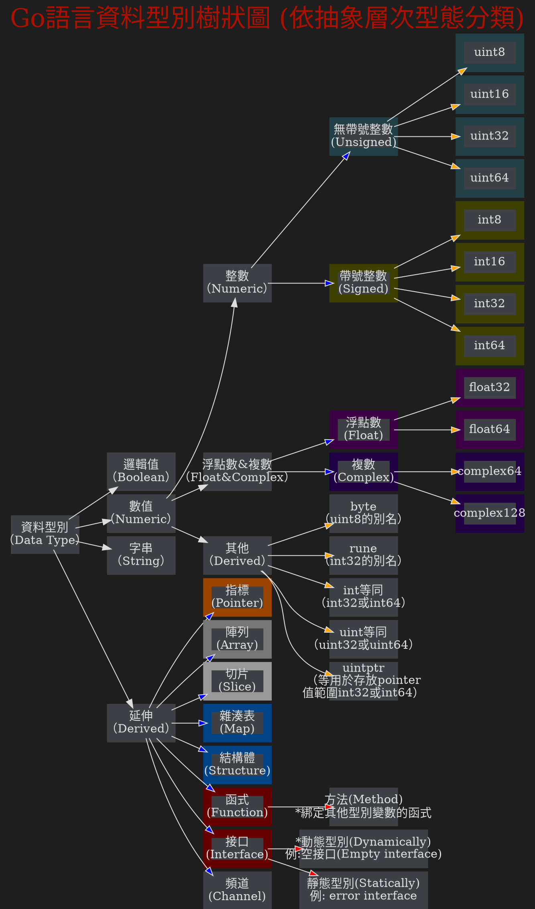
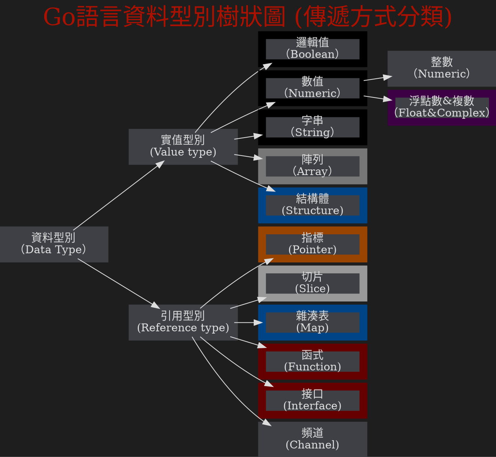

<style>


  /*--------------- view ---------------*/
  body[style],
  body[style*="background-color: white;"] {
    background-color: #444444 !important;
  }

  body {
    color: #abb2bf;
  }

}

  .ui-view-area,
  .markdown-body,
  .ui-content {
    background: #444444;
    color: #abb2bf;
  }
  


  h1,
  h2,
  h3,
  h4,
  h5,
  h6,
  p {
    color: #ddd;
  }

  hr  {
    border-color: #6d6d6d;
  }
  .part code{
    background-color: #999900;
  }

  /* form */
  .form-control {
    background: #333;
    color: #fff;

  }

  .form-control::placeholder,
  .form-control::-webkit-input-placeholder,
  .form-control:-moz-placeholder,
  .form-control::-moz-placeholder,
  .form-control:-ms-input-placeholder {
    color: #eee;
  }

  /*--------------- navbar ---------------*/
  .header,
  .navbar {
    background-color: #0e0e0e;
    border-color: #0e0e0e;
  }

  .navbar a {
    color: #eee !important;
  }

  .navbar .btn-group label {
    background-color: #0e0e0e;
    color: #eee;
    border-color: #555;
  }

  .navbar .btn-group label.btn-default:focus,
  .navbar .btn-group label.btn-default:hover {
    background-color: #2a2a2a;
    color: #eee;
    border-color: #555;
  }


  .navbar .btn-group label.active,
  .navbar .btn-group label.active:focus,
  .navbar .btn-group label.active:hover {
    background-color: #555;
    color: #eee;
    border-color: #555;
  }

  .navbar-default .btn-link:focus,
  .navbar-default .btn-link:hover {
    color: #eee;
  }

  .navbar-default .navbar-nav>.open>a,
  .navbar-default .navbar-nav>.open>a:focus,
  .navbar-default .navbar-nav>.open>a:hover {
    background-color: #555;
  }

  .dropdown-header {
    color: #aaa;
  }

  .dropdown-menu {
    background-color: #222;
    border: 1px solid #555;
    border-top: none;
  }

  .dropdown-menu>li>a {
    color: #eee;
  }

  .dropdown-menu>li>a:focus,
  .dropdown-menu>li>a:hover {
    background-color: #555555;
    color: #eee;
  }

  .dropdown-menu .divider {
    background-color: #555;
  }

  .header .open .dropdown-menu {
    background-color: #202020;
  }

  .navbar .announcement-popover {
    background: #4F4F4F;
  }

  .navbar .announcement-popover .announcement-popover-header {
    background: #2e2e2e;
    border-bottom: 1px solid #2e2e2e;
  }

  .navbar .announcement-popover .announcement-popover-body {
    background: #4F4F4F;
    color: #eee;
  }

  .navbar .announcement-popover .announcement-popover-footer {
    background: #4F4F4F;
  }

  .navbar .announcement-area .caption.inverse {
    color: #eee;
  }

  .label-warning {
    background-color: #ffc107;
    color: #212529;
  }

  /*--------------- history / recent ---------------*/
  .list.row-layout li .item {
    border-color: #696c7d;
  }

  .list.row-layout li:nth-last-of-type(1) .item {
    border-bottom: none;
  }

  .list li .item {
    background: #1c1c1c;
  }

  .list li:hover .item,
  .list li:focus .item {
    background: #404040;
  }

  .list li .item h4 {
    color: #fff;
  }

  .list li p {
    color: #ccc;
  }

  .list li p i {
    font-style: normal;
  }

  .list li .item .content .tags span {
    background: #555;
  }

  .list li .item.wide .content .title a,
  .list li .item.wide .content .title a:focus,
  .list li .item.wide .content .title a:hover {
    color: #ddd;
  }

  .ui-item {
    color: #fff;
    opacity: 0.7;
  }

  .ui-item:hover,
  .ui-item:focus {
    opacity: 1;
    color: #fff;
  }

  .list li .item.wide hr {
    border-color: #6d6d6d;
  }

  .overview-widget-group .btn,
  .multi-select-dropdown-menu .ui-dropdown-label,
  .multi-select-dropdown-menu .dropdown-options,
  .form-control {
    border-color: #6d6d6d;
  }

  .multi-select-dropdown-menu .dropdown-options .ui-option:hover {
    background-color: #4d4d4d;
    color: #eee;
  }

  #overview-control-form #overview-keyword-input-container .select2-container {
    background-color: #3e4045 !important;
  }

  #overview-control-form #overview-keyword-input-container .select2-container .select2-choices {
    background-color: #3e4045;
  }

  .search {
    background-color: #3e4045;
    color: #eee;
  }

  .btn.btn-gray {
    background: #1b1b1b;
  }

  .btn.btn-gray:hover {
    background: #4d4d4d;
    color: #eee;
  }

  .search::placeholder,
  .search::-webkit-input-placeholder,
  .search:-moz-placeholder,
  .search::-moz-placeholder,
  .search:-ms-input-placeholder {
    color: #eee;
  }

  .btn.btn-gray {
    border-color: #6d6d6d;
    background: #333;
    color: #eee;
  }

  .select2-default {
    color: #eee !important;
  }

  .select2-results .select2-highlighted {
    background: #4d4d4d;
    color: #eee;
  }

  .select2-container-multi .select2-choices {
    background: #3e4045;
  }

  .select2-container-multi .select2-choices .select2-search-choice {
    background: #131313;
    color: #eee;
    border-color: #555;
    box-shadow: none;
  }

  .btn-default,
  .btn-default:focus {
    color: #eee;
    background-color: #2e2e2e;
    border-color: #6a6a6a;
  }

  .btn-default.active.focus,
  .btn-default.active:focus,
  .btn-default.active:hover,
  .btn-default:active.focus,
  .btn-default:active:focus,
  .btn-default:active:hover,
  .open>.dropdown-toggle.btn-default.focus,
  .open>.dropdown-toggle.btn-default:focus,
  .open>.dropdown-toggle.btn-default:hover {
    background: #737373;
  }

  .btn-default:hover {
    color: #fff;
    background-color: #7d7d7d;
    border-color: #6a6a6a;
  }

  .overview-widget-group .btn.active {
    background-color: #6a6a6a;
    color: #eee;
  }

  .overview-widget-group .btn:hover {
    background-color: #7d7d7d;
    color: #eee;
    border-color: #636363;
  }

  .overview-widget-group .slider.round {
    border-color: #ccc;
  }

  .overview-widget-group .slider.round:before {
    border-color: #ccc;
  }

  .overview-widget-group input:checked+.slider {
    background-color: #ccc;
  }

  .ui-category-description-icon a {
    color: #eee;
  }

  .item .ui-history-pin.active {
    color: #f00;
  }

  .ui-history-close {
    color: #eee;
    opacity: 0.5;
  }

  .pagination>li>a,
  .pagination>li>span {
    color: #eee;
    background-color: #2e2e2e;
    border-color: #6a6a6a;
  }

  .pagination>li>a:hover {
    color: #fff;
    background-color: #7d7d7d;
    border-color: #6a6a6a;
  }

  .pagination>.disabled>a,
  .pagination>.disabled>a:focus,
  .pagination>.disabled>a:hover,
  .pagination>.disabled>span,
  .pagination>.disabled>span:focus,
  .pagination>.disabled>span:hover {
    color: #eee;
    background-color: #2e2e2e;
    border-color: #6a6a6a;
  }

  .pagination.dark>li>a,
  .pagination.dark>li>span {
    color: #aaa;
  }

  /*--------------- settings ---------------*/
  .section .form-horizontal .form-group .btn-default {
    font-size: 16px;
    border-color: #6d6d6d;
    background-color: #333;
    color: #FFF;
  }

  .section .form-horizontal .form-group .btn-default:hover,
  .section .form-horizontal .form-group .btn-default:focus {
    background-color: #737373;
    color: #FFF;
  }

  .section .form-horizontal .form-control:focus {
    border-color: #bbb;
  }

  /*--------------- share view ---------------*/
  #notificationLabel,
  .ui-infobar .btn.ui-edit {
    color: #eee;
    border-color: #6a6a6a;
  }

  .ui-infobar__user-info li {
    color: #bbb;
  }

  footer {
    background: #101010;
    color: #bbb;
    border-top: 1px solid #454545;
  }

  footer a {
    color: #bbb;
  }

  /*--------------- doc view ---------------*/
  .markdown-body h1,
  .markdown-body h2,
  .markdown-body h3,
  .markdown-body h4,
  .markdown-body h5,
  .markdown-body h6,
  .markdown-body hr,
  #doc>h1 {
    color: #ddd;
    border-color: #777 !important;
  }

  .h1 .small,
  .h1 small,
  .h2 .small,
  .h2 small,
  .h3 .small,
  .h3 small,
  .h4 .small,
  .h4 small,
  .h5 .small,
  .h5 small,
  .h6 .small,
  .h6 small,
  h1 .small,
  h1 small,
  h2 .small,
  h2 small,
  h3 .small,
  h3 small,
  h4 .small,
  h4 small,
  h5 .small,
  h5 small,
  h6 .small,
  h6 small {
    color: #ddd;
  }

  .markdown-body p {
    color: #ddd;
  }

  .markdown-body a {
    color: #7bf;
  }

  .markdown-body a code {
    color: #7bf !important;
  }

  .markdown-body ul li,
  .markdown-body ol li {
    color: #ddd;
  }

  .markdown-body blockquote {
    color: #ddd;
    border-left-color: #777;
    font-size: 16px;
  }

  <--.markdown-body code,
  code {
    color: #dfdfdf !important;
    background-color: #424a55;
  }-->

  .markdown-body pre {
    background-color: #1e1e1e;
    border: 1px solid #555 !important;
    color: #dfdfdf;
  }

  blockquote .small,
  blockquote footer,
  blockquote small {
    color: #bbb;
  }

  .mark,
  mark {
    background-color: rgba(255, 255, 0, 0.32) !important;
    color: #ddd;
    margin: .1em;
    padding: .1em .2em;
  }

  /* Todo list */
  .task-list-item-checkbox {
    margin: 0.18em 0 0.2em -1.3em !important;
  }

  .task-list-item input[type=checkbox] {
    -webkit-appearance: none;
    -moz-appearance: none;
    appearance: none;
    position: relative;
    top: -1px;
    margin: 0 1rem 0 0;
    cursor: pointer;
  }

  .task-list-item input[type=checkbox]::before {
    -webkit-transition: all 0.1s ease-in-out;
    -moz-transition: all 0.1s ease-in-out;
    transition: all 0.1s ease-in-out;
    content: "";
    position: absolute;
    left: 0;
    z-index: 1;
    width: 16px;
    height: 16px;
    border: 2px solid #F44336;
  }

  .task-list-item input[type=checkbox]:checked::before {
    -webkit-transform: rotate(-48deg);
    -moz-transform: rotate(-48deg);
    -ms-transform: rotate(-48deg);
    -o-transform: rotate(-48deg);
    transform: rotate(-48deg);
    height: 9px;
    border-color: #00E676;
    border-top-style: none;
    border-right-style: none;
  }

  .task-list-item input[type=checkbox]::after {
    content: "";
    position: absolute;
    top: -0.125rem;
    left: 0;
    width: 16px;
    height: 16px;
    background: #333;
    cursor: pointer;
  }

  /* table */
  .markdown-body table tr {
    background-color: #1e1e1e;
    border-top: none;
    border-bottom: 1px solid rgba(255, 255, 255, 0.3);
  }

  .markdown-body table tr:first-child {
    border-top: 1px solid rgba(255, 255, 255, 0.2);
  }

  .markdown-body table tr:nth-child(2n) {
    background-color: #333;
  }

  .markdown-body table tr th {
    color: #64B5F6;
  }

  .markdown-body table th,
  .markdown-body table td {
    border: none;
  }

  .markdown-body table tr th:first-child,
  .markdown-body table tr td:first-child {
    border-left: 1px solid rgba(255, 255, 255, 0.1);
  }

  .markdown-body table tr th:last-child,
  .markdown-body table tr td:last-child {
    border-right: 1px solid rgba(255, 255, 255, 0.1);
  }

  .markdown-body table tr td {
    color: #ddd;
  }


  .markdown-body pre.flow-chart,
  .markdown-body pre.sequence-diagram,
  .markdown-body pre.graphviz,
  .markdown-body pre.mermaid,
  .markdown-body pre.abc {
    background-color: #1e1e1e;
    color: #ddd;


  }
              .markdown-body pre.gri {
                stroke: lightgrey;
                opacity: 0.3;
                shape-rendering: crispEdges;
            }
            .markdown-body pre.grid path {
                stroke-width: 0;
            }
  


  /* alert */
  .alert h1,
  .alert h2,
  .alert h3,
  .alert h4,
  .alert h5,
  .alert h6,
  .alert p,
  .alert ul li,
  .alert ol li {
    color: #31708f;
  }

  .alert a {
    color: #002752;
    font-weight: 700;
  }

  .alert h1:first-child,
  .alert h2:first-child,
  .alert h3:first-child,
  .alert h4:first-child,
  .alert h5:first-child,
  .alert h6:first-child {
    margin-top: 0;
  }

  .markdown-body .alert>p {
    margin-top: 0px;
    margin-bottom: 10px;
  }

  .markdown-body .alert>ul,
  .markdown-body .alert>ol {
    margin-bottom: 16px;
  }

  .markdown-body .alert>*:last-child {
    margin-bottom: 0;
  }

  .alert-warning {
    background-color: #fff3cd;
    border-color: #ffeeba;
  }

  /* scroll bar */
  .ui-edit-area .ui-resizable-handle.ui-resizable-e {
    background-color: #303030;
    border: 1px solid #303030;
    box-shadow: none;
  }

  /* info bar */
  .ui-infobar {
    color: #999;
  }

  /* permission */
  .permission-popover-btn-group .btn.focus,
  .permission-popover-btn-group .btn:active,
  .permission-popover-btn-group .btn:focus,
  .permission-popover-btn-group .btn.active {
    background-color: #6a6a6a !important;
    color: #eee !important;
    border-color: #555 !important;
  }

  .permission-popover-btn-group .btn:hover,
  .permission-popover-btn-group .btn.active:hover {
    background-color: #7d7d7d !important;
    color: #eee !important;
    border-color: #636363 !important;
  }

  .ui-delete-note a:hover,
  .ui-delete-note a:focus,
  .ui-delete-note a:active {
    background-color: #dc3545 !important;
  }

  .ui-invitee-invite {
    border-color: #6a6a6a !important;
  }

  .ui-invitee-invite:hover,
  .ui-invitee-invite:focus {
    background-color: #737373;
    color: #eee !important;
  }

  .ui-invitee.ui-invitee-list .ui-invitee-remove,
  .ui-invitee.ui-invitee-list .ui-invitee-remove:hover,
  .ui-invitee.ui-invitee-list .ui-invitee-remove:focus,
  .ui-invitee.ui-invitee-list .ui-invitee-remove:active {
    background-color: #dc3545;
    border: 1px solid #dc3545;
  }

  .select2-container {
    background: #202020;
  }

  .select2-container-multi .select2-choices .select2-search-field input {
    color: #eee;
  }

  .select2-container-multi .select2-choices .select2-search-field input.select2-active {
    color: #000;
  }

  .select2-drop {
    background: #202020;
    color: #eee;
  }

  .select2-results .select2-no-results,
  .select2-results .select2-searching,
  .select2-results .select2-ajax-error,
  .select2-results .select2-selection-limit {
    background: #202020;
  }

  /* table of contents block*/
  .ui-toc-dropdown {
    width: 42vw;
    max-height: 90vh;
    overflow: auto;
    text-align: inherit;
  }

  /* table of contents text*/
  .ui-toc-dropdown .nav>li>a {
    font-size: 14px;
    font-weight: bold;
    color: #ddd;
  }

  /* table of contents text: active*/
  .ui-toc-dropdown .nav>.active:focus>a,
  .ui-toc-dropdown .nav>.active:hover>a,
  .ui-toc-dropdown .nav>.active>a {
    color: #7bf;
    border-left-color: #7bf;
  }

  /* table of contents text: focus, hover*/
  .ui-toc-dropdown .nav>li>a:focus,
  .ui-toc-dropdown .nav>li>a:hover {
    color: #7bf;
    border-left-color: #7bf;
  }

  /* drop down floating table of contents */
  .ui-toc-dropdown.dropdown-menu {
    background: #333;
  }

  .toc-menu a {
    color: #ddd;
  }

  .toc-menu a:focus,
  .toc-menu a:hover {
    color: #7bf;
  }


  /*--------------- editor ---------------*/
  .cm-m-markdown {
    color: #ddd;
  }

  .cm-s-one-dark .cm-header,
  .cm-m-xml.cm-attribute {
    color: #ffa653;
  }

  .cm-s-one-dark .cm-string,
  .cm-s-one-dark .cm-variable-2 {
    color: #7bf;
  }

  .cm-m-markdown.cm-variable-3 {
    color: #ff7e7e;
  }

  .cm-s-one-dark .cm-link {
    color: #b0ee83;
  }

  .cm-s-one-dark .CodeMirror-linenumber {
    color: #666;
  }

  .cm-strong {
    color: #f4511e;
  }

  .cm-s-one-dark .cm-comment {
    color: #a9a9a9;
  }

  .cm-matchhighlight {
    color: #ffea00;
  }

  .cm-positive {
    color: #11bf64;
  }

  .cm-negative {
    color: #ff3e3e;
  }

  .dropdown-menu.CodeMirror-other-cursor {
    border: 2px solid #4d4d4d;
    background-color: #202020;
  }

  .dropdown-menu.CodeMirror-other-cursor li a {
    color: #ececec;
  }

  /*--------------- book mode ---------------*/
  .topbar {
    background: #1e1e1e;
  }

  .btn.focus,
  .btn:focus,
  .btn:hover {
    color: #aaa;
  }

  .summary {
    background: #1e1e1e;
  }

  .summary,
  .toolbar {
    background: #1e1e1e !important;
    border-color: #4d4d4d !important;
  }

  .toolbar i {
    color: #fff;
  }

  .summary h1,
  .summary h2,
  .summary h3 .summary hr {
    color: #ddd;
    border-color: #777 !important;
  }

  .summary .nav>li>a {
    color: #7bf;
  }

  .summary .nav-pills>li.active>a,
  .summary .nav-pills>li.active>a:focus,
  .summary .nav-pills>li.active>a:hover {
    color: #ff9100;
  }

  .ui-summary-search {
    font-size: 16px;
    border: 1px solid #6D6D6D;
    background-color: #333;
    color: #FFF;
  }

  .summary h1,
  .summary h2,
  .summary h3,
  .summary h4,
  .summary h5,
  .summary h6 {
    border-color: #454545;
  }

  /* fix body background color to dark */
  div[class$=container-mask] {
    background: #1e1e1e;
    z-index: 1;
    display: block;
  }

  /* notification */
  .dropdown.ui-notification .ui-notification-label,
  .dropdown.ui-invitee .ui-invitee-label {
    color: #eee;
    border-color: #6a6a6a;
  }

  .ui-notification .dropdown-menu {
    border-top: 1px solid #555;
  }

  /*--------------- help ---------------*/
  .modal-header {
    background-color: #2a2a2a;
  }

  .panel-default {
    border-color: #6d6d6d;
  }

  .panel-default>.panel-heading {
    background-color: #2a2a2a;
    color: #eee;
    border-color: #6d6d6d;
  }

  .panel-body {
    background: #2e2e2e;
  }

  .panel-body a {
    color: #7bf;
  }

  .table>tbody>tr>td,
  .table>tbody>tr>th,
  .table>tfoot>tr>td,
  .table>tfoot>tr>th,
  .table>thead>tr>td,
  .table>thead>tr>th {
    border-color: #6d6d6d;
  }

  /*--------------- comment ---------------*/
  .ui-comment-container .ui-comment-header {
    background-color: #2a2a2a;
    color: #eee;
    border-color: #6d6d6d;
  }

  .ui-comment-container {
    background-color: #2e2e2e;
    border-color: #6d6d6d;
  }

  .ui-comment-container .ui-comments-container .ui-comment .comment-author {
    color: #eee;
  }

  .ui-comment-container .ui-comments-container .ui-comment .timestamp {
    color: #aaa;
  }

  .ui-comment-container .ui-comments-container .ui-comment .comment-content {
    color: #eee;
  }

  .ui-comment-container .ui-comments-container .ui-comment .comment-menu {
    color: #eee;
  }

  .ui-comment-container .ui-comments-container .ui-comment .comment-menu .comment-dropdown-menu {
    background: #222;
    color: #eee;
    border-color: #555;
  }

  .ui-comment-container .ui-comments-container .ui-comment .comment-menu .comment-dropdown-menu>div:hover {
    background-color: #555555;
    color: #eee;
  }

  .ui-comment-container .ui-comments-container .ui-comment .comment-menu:hover,
  .ui-comment-container .ui-comments-container .ui-comment .comment-menu:active,
  .ui-comment-container .ui-comments-container .ui-comment .comment-menu.active {
    background-color: #737373;
    color: #eee;
  }

  .ui-comment-container .ui-comment-input-container {
    background-color: #3c3c3c;
  }

  .ui-comment-container textarea {
    background-color: #3e4045;
    color: #eee;
    border: 1px solid #6d6d6d;
  }

  .ui-comment-container textarea::placeholder,
  .ui-comment-container textarea::-webkit-input-placeholder,
  .ui-comment-container textarea:-moz-placeholder,
  .ui-comment-container textarea::-moz-placeholder,
  .ui-comment-container textarea:-ms-input-placeholder {
    color: #eee;
  }

  @keyframes highlight {
    0% {
      background-color: #3c3c3c;
    }

    30% {
      background-color: #3c3c3c;
    }

    100% {
      background-color: transparent;
    }
  }

  /*--------------- template ---------------*/
  .template-content .modal-header {
    background: #2a2a2a;
  }

  .template-content .close {
    color: #fff;
  }

  .template-content .modal-title {
    color: #eee;
  }

  .template-content .ui-templates-container {
    border-color: #6d6d6d;
  }

  .ui-templates-container .ui-create-template-btn {
    background: #446fab;
    color: #fff;
  }

  .ui-template-list-filter .ui-template-list-filter-label,
  .ui-template-list-filter .ui-template-list-filter-label:hover {
    color: #eee;
  }

  .ui-template-list .list-group-item.active {
    background: #4d4d4d;
  }

  .ui-template-list .list-group-item.active:focus {
    background: #4d4d4d !important;
  }

  .list-group-item.active,
  .list-group-item.active:focus,
  .list-group-item.active:hover {
    color: #eee;
  }

  .ui-template-list .list-group-item .list-group-item-heading {
    color: #eee;
  }

  .ui-template-list .list-group-item.active .list-group-item-heading {
    color: #eee;
  }

  .ui-template-list .list-group-item:hover {
    background: #4d4d4d !important;
  }

  .ui-template-item-menu {
    color: #eee !important;
  }

  .ui-template-list .list-group-item {
    color: #fff;
  }

  .ui-template-list .list-group-item .dropdown-container.open {
    background-color: #2a2a2a;
  }

  .ui-template-list .list-group-item .dropdown-container:hover {
    background-color: #2a2a2a !important;
  }

  .template-menu .more-template {
    border-color: #6d6d6d;
  }

  .template-menu .more-template:hover {
    color: #eee;
    border-color: #6d6d6d;
  }

  /*--------------- code mirror ---------------*/
  .modal-content {
    background: #1f2226;
  }

  .modal-header {
    border-bottom: 1px solid #46484f;
  }

  .modal-footer {
    border-top: 1px solid #46484f;
  }

  a.list-group-item {
    background: #1f2226;
    color: #ddd;
    border: 1px solid #46484f;
  }

  a.list-group-item .list-group-item-heading {
    color: #ddd;
  }

  a.list-group-item:focus,
  a.list-group-item:hover {
    background: #434651;
    color: #ddd;
  }

  button.close {
    color: #ddd;
    opacity: .5;
  }

  .close:focus, .close:hover {
    color: #fff;
    opacity: .8;
  }

  .CodeMirror {
    background: #1f2226;
  }

  .CodeMirror-gutters {
    background: #1f2226;
    border-right: 1px solid rgba(204, 217, 255, 0.1);
  }

  .cm-s-default .cm-comment {
    color: #888;
  }

  .cm-s-default .cm-quote {
    color: #ddd;
  }

  .cm-s-default .cm-header {
    color: #ffa653;
  }

  .cm-s-default .cm-link {
    color: #b0ee83;
  }

  .cm-s-default .cm-string,
  .cm-s-default .cm-variable-2 {
    color: #7bf;
  }

  .cm-s-default .cm-def {
    color: #c678dd;
  }

  .cm-s-default .cm-number,
  .cm-s-default .cm-attribute,
  .cm-s-default .cm-qualifier,
  .cm-s-default .cm-plus,
  .cm-s-default .cm-atom {
    color: #eda35e;
  }

  .cm-s-default .cm-property,
  .cm-s-default .cm-variable,
  .cm-s-default .cm-variable-3,
  .cm-s-default .cm-operator,
  .cm-s-default .cm-bracket {
    color: #f76e79;
  }

  .cm-s-default .cm-keyword,
  .cm-s-default .cm-builtin,
  .cm-s-default .cm-tag {
    color: #98c379;
  }

  .modal-title {
    color: #ccc;
  }

  .modal-body {
    color: #ccc !important;
  }

  div[contenteditable]:empty:not(:focus):before {
    color: #aaa;
  }

  .CodeMirror pre {
    color: #ddd;
  }

  .CodeMirror pre span[style^="background-color: rgb(221, 251, 230)"] {
    background-color: #288c27 !important;
  }

  .CodeMirror pre span[style^="background-color: rgb(249, 215, 220)"] {
    background-color: #a52721 !important;
  }

  /*------- code highlight: Visual Stutdio Code theme for highlight.js -------*/
  .hljs {
    background: #1E1E1E;
    color: #DCDCDC;
  }

  .hljs-keyword,
  .hljs-literal,
  .hljs-symbol,
  .hljs-name {
    color: #569CD6;
  }

  .hljs-link {
    color: #569CD6;
    text-decoration: underline;
  }

  .hljs-built_in,
  .hljs-type {
    color: #4EC9B0;
  }

  .hljs-number,
  .hljs-class {
    color: #B8D7A3;
  }

  .hljs-string,
  .hljs-meta-string {
    color: #D69D85;
  }

  .hljs-regexp,
  .hljs-template-tag {
    color: #d16969;
  }

  .hljs-title {
    color: #dcdcaa;
  }

  .hljs-subst,
  .hljs-function,
  .hljs-formula {
    color: #DCDCDC;
  }

  .hljs-comment,
  .hljs-quote {
    color: #57A64A;
  }

  .hljs-doctag {
    color: #608B4E;
  }

  .hljs-meta,
  .hljs-meta-keyword,
  .hljs-tag {
    color: #9B9B9B;
  }

  .hljs-variable,
  .hljs-template-variable {
    color: #BD63C5;
  }

  .hljs-params,
  .hljs-attr,
  .hljs-attribute,
  .hljs-builtin-name {
    color: #9CDCFE;
  }

  .hljs-section {
    color: gold;
  }

  .hljs-emphasis {
    font-style: italic;
  }

  .hljs-strong {
    font-weight: bold;
  }

  /*
  .hljs-code {
    font-family:'Monospace';
  }
  */

  .hljs-bullet,
  .hljs-selector-tag,
  .hljs-selector-id,
  .hljs-selector-class,
  .hljs-selector-attr,
  .hljs-selector-pseudo {
    color: #D7BA7D;
  }

  .hljs-addition {
    background-color: #155a36;
    color: #dfdfdf;
    display: inline-block;
    width: 100%;
  }

  .hljs-deletion {
    background-color: #872e2e;
    color: #dfdfdf;
    display: inline-block;
    width: 100%;
  }

  /*---------- code highlight: Visual Stutdio Code theme for Prism.js ----------*/
  code[class*="language-"],
  pre[class*="language-"] {
    color: #DCDCDC;
  }

  :not(pre)>code[class*="language-"],
  pre[class*="language-"] {
    background: #1E1E1E;
  }

  .token.comment,
  .token.block-comment,
  .token.prolog,
  .token.cdata {
    color: #57A64A;
  }

  .token.doctype,
  .token.punctuation {
    color: #9B9B9B;
  }

  .token.tag,
  .token.entity {
    color: #569CD6;
  }

  .token.attr-name,
  .token.namespace,
  .token.deleted,
  .token.property,
  .token.builtin {
    color: #9CDCFE;
  }

  .token.function,
  .token.function-name {
    color: #dcdcaa;
  }

  .token.boolean,
  .token.keyword,
  .token.important {
    color: #569CD6;
  }

  .token.number {
    color: #B8D7A3;
  }

  .token.class-name,
  .token.constant {
    color: #4EC9B0;
  }

  .token.symbol {
    color: #f8c555;
  }

  .token.rule {
    color: #c586c0;
  }

  .token.selector {
    color: #D7BA7D;
  }

  .token.atrule {
    color: #cc99cd;
  }

  .token.string,
  .token.attr-value {
    color: #D69D85;
  }

  .token.char {
    color: #7ec699;
  }

  .token.variable {
    color: #BD63C5;
  }

  .token.regex {
    color: #d16969;
  }

  .token.operator {
    color: #DCDCDC;
    background: transparent;
  }

  .token.url {
    color: #67cdcc;
  }

  .token.important,
  .token.bold {
    font-weight: bold;
  }

  .token.italic {
    font-style: italic;
  }

  .token.entity {
    cursor: help;
  }

  .token.inserted {
    color: green;
  }

  /*---------- code highlight: dark theme for Gist ----------*/
  .gist .gist-file {
    border: 1px solid #555;
  }

  .gist .gist-data {
    background-color: #1e1e1e;
    border-bottom: 1px solid #555;
  }

  .gist .gist-meta {
    background-color: #424a55;
    color: #eee;
  }

  .gist .gist-meta a {
    color: #eee;
  }

  .gist .highlight {
    color: #eee;
    background-color: #1e1e1e;
  }

  .gist .blob-num {
    color: #afafaf;
  }

  .gist .blob-code-inner {
    color: #dfdfdf;
  }

  .pl-mb {
    color: #fff !important;
  }

  .pl-c {
    color: #57A64A !important;
  }

  /* comment */
  .pl-ent {
    color: #569CD6 !important;
  }

  /* entity */
  .pl-e {
    color: #9CDCFE !important;
  }

  .pl-en {
    color: #4EC9B0 !important;
  }

  /* entity attribute */
  .pl-smi {
    color: #9CDCFE !important;
  }

  .pl-k {
    color: #569cd6 !important;
  }

  .pl-c1,
  .pl-s .pl-v {
    color: #4EC9B0 !important;
  }

  .pl-pds,
  .pl-s,
  .pl-s .pl-pse .pl-s1,
  .pl-sr,
  .pl-sr .pl-cce,
  .pl-sr .pl-sra,
  .pl-sr .pl-sre,
  .pl-s .pl-s1 {
    color: #D69D85 !important;
  }

  .pl-s .pl-s1 .pl-pse {
    color: #c5dbff !important;
  }

  /* strings */
  .diff-table .pl-c,
  .diff-table .pl-ent,
  .diff-table .pl-e,
  .diff-table .pl-en,
  .diff-table .pl-pds,
  .diff-table .pl-s,
  .diff-table .pl-s .pl-s1,
  .diff-table .pl-s .pl-pse .pl-s1,
  .diff-table .pl-sr,
  .diff-table .pl-sr .pl-cce,
  .diff-table .pl-sr .pl-sra,
  .diff-table .pl-sr .pl-sre,
  .diff-table .pl-k,
  .diff-table .pl-smi,
  .diff-table .pl-c1,
  .diff-table .pl-v {
    color: #eee !important;
  }

 </style>


###### tags: `GoLang`

# GoLang入門基礎:

### Go 語言的重要特色
> 
> 1. 編譯副檔名必須為 ==`.go`==，預設以 ==`UTF-8`== 編碼
> 2. 語句結尾可加入 ==`;`== 號或者不加，語句結尾必須換行分隔
> 3. GoLang所有程式碼必須命名並編為一個Package
> 4. GoLang不允許Package import引入後卻未使用
> 5. GoLang不允許區域內變數宣告後卻從未使用
> ### Go 語言func可方便多個變數:
> ```go=
> package main
> import "fmt"
> func vals() (int, int) {
> 	return 3, 7
> }
> func main() {
> 
> 	a, b := vals()
> 	fmt.Println("Muilt value:\n", a, "\n", b)
> 	//Muilt value:
> 	//3
> 	//7
> 
> 	_, c := vals()
> 	fmt.Println("Get one value:\n", c)
> 	//Get one value:
> 	//7
> 
> 	x, y := 1, 2
> 	x, y = y, x
> 	fmt.Println("x=", x, " y=", y)
> 	// x y 變數直接交換
> 
> }
> 
> ```
---

### Go 語言與其他語言比較

<table border="0" cellspacing="0" style="width: 107%;">
<tbody>
<tr style="height: 28px;">
<td style="border-width: 2px 1px 2px 2px; border-style: initial; border-color: initial; height: 28px;" align="center" valign="middle"><strong><span style="font-family: 'DejaVu Sans Mono'; font-size: large;">集合</span></strong></td>
<td style="border-width: 2px 2px 2px px; border-style: initial; border-color: initial; height: 28px;" align="center" valign="middle"><strong><span style="font-family: 'DejaVu Sans Mono'; font-size: large;">特性項</span></strong></td>
<td style="border-top: 2px; border-bottom: 2px; border-right: 1px; height: 28px;" align="center" valign="middle"><strong><span style=" font-size: large;">Go</span></strong></td>
<td style="border-width: 2px 1px; border-style: initial; border-color: initial; height: 28px;" align="center" valign="middle"><strong><span style=" font-size: large;">C</span></strong></td>
<td style="border-width: 2px 2px 2px 1px; border-style: initial; border-color: initial; height: 28px;" align="center" valign="middle"><strong><span style=" font-size: large;">Java</span></strong></td>
</tr>
<tr style="height: 23px;">
<td style="border-bottom: 1px; border-left: 2px; border-right: 2px; height: 23px;" colspan="2" align="center" valign="middle">關鍵字與保留字</td>
<td style="border-bottom: 1px; border-right: 1px; height: 23px;" align="center" valign="middle">25個</td>
<td style="border-bottom: 1px; border-left: 1px; border-right: 1px; height: 23px;" align="center" valign="middle">32個(ANSI)</td>
<td style="border-bottom: 1px; border-left: 1px; border-right: 2px; height: 23px;" align="center" valign="middle">超過48個</td>
</tr>
<tr style="height: 22px;">
<td style="border-width: 1px 1px 1px 2px; border-style: initial; border-color: initial; height: 110px;" rowspan="5" align="center" valign="middle">類型系統</td>
<td style="border-width: 1px 2px 1px 1px; border-style: initial; border-color: initial; height: 22px;" align="center" valign="middle">動/靜態分類(Static/Dynamic)</td>
<td style="border-top: 1px; border-bottom: 1px; border-right: 1px; height: 22px;" align="center" valign="middle">靜態(以Duck型別運行動態)</td>
<td style="border: 1px; height: 22px;" align="center" valign="middle">靜態</td>
<td style="border-width: 1px 2px 1px 1px; border-style: initial; border-color: initial; height: 22px;" align="center" valign="middle">靜態</td>
</tr>
<tr style="height: 22px;">
<td style="border-width: 1px 2px 1px 1px; border-style: initial; border-color: initial; height: 22px;" align="center" valign="middle">強/弱型別分類(Strong/Weak)</td>
<td style="border-top: 1px; border-bottom: 1px; border-right: 1px; height: 22px;" align="center" valign="middle">強型別</td>
<td style="border: 1px; height: 22px;" align="center" valign="middle">弱型別</td>
<td style="border-width: 1px 2px 1px 1px; border-style: initial; border-color: initial; height: 22px;" align="center" valign="middle">強型別</td>
</tr>
<tr style="height: 22px;">
<td style="border-width: 1px 2px 1px 1px; border-style: initial; border-color: initial; height: 22px;" align="center" valign="middle">型別安全(Type safety)</td>
<td style="border-top: 1px; border-bottom: 1px; border-right: 1px; height: 22px;" align="center" valign="middle"><span style="">Type safety</span></td>
<td style="border: 1px; height: 22px;" align="center" valign="middle"><span style="">Type-unsafe</span></td>
<td style="border-width: 1px 2px 1px 1px; border-style: initial; border-color: initial; height: 22px;" align="center" valign="middle"><span style="">Type safety</span></td>
</tr>
<tr style="height: 22px;">
<td style="border-width: 1px 2px 1px 1px; border-style: initial; border-color: initial; height: 22px;" align="center" valign="middle">型別推論(Type inference)</td>
<td style="border-top: 1px; border-bottom: 1px; border-right: 1px; height: 22px;" align="center" valign="middle">支援</td>
<td style="border: 1px; height: 22px;" align="center" valign="middle">無</td>
<td style="border-top: 1px; border-bottom: 1px; border-right: 1px; height: 22px;" align="center" valign="middle">支援</td>
</tr>
<tr style="height: 22px;">
<td style="border-width: 1px 2px 1px 1px; border-style: initial; border-color: initial; height: 22px;" align="center" valign="middle">自訂型別(User-defined)方式</td>
<td style="border-top: 1px; border-bottom: 1px; border-right: 1px; height: 22px;" align="center" valign="middle">自訂變數(type)實現</td>
<td style="border: 1px; height: 22px;" align="center" valign="middle">自訂結構體(struct)實現</td>
<td style="border-width: 1px 2px 1px 1px; border-style: initial; border-color: initial; height: 22px;" align="center" valign="middle">透過class、 interface方式實現</td>
</tr>
<tr style="height: 22px;">
<td style="border-width: 1px 1px 1px 2px; border-style: initial; border-color: initial; height: 66px;" rowspan="3" align="center" valign="middle">抽象</td>
<td style="border-width: 1px 2px 1px 1px; border-style: initial; border-color: initial; height: 22px;" align="center" valign="middle">物件導向設計(OOP)支援方式</td>
<td style="border-top: 1px; border-bottom: 1px; border-right: 1px; height: 22px;" align="center" valign="middle">透過 struct、methods、interface 方式實現</td>
<td style="border: 1px; height: 22px;" align="center" valign="middle">透過 struct、function pointer 方式實現</td>
<td style="border-width: 1px 2px 1px 1px; border-style: initial; border-color: initial; height: 22px;" align="center" valign="middle">透過class、interface方式實現</td>
</tr>
<tr style="height: 22px;">
<td style="border-width: 1px 2px 1px 1px; border-style: initial; border-color: initial; height: 22px;" align="center" valign="middle">接口(Interface)呈現方式</td>
<td style="border-top: 1px; border-bottom: 1px; border-right: 1px; height: 22px;" align="center" valign="middle">透過 Duck型別方式</td>
<td style="border: 1px; height: 22px;" align="center" valign="middle">透過 (void *)間接方式</td>
<td style="border-width: 1px 2px 1px 1px; border-style: initial; border-color: initial; height: 22px;" align="center" valign="middle">透過宣告接口(interface)方式</td>
</tr>
<tr style="height: 22px;">
<td style="border-width: 1px 2px 1px 1px; border-style: initial; border-color: initial; height: 22px;" align="center" valign="middle">多型(Polymorphism)呈現方式</td>
<td style="border-top: 1px; border-bottom: 1px; border-right: 1px; height: 22px;" align="center" valign="middle">透過 interface 方式實現</td>
<td style="border: 1px; height: 22px;" align="center" valign="middle">透過 (void *)間接方式</td>
<td style="border-width: 1px 2px 1px 1px; border-style: initial; border-color: initial; height: 22px;" align="center" valign="middle">透過class、 interface方式實現</td>
</tr>
<tr style="height: 22px;">
<td style="border-width: 1px 1px 1px 2px; border-style: initial; border-color: initial; height: 44px;" rowspan="2" align="center" valign="middle">元程式設計</td>
<td style="border-width: 1px 2px 1px 1px; border-style: initial; border-color: initial; height: 22px;" align="center" valign="middle">泛型(Generic)支援 ⁴</td>
<td style="border-top: 1px; border-bottom: 1px; border-right: 1px; height: 22px;" align="center" valign="middle">無</td>
<td style="border: 1px; height: 22px;" align="center" valign="middle">無</td>
<td style="border-width: 1px 2px 1px 1px; border-style: initial; border-color: initial; height: 22px;" align="center" valign="middle">支援</td>
</tr>
<tr style="height: 22px;">
<td style="border-width: 1px 2px 1px 1px; border-style: initial; border-color: initial; height: 22px;" align="center" valign="middle">映射(Reflection)支援 ⁵</td>
<td style="border-width: 1px 2px 1px 1px; border-style: initial; border-color: initial; height: 22px;" align="center" valign="middle">支援</td>
<td style="border: 1px; height: 22px;" align="center" valign="middle">無</td>
<td style="border-width: 1px 2px 1px 1px; border-style: initial; border-color: initial; height: 22px;" align="center" valign="middle">支援</td>
</tr>
<tr style="height: 22px;">
<td style="border-width: 1px 1px 2px 2px; border-style: initial; border-color: initial; height: 132px;" rowspan="6" align="center" valign="middle">運行平台管理</td>
<td style="border-width: 1px 2px 1px 1px; border-style: initial; border-color: initial; height: 22px;" align="center" valign="middle">跨平台方式</td>
<td style="border-top: 1px; border-bottom: 1px; border-right: 1px; height: 22px;" align="center" valign="middle">官方支持</td>
<td style="border: 1px; height: 22px;" align="center" valign="middle">第三方支持</td>
<td style="border-width: 1px 2px 1px 1px; border-style: initial; border-color: initial; height: 22px;" align="center" valign="middle">原生跨平台(JVM)</td>
</tr>
<tr style="height: 22px;">
<td style="border-width: 1px 2px 1px 1px; border-style: initial; border-color: initial; height: 22px;" align="center" valign="middle">編譯方式</td>
<td style="border-top: 1px; border-bottom: 1px; border-right: 1px; height: 22px;" align="center" valign="middle">編譯可執行檔</td>
<td style="border: 1px; height: 22px;" align="center" valign="middle">編譯可執行檔</td>
<td style="border-width: 1px 2px 1px 1px; border-style: initial; border-color: initial; height: 22px;" align="center" valign="middle">編譯位元組碼</td>
</tr>
<tr style="height: 22px;">
<td style="border-width: 1px 2px 1px 1px; border-style: initial; border-color: initial; height: 22px;" align="center" valign="middle">運行模式</td>
<td style="border-top: 1px; border-bottom: 1px; border-right: 1px; height: 22px;" align="center" valign="middle">直接運行</td>
<td style="border: 1px; height: 22px;" align="center" valign="middle">直接運行</td>
<td style="border-width: 1px 2px 1px 1px; border-style: initial; border-color: initial; height: 22px;" align="center" valign="middle">虛擬機運行(JVM)</td>
</tr>
<tr style="height: 22px;">
<td style="border-width: 1px 2px 1px 1px; border-style: initial; border-color: initial; height: 22px;" align="center" valign="middle">記憶體管理</td>
<td style="border-top: 1px; border-bottom: 1px; border-right: 1px; height: 22px;" align="center" valign="middle">自動垃圾回收</td>
<td style="border: 1px; height: 22px;" align="center" valign="middle">手動管理</td>
<td style="border-width: 1px 2px 1px 1px; border-style: initial; border-color: initial; height: 22px;" align="center" valign="middle">自動垃圾回收</td>
</tr>
<tr style="height: 22px;">
<td style="border-width: 1px 2px 1px 1px; border-style: initial; border-color: initial; height: 22px;" align="center" valign="middle">並行計算方式(Concurrent)</td>
<td style="border-top: 1px; border-bottom: 1px; border-right: 1px; height: 22px;" align="center" valign="middle">原生支援goroutine (CSP模型)</td>
<td style="border: 1px; height: 22px;" align="center" valign="middle">透過OS管理</td>
<td style="border-width: 1px 2px 1px 1px; border-style: initial; border-color: initial; height: 22px;" align="center" valign="middle">透過虛擬機管理</td>
</tr>
<tr style="height: 22px;">
<td style="border-width: 1px 2px 2px 1px; border-style: initial; border-color: initial; height: 22px;" align="center" valign="middle">交叉編譯器(Cross compiler)⁶</td>
<td style="border-top: 1px; border-bottom: 2px; border-right: 1px; height: 22px;" align="center" valign="middle">支援</td>
<td style="border-width: 1px 1px 2px; border-style: initial; border-color: initial; height: 22px;" align="center" valign="middle">支援</td>
<td style="border-width: 1px 2px 2px 1px; border-style: initial; border-color: initial; height: 22px;" align="center" valign="middle">原生支援(JVM)</td>
</tr>
</tbody>
</table>

> **[¹]**	https://openhome.cc/Gossip/Programmer/DynamicStaticLanguage.html
> **[²]**	https://bbs.csdn.net/topics/360124878
> **[³]**	https://www.ithome.com.tw/voice/88063
> **[⁴]**	https://ithelp.ithome.com.tw/articles/10194019
> **[⁵]**	https://www.ithome.com.tw/node/57227
> **[⁶]**	https://kknews.cc/zh-tw/tech/bxgj5xo.html
> > ==`此表格為本hackmd作者所整理，雖嚴謹查證資料但不保證內容完美無誤`==

---

### Go 語言的標識符(Identifiers)

<iframe
style="frameborder:0;border:0;scrolling:no;background-color:#4e4e4e;width:110%;height:700px"
src="http://www.plantuml.com/plantuml/svg/TLLTRzn457tthxXjrMZJi4dpmIPQigkIYA8A8Ig1U444pTftTqSPprZZSS92a594r8XIo0CbROKgNe2q8da0WG8Y_1datUs_mEEn9zurjXBFyJttd7izT-Iz5IeYLUGpXs5NWH8WQQ-lmACINKK5Ty9joWCYYGz4kdtg4uMt1LURWWa9rzv8hwgaT-ad28kD0ir5jTpobSeD8JsKHjjXnDqkyAydxUvGDIZdEBOdkBQoqLYykG5NrpljDyNunRFnoVxewHV3aoVZqyUZNtwgtV6GAzgbACFPzOLE-ogG40h1ejSQQImlUnDUyS7FeuipQvUgDoBAr1rUL2vxgwjhPBABRq-6Xt-Cxx-8pvwE_dcUAZUZK0b_ed-Fo6s9fkZB7uxYWyFnlL-7Zx--cmJHPIHPQaitPrDv8LPfSVpzouU_nwV7R-5WLqWlh2szQiHve59vxy7ex3W-FNedG4cKa65jPTL8RQJKUOT5cAhZhmxYeuUrkybuI0-DB7ker8pFlXm-EjUozuaqaWHKbpW_pz8t1G-L4QImMdB_8lxx6osv7N7NA3Ig52JZ6fzy7Zzx41_-M7jl4A3HQ5If6Nxtv_2tHxMtKVK5D_a6EqxXd07Kw-tywC2rdYI3CctEHyOwMR9cxFGCDq7PwPIvued9NKqDmve16QP0w36KWcQhos6zd-Meth5orEnBtWaN2hEla-XEls578jd-TtyVzB-vFEoIYAaaO6EQxIODJ0G0A5SekyH5oEKXCdILuv8GZTx-9QuexPFzwucfW4-2gKYePAGz-uJR65nUoF9QCC7rX18J_GRP66olkrIvVSVL-rsqx1B6L5-AgDU_DAJToQev8mbFBAUQKibKjA-YF493fFUka9EPXg1-8AIoOOagal_tgZj4EiYzz8i-DTRIwPpBnJFMPQwLkSrOa94j4xZICeyrMtlMgLkyPusWth9upyAzFVkcwrdUUaP-O4q-T6vOwPP5S2FlQCi0hQsdg9qzjpEhJwtLPyv2Rh2U5mHOC0OwPj3SNBhauMRB6hnYqMlETGFQUJcudWlQxGpLiwsuabUTdv-t3fUewSniQNfcgrKvhFBdOlJyhz6J2_lx1qtuo3ewZlbrD1_c9YWPeJwa8G8LYW2dB4ynd_ecKAv0tzPgdO72sHGlDj9bUIbT6YlWmDGLfR98wo3A554ggSc8Qvl8ADCrKBBaq6M2w0e6w4nN-073ZnUNrYnkh9Hq7I5OieHAKju3G2c5pD_9_BWqmIVR2C2G9qOa0E2uMtu54WJ8FLqg62Ht9i94uo53XQNSh1q0YOG1K9_qIZa1uTJL6QxOGLcc9UNAt1c_7FUj14K--my0">
</iframe>


### Go 語言的保留字(Reserved words)

```go
包管理（2個）：
import package

程序實體聲明與定義（8個）：
chan const func interface map struct type var

程序流程控制（15個）：
break case continue default defer else fallthrough
for go goto if range return select switch
```
---

### Go 語言的變數宣告方式
> 
> 1. Go預設變數宣告時若未賦值則為預設值為(數字=0、字串為空、邏輯值為false)
> 2. Go變數宣告可依據所賦值判斷資料型別
> 3. 整數變數賦值預設型別為int、小數和指數為float64、字串為string
> 4. 可使用 ==`:=`== 指令免去使用 ==`var`== 宣告，但不能在函數以外作宣告使用
> 5. 變數命名首字大寫，則該變數Package之外可見(Exported)
> 
> 
> ```go=
> package main
> import "fmt"
> var Global = "global" //此為全域變數且可見(Exported)
> 
> func main() {
> 	//全域變數可單獨存在，未使用狀況下仍可編譯成功
> 	//fmt.Println("\r", Global, "\n")
> 
> 	//1. Go預設變數宣告時若未賦值則為預設值
> 	var n1, n2, n3 int
> 	fmt.Println("\r", n1, "\n", n2, "\n", n3, "\n")
> 
> 	//2. Go變數宣告可依據所賦值自動判斷資料型別
> 	var m1, m2, m3 = 1, "Text", 2
> 	fmt.Println("\r", m1, "\n", m2, "\n", m3, "\n")
> 
> 	//3. 可使用 ==`:=`== 指令免去使用 ==`var`== 宣告，但不能宣告原先以有變數名稱
> 	p1, p2, p3 := 100, "PString", 220
> 	fmt.Println("\r", p1, "\n", p2, "\n", p3, "\n")
> 
> 	//可使用一次性聲明宣告變數
> 	var (
> 		k1 int
> 		k2 = 100
> 		k3 = "KString"
> 	)
> 	fmt.Println("\r", k1, "\n", k2, "\n", k3, "\n")
> }
> ```

### Go 語言變數與 ==`+`== 號運算
> 1. Go預設變數之整數類型預設為 ==`int`==
> 2. 數值必須型別完全相同才可以運算，必須透過轉換
> 3. 字串之間使用+號可以進行拼接
> 4. 浮點轉換或計算可能失去精確度
> 5. Bool賦值必須是true或false (不可0或空)
> 
> ```go=
> package main
> import "fmt"
> func main() {
> 
> 	//數值必須型別相同(整數、浮點數、複數三者)才可以運算
> 	var a int
> 	var b = 100
> 	fmt.Println(a + b) //100
> 
> 	//字串之間使用+號可以進行拼接
> 	var str1 = "Hello "
> 	var str2 = "how are you?"
> 	fmt.Println(str1 + str2) //Hello how are you?
> 
> 	//不同類型之變數必須經過轉換彼此間才能運算
> 	var test = string(b) + str1
> 	fmt.Println(test) //dHello
> }
> ```

### Go 變數之資料型別(抽象層次分類)

> Go的官方文件並未明確指出接口(Interface)動態、靜態的型別分類(Dynamic、Static)，但《Go语言核心编程》(李文塔) 的分析指出接口可由Duck型別做出動靜態分類 (https://blog.golang.org/laws-of-reflection)
> 
---
### Go 變數之資料型別(傳遞方式分類)



---
### Go 變數之數值範圍(整數、浮點數)
> ==`uint8`==    正整數範圍: 到
> 
> ==`uint16`==    正整數範圍: 到
> 
> ==`uint32`==    正整數範圍: 到
> 
> ==`uint64`==    正整數範圍: 到
> 
> ==` int8`==    整數範圍:  到 
>
> ==`int16`==    整數範圍:  到 
>
> ==`int32`==    整數範圍:  到 
> 
> ==`int64`==    整數範圍:  到 
>
>
> 
> ==`float32`==    數值範圍:  到 
> 
> ==`float64`==    數值範圍:  到 
>
> ==`complex64 `==  the set of all complex numbers with float32 real and imaginary parts
> 
> ==`complex128`==  the set of all complex numbers with float64 real and imaginary parts
> 
> ==`byte`==        alias for uint8
> 
> ==`rune`==        alias for int32

---

### Go 語言變數的字串與字元關係

> 1. Go字串變數預設編碼皆為UTF-8
> 2. Go字串變數一但賦值後不可以任意修改字元，必須重新給予賦值才能修改
> 
> ==`\a`== → U+0007 alert or bell
> 
> ==`\b`== → U+0008 backspace
> 
> ==`\f`== → U+000C form feed
> 
> ==`\n`== → U+000A line feed or newline
> 
> ==`\r`== → U+000D carriage return
> 
> ==`\t`== → U+0009 horizontal tab
> 
> ==`\v`== → U+000b vertical tab
> 
> ==`\\`== → U+005c backslash
> 
> ==`\"`== → U+0022 double quote
> 
> ==`\ooo`== → o is octal digit.
> 
> ==`\xhh`== → a byte. h here is a hexadecimal digit.
> 
> ==`\uhhhh`== → a Unicode character whose codepoint can be expressed in 4 hexadecimal digits. (pad 0 in front)
> 
> ==`\Uhhhhhhhh`== → a Unicode character whose codepoint can be expressed in 8 hexadecimal digits. (pad 0 in front)
> 
> 
> http://xahlee.info/comp/unicode_character_representation.html
> ### Go語言變數基礎 - 字元編碼:
> ```go=
> package main
> import "fmt"
> func main() {
> 
> 	var a byte = 'a'
> 	var zero byte = '0'
> 	fmt.Println("")
> 	fmt.Println("a: ", a)    //UTF-8 : 97(Decimal)
> 	fmt.Println("0: ", zero) //UTF-8 : 48(Decimal)
> 	fmt.Println("")
> 
> 	//constant 21271 overflows byte
> 	//var n byte = '北'
> 	//fmt.Println("n: ", n)
> 
> 	var n int = '北'
> 	fmt.Println("北: ", n) //UTF-8 : 21271(Decimal)
>     
> 	// btye與int皆為整數型別，Go語言可直接將字元編碼當作整數進行賦值
> }
> 
> ```
> 
> 
> ### string宣告演示範例:
> ```go=
> package main
> 
> import "fmt"
> 
> func main() {
> 
> 	var str1 = "Hello"
> 	//str1[0] = 'a' //cannot assign
> 	//字串若賦值後不可以任意修改字元，必須重新給予賦值才能修改
> 	//String[0:2] 表示第一個字元到第二個字元，0可省略
> 	//String[1:2] 表示第二個字元
> 	//String[3:] 表示第四個字元到最後一個字元
> 	//String[3:4] 表示第四個字元
> 	//String[n:n] 結果為""(預設無值)
> 	str1 = str1[0:2] + "ABCD" + str1[3:]
> 	fmt.Println(str1) //HeABCDlo
> 
> 	// +號可換行拼接
> 	str2 := "Hey" + " you " +
> 		"Hey" + "you " +
> 		"Hey" + "you "
> 	fmt.Println(str2)
> 
> 	// 「`」式非常方便的字串輸入符號
> 	str3 := `
> 
> 	package main
> 	import "fmt"
> 	func main() {
> 
> 		var a byte = 'a'
> 		var zero byte = '0'
> 		fmt.Println("")
> 		fmt.Println("a: ", a)    //UTF-8 : 97(Decimal)
> 		fmt.Println("0: ", zero) //UTF-8 : 48(Decimal)
> 		fmt.Println("")
> 
> 		//constant 21271 overflows byte
> 		//var n byte = '北'
> 		//fmt.Println("n: ", n)
> 
> 		var n int = '北'
> 		fmt.Println("北: ", n) //UTF-8 : 21271(Decimal)
> 
> 		var chr1 = 10 + '北'
> 		fmt.Println("10+北: ", chr1) //UTF-8 : 21271+10=21281(Decimal)
> 
> 	}
> 	`
> 
> 	fmt.Println(str3)
> }
> 
> ```

### Go 語言變數基礎 - int 特殊案例:
```go=
package main
import (
	"fmt"
	"math"
	"runtime"
)
func main() {

	//int大小取決於你的OS是64或是32位元
	//9223372036854775807 若32位元則跳錯誤overflows
	var a_int int = math.MaxInt64
	fmt.Println("Hello, playground", a_int, runtime.Version())

	//uint大小取決於你的OS是64或是32位元
	//18446744073709551615 若32位元則跳錯誤overflows
	var b_int uint = math.MaxUint64
	fmt.Println("Hello, playground", b_int, runtime.Version())

	var v_uint64 uint64 = 256
	var v_uint8 uint8 = 255
	fmt.Println("uint8溢位顯示:", uint8(v_uint64))  //Output=0 uint變數型別轉換會喪失溢位資料
	fmt.Println("uint64正確顯示:", uint64(v_uint8)) //Output=255

	var v_int64 int64 = 1
	var v_int8 int8 = 127
	fmt.Println("int8溢位顯示:", int8(v_int64)+v_int8)  //Output=-128 int變數型別因溢位導致±互換
	fmt.Println("int8正確顯示:", v_int64+int64(v_int8)) //Output=128

}

```
### Go 語言變數基礎 - float 特殊案例:
```go=
package main
import (
	"fmt"
	"math"
)

func main() {
	// case1: 135.90*100 ====
	// float32
	fmt.Println("\r\ncase1 → 135.90*100=13590")
	var f1 float32 = 135.90
	fmt.Println("\rError:", f1*100) // output:13589.999 精確度誤差
	// float64
	var f2 float64 = 135.90
	fmt.Println("Pass:", f2*100) // output:13590 精確度正常

	// case2: 0.1 add 10 times ===
	// float32
	fmt.Println("\r\ncase2 → 0.1 add 10 times = 1.0")
	var f3 float32
	for i := 0; i < 10; i++ {
		f3 += 0.1
	}
	fmt.Println("\rError:", f3) //output:1.0000001 精確度誤差0.1連加10次
	// float64
	var f4 float64
	for i := 0; i < 10; i++ {
		f4 += 0.1
	}
	fmt.Println("\rError:", f4) //output:0.9999999999999999 精確度誤差0.1連加10次

        // case: float32==>float64
        // 從數據庫中取出80.45, 歷史代碼用float32接收
        fmt.Println("\r\ncase3 → float32==>float64 = 80.45")
        var f32 float32 = 80.45
        var f64 float64
        // 有些函數只能接收float64, 只能強轉
        f64 = float64(f32)
        // 印出值強轉後出現偏差
        fmt.Println("\rError:", f64) //output:80.44999694824219

        // case: int64==>float64
        fmt.Println("\r\ncase4 → int64==>float64")
        var i_int64 int64 = math.MaxInt64
        fmt.Println("\rPass: ", i_int64)             //9223372036854775807
        fmt.Printf("\rError: %.f", float64(i_int64)) //9223372036854775808

        // case: int(float64(xx.xx*100))
        fmt.Println("\r\n\ncase5 → int(float64(1129.6*100))=112960")
        var d float64 = 1129.6
        var e int64 = int64(d * 100)
        fmt.Println("\rError:", e) //output:112959
}

```
### Go 使用(math/big包)解決「大整數」與「小數運算」問題:
 ```go=
 package main
 import (
 	"math/big"
 	"fmt"
 
 )
 
 func main() {
 
 	var vZeroInt = big.NewInt(0)
 	var vBigInt, _ = new(big.Int).SetString("21888242871839275222246405745257275088696311157297823662689037894645226208583", 10)
 
 
 	fmt.Printf("vBigInt=\"%v\"\n",vBigInt)
 	fmt.Printf("vBigInt=\"%x\"(HEX)\n",vBigInt)
 	//vBigInt="21888242871839275222246405745257275088696311157297823662689037894645226208583"
 	//vBigInt="30644e72e131a029b85045b68181585d97816a916871ca8d3c208c16d87cfd47"(HEX)
 	//https://www.mobilefish.com/services/big_number/big_number.php
 	fmt.Println()
 	fmt.Printf("vBigInt+1=\"%v\"\n",vZeroInt.Add(vBigInt,big.NewInt(1)))
 	fmt.Printf("vBigInt-2=\"%v\"\n",vZeroInt.Sub(vBigInt,big.NewInt(2)))
 	fmt.Printf("vBigInt×3=\"%v\"\n",vZeroInt.Mul(vBigInt,big.NewInt(3)))
 	fmt.Printf("vBigInt÷3=\"%v\"\n",vZeroInt.Div(vBigInt,big.NewInt(3)))
 	fmt.Println()
 	//vBigInt+1="21888242871839275222246405745257275088696311157297823662689037894645226208584"
 	//vBigInt-2="21888242871839275222246405745257275088696311157297823662689037894645226208581"
 	//vBigInt×3="65664728615517825666739217235771825266088933471893470988067113683935678625749"
 	//vBigInt÷3="7296080957279758407415468581752425029565437052432607887563012631548408736194"
 	
 
 	
 	var vBigFloat =  new(big.Float).SetFloat64(0.1*10)
 	fmt.Printf("(0.1)×10 → vBigFloat=\"%v\"\n", vBigFloat)
 	fmt.Println()
 	//(0.1)×10 → vBigFloat="1"
 	
 }
 
 ```
 
```go=
package main
import (
	"fmt"
	"strconv"
	"math"
	"github.com/shopspring/decimal"
)

func main() {
	vFloat, err := decimal.NewFromString("0")
	if err != nil {
		panic(err)
	}

	for index:=0;index<10;index++{
		vFloat = vFloat.Add(decimal.NewFromFloat(0.1))
	}
	fmt.Printf("vFloat=\"%v\"\n", vFloat)
	//vFloat="1"
	
	vBigInt, err := decimal.NewFromString("9")
	vCache, err := decimal.NewFromString("0")
	
	for index:=0;index<38;index++{
		vCache , _= decimal.NewFromString(strconv.FormatFloat(9*math.Pow(10, float64(index+1)), 'g', 5, 32))
		vBigInt = vBigInt.Add(vCache)
	}
	fmt.Printf("vBigInt=\"%v\"(%v)\n", vBigInt, len(fmt.Sprintf("%v", vBigInt)))
	//vBigInt="99999999999999999999999999999999999999"(38) 本包最多能處理38位
	
}

```


### Go 使用(fmt.Print包)(println & printf)
> ```vb
> ### 通用
> %v : 顯示自動格式
> %+v : 顯示struct結構名稱
> %#v : golang 相對表示方法
> %T : 顯示資料型別
> %% : 顯示%字元
> %0 : 設定顯示整數最小位元數不足位則補上符號0
> %正整數 : 設定顯示整數最小位元數，不足位則向左邊補上空白或0
> %負整數 : 設定顯示整數最小位元數，不足位則向右邊補上空白或0
> %.正整數v : 設定顯示小數精度(近似值)，小數最末為0者不顯示
> 
> ### Boolean 布林值
> %t : 顯示布林值
> %.正整數 : 作用未知待確認
> 
> ### String 文字
> %s : 顯示字串
> %q : 顯示文字加上雙引號" "
> %x : 顯示每個 char byte大小(ff英文以小寫表示)
> %X : 顯示每個 char byte大小(FF英文以小寫表示)
> %.正整數 : 設定顯示小數位元數，溢位將會被截斷
> 
> ### Numeric 整數
> %b : 顯示二進位
> %d : 顯示十進位
> %o : 顯示八進位
> %x : 顯示十六進位(字母使用小寫表示 a-f)
> %X : 顯示十六進位(字母使用大寫表示 A-F)
> %c : 顯示該編號之Unicode
> %q : 顯示該編號之Unicode(加上單引號 ' ')
> %U : 顯示該編號之Unicode(Hex code point,格式(U+%04X))
> %.正整數 : 作用未知待確認
> 
> ### Float&Complex 浮點數&複數
> %b : 無小數部分的，指數為二的冪的科學計數法
> 
> %f : 打印浮點數(預設精度為小數點後六位)
> %F : 與 %f 相同
> %.正整數f : 設定顯示小數位元數，不足位則向右邊補上0，小數顯示為近似值(五捨六入)
> 
> ### Float&Complex 浮點數&複數
> %e : 科學記號(英文字母小寫表示 e)
> %E : 科學記號*英文字母大寫表示 E)
> %.正整數 : 設定顯示小數位元數+1，不足位則向右邊補上0
> 
> ### Float&Complex 浮點數&複數
> %g : 自動判定使用%f或%e顯示(英文字母小寫表示 e)
> %G : 與%g功能相同，僅將科學記號 英文字母大寫表示 E
> %.正整數f : 設定顯示小數位元數，不足位則向右邊補上0，小數顯示為近似值(五捨六入)
> 
> 
> ### Pointer 指標
> %p : 表示記憶體位址十六進位表示前綴 0x
> 
> 
> ```
> 
> ### print & println & printf:
> ``` go=
> 
> package main
> import (
> 	"fmt"
> )
> 
> func main() {
> 
> 	const name, age = "Kim", 22 //const 為固定常數放置在唯讀記憶體內
> 	fmt.Print(name, " is ", age, " years old.\n")
> 	fmt.Println(name, "is", age, "years old.")
> 	fmt.Printf("%s is %d years old.\n", name, age)
> 	String_Sprint := fmt.Sprint(name, " is ", age, " years old.\n")
> 	fmt.Print(String_Sprint)
> 	String_Sprintln := fmt.Sprintln(name, "is", age, "years old.")
> 	fmt.Print(String_Sprintln)
> 	String_Sprintf := fmt.Sprintf("%s is %d years old.\n", name, age)
> 	fmt.Print(String_Sprintf)
> }
> 
> 
> ```
---
### Go 語言變數作用範圍

1. 函數內部宣告的變數僅能在該函數域內使用，稱為局部變數(Local Variable)
2. 函數外部宣告的變數稱為全域變數(Global Variable)
3. 將全域變數首字母命名為大寫者，表示該變數可供其他Package使用，小寫者僅能於該Package內使用
4. ==`if`== ==`switch`== ==`for`== ... 等判斷式或區域內所宣告變數僅能在該函數內使用

### Go 語言常量宣告與iota
> ```go=
> package main
> 
> const (
> 	pi = 3.1415   // 	+3.141500e+000
> 	n1 = iota     // 1
> 	n2 = iota     // 2
> 	n3            // 3
> 	n4            // 4
> 	x  = "string" // string
> 	n5            // string
> 	n6 = iota     // 7
> 	n7            // 8
> 
> )
> 
> func main() {
> 
> 	println(pi)
> 	println(n1)
> 	println(n2)
> 	println(n3)
> 	println(n4)
> 	println(x)
> 	println(n5)
> 	println(n6)
> 	println(n7)
> }
> 
> ```

---
### Go 語言算數運算子(Operators)
> 1. ==`++`== 和 ==`--`== 必須放置變數右邊，必須獨立使用(自成一行)
> 2. ==`%`== 號運算結果 = ==`被除數-(被除數/除數)*除數`==
> 
> 資料參考:https://www.tutorialspoint.com/go/go_operators.htm
> |算數運算子(Arithmetic Operator)|二元運算子(Bitwise Operator)|關係運算子(Relational Operator)|邏輯運算子(Logical Operator)|位址運算子(Adress Operator)|接收運算子(Receive Operator)|
> |- |-  |- |-   |-|-|
> |+ |&  |==| && |&變數位址|<-
> |- |`|`|!=|`||`|*指標變數|
> |* |^  |< | !  | |
> |/ |>> |<=|    | |
> |% |<< |> |    | |
> |  |   |>=|    | |
> 
> 
> ||賦值運算子|(Assignment Operators)|
> |-   |-        |-   |
> | =  |賦值運算   |  |
> | ++  |自減賦值運算   | ==`O++`== → ==`O=O+1`==  |
> | ==``--``==  |自減賦值運算   | ==`O--`== → ==`O=O-1`==  |
> |+=  |相加後賦值 |==`O+=A`== → ==`O=O+A`== |
> |-=  |相減後賦值 |==`O-=A`== → ==`O=O-A`== |
> |*=  |相乘後賦值 |==`O*=A`== → ==`O=O*A`== |
> |/=  |相除後賦值 |==`O/=A`== → ==`O=O/A`==  |
> |%=  |求餘後賦值 |==`O%=A`== → ==`O=O%A`==  |
> |<<= |左移後賦值 |==`O<<=A`== → ==`O=O<<A`== |
> |>>= |右移後賦值 |==`O>>=A`== → ==`O=O>>A`== |
> |&=  |按位與後赋值|==`O&=A`== → ==`O=O&A`==  |
> |^=  |按位異或後赋值|==`O^A`== → ==`O=O^A`==  |
> |`|`=|按位或後赋值| ==` O|=A →`== → ==`O=O|A`==  |
> 
> |Category | Operator | Associativity|
> | - | - | - | -  |
> |Postfix | ==`()`== ==`[]`== ==`<-`== ==`.`== | Left to right|
> |Unary | ==`+`== ==`-`== ==`!`== ==`~`== ==`++`== ==`--`== ==`*(type)`== ==`&`== ==`sizeof`== | Right to left|
> |Multiplicative | * / % | Left to right|
> |Additive | + - | Left to right|
> |Shift | << >> | Left to right|
> |Relational | ==`<`== ==`<=`== ==`>`== ==`>=`== | Left to right|
> |Equality | == != | Left to right|
> |Bitwise AND | & | Left to right|
> |Bitwise XOR | ^ | Left to right|
> |Bitwise OR | `|` | Left to right|
> |Logical AND | && | Left to right|
> |Logical OR | `||` | Left to right|
> |Conditional | ?: | Right to left|
> |Assignment | ==`=`== ==`+=`== ==`+=`== ==`-=`== ==`*=`== ==`/=`== ==`%=`== ==`>>=`== ==`<<=`== ==`&=`== ==`^=`== ==`|=`== | Right to left|
> |Comma | , | Left to right|
> 
> 
> ``` go=
> package main
> import "fmt"
> func main() {
> 
> 	// demo1 利用運算，將變數數值a和b兩者交換，中間不使使用其他變數
> 	var a = 10
> 	var b = 20
> 
> 	a += b
> 	b -= a
> 	b *= -1
> 	a -= b
> 
> 	fmt.Printf("a=%v b=%v\n", a, b)
> 
> 	// demo2 將變數數值a和b兩者交換，中間不使使用其他變數
> 	var x = 10
> 	var y = 20
> 
> 	x, y = y, x
> 	fmt.Printf("x=%v y=%v", x, y)
> 
> }
> 
> ```
> 
> ``` go=
> package main
> import "fmt"
> func main() {
> 
> 	var a = 9
> 	var b = 10
> 	fmt.Println(a < b)
> 	fmt.Println(a > b)
> 	fmt.Println(a != b)
> 	fmt.Println(a == b)
> 	fmt.Println(a <= b)
> 	fmt.Println(a >= b, "\n")
> 
> 	v_bool := a < b
> 	fmt.Println(v_bool, "\n")
> 
> 	if func_bool() {
> 		fmt.Println(func_bool())
> 	}
> }
> 
> func func_bool() bool {
> 
> 	fmt.Println("Use func_bool()")
> 	return true
> 
> }
> ```
> 
---


### Go 字串與字元的拆解的基本概念
> ``` go=
> package main
> import "fmt"
> 
> func main() {
> 
> 	vStr := "你好 Hello World!"
> 	rStr := []rune(vStr)
> 	fmt.Println("字元byte數:", len(vStr))
> 	fmt.Println("字元數:", len(rStr))
> 
> 	fmt.Println("\nbyte分解:")
> 	for i := 0; i < len(vStr); i++ {
> 		fmt.Printf("%c", vStr[i])
> 	} //ä½ å¥½ Hello World!
> 
> 	fmt.Println("\n\n使用range分解:")
> 	for _, vRange := range vStr {
> 		fmt.Printf("%c", vRange)
> 	} //你好 Hello World!
> 
> 	fmt.Println("\n\n使用切片分解:")
> 	for i := 0; i < len(rStr); i++ {
> 		fmt.Printf("%c", rStr[i])
> 	} //你好 Hello World!
> 
> 
> 	//以byte分解結果無法顯示U+007F以後的字元
> 	//使用切片分解可精準將字串分解，但較消耗硬體資源
> 	//故一般狀況對字串使用range分解較合適
> }
> ```


### Go 字串型別轉換(使用Sprintf&strconv包)
> 
> #### fmt.Sprintf 使用範例:
> ``` go=
> package main
> import (
> 	"fmt"
> 	"strconv"
> )
> func main() {
> 
> 	var v_int int = 99
> 	var v_float64 float64 = 3.1415
> 	var v_bool bool = true
> 	var v_byte byte = 'b'
> 	var v_string string = "test"
> 
> 	fmt.Println("\n不轉換型別:")
> 	fmt.Printf("%T → %v \n", v_int, v_int)
> 
> 	fmt.Println("\n變數型別轉字串:")
> 	fmt.Printf("%T → %v \n", fmt.Sprintf("%v", v_int), v_int)
> 	fmt.Printf("%T → %v \n", fmt.Sprintf("%v", v_float64), v_float64)
> 	fmt.Printf("%T → %v \n", fmt.Sprintf("%v", v_bool), v_bool)
> 	fmt.Printf("%T → %v \n", fmt.Sprintf("%v", v_byte), v_byte)
> 	fmt.Printf("%T → %v \n", fmt.Sprintf("%v", v_string), v_string)
> 
> 	var v_string_bool string = "true"
> 	var v_string_int string = "99"
> 	var v_string_float64 string = "3.1415"
> 
> 	fmt.Println("\n字串轉變數型別:")
> 	v_bool_strconv, _ := strconv.ParseBool(v_string_bool)
> 	fmt.Printf("%T → %v \n", v_bool_strconv, v_bool_strconv)
> 	v_int_strconv, _ := strconv.ParseInt(v_string_int, 10, 0)
> 	fmt.Printf("%T → %v \n", v_int_strconv, v_int_strconv)
> 	v_uint_strconv, _ := strconv.ParseUint(v_string_int, 10, 0)
> 	fmt.Printf("%T → %v \n", v_uint_strconv, v_uint_strconv)
> 	v_float64_strconv, _ := strconv.ParseFloat(v_string_float64, 64)
> 	fmt.Printf("%T → %v \n", v_float64_strconv, v_float64_strconv)
> 
> 	//特殊案例 字串轉數值時若遇非數字則最後輸出結果為輸出變數的預設值
> 	fmt.Println("\n特殊案例:")
> 	var v_BugString string = "BUGGGGG"
> 	var v_BugInt64 int64 = 99
> 	v_BugInt64, _ = strconv.ParseInt(v_BugString, 10, 0)
> 	fmt.Printf("%T → %v \n", v_BugInt64, v_BugInt64)
> }
> 
> ```
> 

> 
> #### strconv包使用說明:
> | 函數名稱 | 說明| 輸入 | 輸出類型 |
> | - | - | -   | - | 
> |strconv.Atoi|將string轉成int|(string)|(int,error)|
> |strconv.Itoa|將int轉成string|(int)|(string)|
> |strconv.FormatBool|將bool轉成string|(bool)|(string)|
> |strconv.FormatInt|將int轉成string(自訂進位格式)|(int,進位格式) 進位格式→0,2~36|(string)|
> |strconv.FormatUint|將uint轉成string(自訂進位格式)|(uint,進位格式) 進位格式→0,2~36|(string)|
> |strconv.FormatFloat|將float轉成string|(float,Verbs格式,  Verbs顯示位元,bitSize) bitsize→32,64|(string)|
> |strconv.ParseBool|將string轉成bool|(string)|(bool,error)|
> |strconv.ParseFloat|將string轉成float(自訂位元精度)|(string,bitSize) bitsize→0,8,16,32,64|(float64,error)|
> |strconv.ParseInt|將string轉成int(自訂進位格式、位元精度)|(string,進位格式,bitSize) 進位格式→0,2~36 bitsize→0,8,16,32,64|(int64,error)|
> |strconv.ParseUint|將string轉成uint(自訂進位格式、位元精度)|(string,進位格式,bitSize) 進位格式→0,2~36 bitsize→0,8,16,32,64|(uint64,error)|
> 
> 
> 
> 
> ``` go=
> 
> package main
> import (
> 	"fmt"
> 	"strconv"
> )
> 
> func main() {
> 
> 	var vInt = 99
> 	fmt.Printf("\nvInt=%v (%T)(%v)\n", vInt, vInt, &vInt)
> 
> 	vInt, vERR := strconv.Atoi("100")
> 	if vERR != nil {
> 		//若strconv轉換發生錯誤,vInt值則會還原變數預設值
> 		fmt.Printf("vInt=%v (%T)(%v)\n", vInt, vInt, &vInt)
> 		fmt.Println(vERR)
> 	} else {
> 		fmt.Printf("vInt=%v (%T)(%v)\n", vInt, vInt, &vInt)
> 	}
> 
> 	fmt.Printf("\nstrconv.Itoa(1000) = %v (%T)\n", strconv.Itoa(1000), strconv.Itoa(1000))
> 
> 	vParseBool, _ := strconv.ParseBool("true")
> 	fmt.Printf("vParseBool=%v (%T)(%v)\n", vParseBool, vParseBool, &vParseBool)
> 	vParseFloat, _ := strconv.ParseFloat("0.12345678901234567", 8)
> 	fmt.Printf("vParseFloat=%v (%T)(%v)\n", vParseFloat, vParseFloat, &vParseFloat)
> 	vParseInt, _ := strconv.ParseInt("-42", 10, 64)
> 	fmt.Printf("vParseInt,=%v (%T)(%v)\n", vParseInt, vParseInt, &vParseInt)
> 	vParseUint, _ := strconv.ParseUint("42", 10, 64)
> 	fmt.Printf("vParseUint=%v (%T)(%v)\n", vParseUint, vParseUint, &vParseUint)
> 
> 	fmt.Printf("\nstrconv.FormatBool(true) = %v (%T)\n", strconv.FormatBool(true), strconv.FormatBool(true))
> 
> 	fmt.Printf("\nstrconv.FormatInt(-255) = %v (%T)\n", strconv.FormatInt(-255, 2), strconv.FormatInt(-255, 2))   // -11111111
> 	fmt.Printf("\nstrconv.FormatInt(-255) = %v (%T)\n", strconv.FormatInt(-255, 10), strconv.FormatInt(-255, 10)) // -255
> 	fmt.Printf("\nstrconv.FormatInt(-255) = %v (%T)\n", strconv.FormatInt(-255, 16), strconv.FormatInt(-255, 16)) //-ff
> 
> 	fmt.Printf("\nstrconv.FormatUint(255) = %v (%T)\n", strconv.FormatUint(255, 2), strconv.FormatUint(255, 2))   // 11111111
> 	fmt.Printf("\nstrconv.FormatUint(255) = %v (%T)\n", strconv.FormatUint(255, 10), strconv.FormatUint(255, 10)) // 255
> 	fmt.Printf("\nstrconv.FormatUint(255) = %v (%T)\n", strconv.FormatUint(255, 16), strconv.FormatUint(255, 16)) //ff
> 
> 	vFloat := 100.12345678901234567890123456789
> 	fmt.Println()
> 	fmt.Println("strconv.FormatFloat(vFloat, 'g', 5, 32) = \n", strconv.FormatFloat(vFloat, 'g', 5, 32))
> 	// 100.12
> 	fmt.Println("strconv.FormatFloat(vFloat, 'G', 5, 32) = \n", strconv.FormatFloat(vFloat, 'G', 5, 32))
> 	// 100.12
> 	fmt.Println("strconv.FormatFloat(vFloat, 'f', 5, 32) = \n", strconv.FormatFloat(vFloat, 'f', 5, 32))
> 	// 100.12346
> 	fmt.Println("strconv.FormatFloat(vFloat, 'e', 5, 32) = \n", strconv.FormatFloat(vFloat, 'e', 5, 32))
> 	// 1.00123e+02
> 	fmt.Println("strconv.FormatFloat(vFloat, 'E', 5, 32) = \n", strconv.FormatFloat(vFloat, 'E', 5, 32))
> 	// 1.00123E+02
> 	fmt.Println("strconv.FormatFloat(vFloat, 'b', 5, 32) = \n", strconv.FormatFloat(vFloat, 'b', 5, 32))
> 	// 13123382p-17
> 	fmt.Println("strconv.FormatFloat(vFloat, 'b', 30, 32) = \n", strconv.FormatFloat(vFloat, 'b', 30, 32))
> 	// 13123382p-17
> 	fmt.Println("strconv.FormatFloat(vFloat, 'f', 30, 32) = \n", strconv.FormatFloat(vFloat, 'f', 30, 32))
> 	// 100.123458862304687500000000000000
> 	fmt.Println("strconv.FormatFloat(vFloat, 'g', 30, 32) = \n", strconv.FormatFloat(vFloat, 'g', 30, 32))
> 	// 100.1234588623046875
> 	fmt.Println("strconv.FormatFloat(vFloat, 'G', 30, 32) = \n", strconv.FormatFloat(vFloat, 'G', 30, 32))
> 	// 100.1234588623046875
> 	fmt.Println("strconv.FormatFloat(vFloat, 'e', 30, 32) = \n", strconv.FormatFloat(vFloat, 'e', 30, 32))
> 	// 1.001234588623046875000000000000e+02
> 	fmt.Println("strconv.FormatFloat(vFloat, 'E', 30, 32) = \n", strconv.FormatFloat(vFloat, 'E', 30, 32))
> 	// 1.001234588623046875000000000000E+02
> 
> }
> 
> 
> ```
> 


### Go 常用字串處理指令(使用strings包)
> 
> 
> | 函數名稱 | 說明 | 輸入::::::::::::::::::::::::::::::::| 輸出類型 |
> |-   |-   |-   |- 
> |strings.EqualFold|檢查兩字串是否相等(不區分大小寫)|(字串1,字串2)|(bool)|
> |strings.Contains|檢查字串是否包含有該字元|(被檢查字串,搜尋字串)|(bool)|
> |strings.HasPrefix|檢查該字串是否以該字串為開頭|(被檢查字串,搜尋字串)|(bool)|
> |strings.HasSuffix|檢查該字串是否以該字串為結尾|(被檢查字串,搜尋字串)|(bool)|
> |strings.Count|統計字串的字元種類數|(被統計字串,搜尋字串)|(int)|
> |strings.Index|計算字串位於該中所在位置(由左至右第一位)|(被計算字串,搜尋字串)|(int) (0表示首位 -1表示搜尋不到)|
> |strings.LastIndex|計算字串位於該中所在位置(由右至左第一位)|(被計算字串,搜尋字串)|(int) (0表示首位 -1表示搜尋不到)|
> |strings.ToUpper|將字串內的字元之英文字母改成大寫|(string)|(string)|
> |strings.ToLower|將字串內的字元之英文字母改成小寫|(string)|(string)|
> |strings.Replace|將字串內的特定字串取代成另一字串(+由左至右/-由右至左)|(原始字串,被取代字串,搜尋字串,±取代次數)|(string)|
> |strings.ReplaceAll|將字串內的所有特定字串取代成另一字串|(原始字串,被取代字串,搜尋字串)|(string)|
> |strings.TrimSpace|將字串最靠左與最靠右之空白與"\n\t\r"去除|(string)|(string)|
> |strings.TrimPrefix|將字串最靠左特定字串去除|(原始字串,去除字串)|(string)|
> |strings.TrimSuffix|將字串最靠右特定字串去除|(原始字串,去除字串)|(string)|
> |strings.TrimLeft|將字串最靠左特定之所有字元去除|(原始字串,去除所有字元)|(string)|
> |strings.TrimRight|將字串最靠右特定之所有字元去除|(原始字串,去除所有字元)|(string)|
> |strings.Split|將字串中以特定字元分隔成陣列(array)|(原始字串,分隔字串)|(array)|
> 
> ``` go=
> package main
> import (
> 	"fmt"
> 	"strings"
> )
> 
> func main() {
> 
> 	fmt.Println("\nstrings.EqualFold:")
> 	fmt.Println(strings.EqualFold("Go", "go")) //true
> 
> 	fmt.Println("\nstrings.Contains:")
> 	fmt.Println(strings.Contains("seafood", "bar")) //false
> 	fmt.Println(strings.Contains("seafood", ""))    //true
> 	fmt.Println(strings.Contains("", ""))           //true
> 
> 	fmt.Println("\nstrings.HasPrefix:")
> 	fmt.Println(strings.HasPrefix("Gopher", "Go")) //true
> 	fmt.Println(strings.HasPrefix("Gopher", ""))   //true
> 	fmt.Println(strings.HasPrefix("Gopher", "C"))  //false
> 
> 	fmt.Println("\nstrings.HasSuffix:")
> 	fmt.Println(strings.HasSuffix("Amigo", "go"))  //true
> 	fmt.Println(strings.HasSuffix("Amigo", "O"))   //false
> 	fmt.Println(strings.HasSuffix("Amigo", "Ami")) //false
> 	fmt.Println(strings.HasSuffix("Amigo", ""))    //true
> 
> 	fmt.Println("\nstrings.Count:")
> 	fmt.Println(strings.Count("cheese", "e"))
> 	fmt.Println(strings.Count("你好好好", "好"))
> 	fmt.Println(strings.Count("five", "好")) // 未在字串內回傳0
> 	fmt.Println(strings.Count("1234", ""))  // 計算空字元則轉為計算字數+1
> 	fmt.Println(strings.Count("一二三四", ""))  // 計算空字元則轉為計算字數+1
> 	fmt.Println(strings.Count("", ""))      // 計算空字元與空字串則回傳1
> 
> 	fmt.Println("\nstrings.Index:")
> 	fmt.Println(strings.Index("chicken", "ken")) //4
> 	fmt.Println(strings.Index("chicken", "dmr")) //-1
> 	fmt.Println(strings.Index("chicken", ""))    //0
> 	fmt.Println(strings.Index("", ""))           //0
> 
> 	fmt.Println("\nstrings.LastIndex:")
> 	fmt.Println(strings.LastIndex("chic測試", "測"))    //4
> 	fmt.Println(strings.LastIndex("chicken", "dmr")) //-1
> 	fmt.Println(strings.LastIndex("chicken測試", ""))  //7 可用於計算byte數
> 	fmt.Println(strings.LastIndex("", ""))           //0
> 
> 	fmt.Println("\nstrings.ToUpper:")
> 	fmt.Println(strings.ToUpper("Gopher")) //GOPHER
> 	fmt.Println("\nstrings.ToLower:")
> 	fmt.Println(strings.ToLower("Gopher")) //gopher
> 
> 	fmt.Println("\nstrings.Replace:")
> 	fmt.Println(strings.Replace("xxx被取代,123被取代890,yyy無法被取代zzz", "被取代", "取代文字", 2))    //由左置右
> 	fmt.Println(strings.Replace("xxx無法被取代,123無法被取代890,yyy被取代zzz", "被取代", "取代文字", -1)) //由右置左
> 	fmt.Println(strings.Replace("abc123456測試", "123", "取代文字", 0))                     // 無作用
> 	fmt.Println(strings.Replace("abc123456測試", "123", "", 1))                         // 移除該字串
> 	fmt.Println(strings.Replace("abc123456測試", "", "", 99))                           // 無作用
> 	fmt.Println(strings.Replace("abc123456測試", "", "x", 99))                          // 每個字元前面插入
> 
> 	fmt.Println("\nstrings.ReplaceAll:")
> 	fmt.Println(strings.ReplaceAll("xxx被取代,123被取代890,yyy被取代zzz", "被取代", "取代文字"))
> 
> 	fmt.Println("\nstrings.TrimSpace:")
> 	fmt.Println(strings.TrimSpace(" \n\t\r\n \"Hello,\n\t\r\n Gophers\" \n\t\r\n")) // "Hello,\n\t\r\n  Gophers"
> 
> 	fmt.Println("\nstrings.TrimPrefix:")
> 	fmt.Println(strings.TrimPrefix("**--Hello, Gophers!!!--**", "**--")) //Hello, Gophers!!!--**
> 	fmt.Println(strings.TrimPrefix("**--Hello, Gophers!!!--**", "*"))    //無作用
> 	fmt.Println("\nstrings.TrimSuffix:")
> 	fmt.Println(strings.TrimSuffix("**--Hello, Gophers!!!--**", "--**")) //**--Hello, Gophers!!!
> 	fmt.Println(strings.TrimSuffix("**--Hello, Gophers!!!--**", ""))     //無作用
> 
> 	fmt.Println("\nstrings.TrimLeft:")
> 	fmt.Println(strings.TrimLeft("**--Hello, Gophers!!!--**", "*-")) //Hello, Gophers!!!--**
> 	fmt.Println(strings.TrimLeft("**--Hello, Gophers!!!--**", ""))   //無作用
> 	fmt.Println("\nstrings.TrimRight:")
> 	fmt.Println(strings.TrimRight("**--Hello, Gophers!!!--**", "*-")) //**--Hello, Gophers!!!
> 	fmt.Println(strings.TrimRight("**--Hello, Gophers!!!--**", ""))   //無作用
> 
> 	fmt.Println("\nstrings.Split")
> 	fmt.Printf("%q\n", strings.Split("a,b,c", ","))        // ["a" "b" "c"]
> 	fmt.Printf("%q\n", strings.Split("測a試aaa中 a...", "a")) // ["測" "試" "" "" "中 " "..."]
> 	fmt.Printf("%q\n", strings.Split(" xyz ", ""))         // [" " "x" "y" "z" " "]
> 	fmt.Printf("%q\n", strings.Split("", "#@!"))           // [""]
> 
> }
> 
> ```
---

### Go 語言的指標 Pointer 說明與應用

<div class="panel-body">

> 編譯器皆會分配記憶體空間給變數，實值型別變數皆有被分配固定的記憶體地址，該地址稱為依型別分類稱為變數的指標(Pointer)，其宣告方式如下:
> > <span style="color: DeepSkyBlue">**var**</span> <span style="color: DodgerBlue">**指標名稱**</span> *<span style="color: lightgreen">實值型別</span>
>
> 此宣告表示該型別的指標(程式碼中必位於 ==`var`== 右側與 ==`=`== 的左側)
> 不同型別的之間指標視為不同型別的變數，故無法交換或賦值
>

</div>

<div class="panel-body">

> 
> 實值型別變數中的基本型別變數: 邏輯值、數值、字串，皆可直接獲取該類變數的指標:
> > <span style="color: yellow">**被賦值的變數名稱**</span> = *<span style="color: DodgerBlue">**指標名稱**</span>
>
> 指標即代表某變數所指向的記憶體地址， ==`*指標名稱`== 位於程式碼 ==`=`== 的右側，即代表該變數的值。( ==`*指標名稱`== 在此可視為該變數的另類表示法)
>
>
>

</div>

<div class="panel-body">

> 
> 實值型別變數可直接使用 ==`&`== 符號獲取該變數的記憶體地址，該記憶體地址可以直接作賦值給指標:
> > <span style="color: DodgerBlue">**指標名稱**</span> = &<span style="color: yellow">**變數名稱**</span>
>
> ==`&變數`== 位於程式碼 ==`=`== 的右側，即代表該變數的地址。
>
>
>

</div>

</div>

<div class="panel-body">

> 
> 指標可使用 ==`*`== 符號直接對記憶體地址作賦值:
> > *<span style="color: DodgerBlue">**指標名稱**</span> = <span style="color: orange">**值**</span>
>
>
>
>

</div>


``` go=
package main
import "fmt"
func main() {

	var i int = 1
	fmt.Printf("i的值=%v\n", i)
	fmt.Printf("i的地址=%v\n", &i)
	//i的值=1
	//i的地址=0xc000054080

	var p *int = &i
	fmt.Printf("p 的值=%v\n", p)
	fmt.Printf("p 的地址=%v\n", &p)
	fmt.Printf("p 指向的值=%v\n", *p)
	//p 的值=0xc000054080
	//p 的地址=0xc000080020
	//p 指向的值=1

	//指標的應用
	fmt.Print("\n\n")

	var a int = 100
	var b int = 200
	var pter *int

	pter = &a
	*pter = 10
	fmt.Printf("a的值=%v\n", a)
	pter = &b
	*pter = 20
	fmt.Printf("b的值=%v\n", b)
	fmt.Printf("p指向的值=%v\n", *pter)
	//a的值=10
	//b的值=20
	//p指向的值=20

	var input_num int = 0
	func_pointer(&input_num)
	fmt.Printf("\n\nfunc_pointer回傳的值=%v\n", input_num)
	//func_pointer回傳的值=10

	//指標應用於將變數地址進行傳遞，可直接修改該變數值，無需額外設定該變數作用區域

}

func func_pointer(p *int) {
	*p += 10
}

```

### Go 語言的傳址驗證測試
```go=
package main

import (
	"log"
	"time"
)

func StartTimer() time.Time {
	return time.Now()
}
func SubTimer(input time.Time) float64 {
	return time.Now().Sub(input).Seconds() * 1000
}

//////////////////////////以下是[實值變數]與[對變數地址]兩者做自加運算
func fcVarTypeDemoAdder(input float64) float64 {
	input++
	return input
}

func fcReferenceTypeDemoAdder(input *float64) {
	*input++
}

//////////////////////////

//////////////////////////以下是[實值變數]與[對變數地址]兩者做複寫運算
func fcVarTypeDemoTrans(input string) string {
	input = "賦值測試字元"
	return input
}

func fcReferenceTypeDemoTrans(input *string) {
	*input = "賦值測試字元"
}

//////////////////////////

func main() {
	var vVTFloat64 float64 = 0
	var vRTFloat64 float64 = 0

	var TestCount = 999999999

	var vTime1 = StartTimer()
	for index := 0; index < TestCount; index++ {
		vVTFloat64 = fcVarTypeDemoAdder(vVTFloat64)
	}
	log.Printf("FormatFloat 耗費:%.4f ms (直接對實值變數自加)", SubTimer(vTime1))

	var vTime2 = StartTimer()
	for index := 0; index < TestCount; index++ {
		fcReferenceTypeDemoAdder(&vRTFloat64)
	}
	log.Printf("FormatFloat 耗費:%.4f ms (依地址對該變數自加)", SubTimer(vTime2))


	var vVTString string
	var vRTString string

	var vTime3 = StartTimer()
	for index := 0; index < TestCount; index++ {
		vVTString = fcVarTypeDemoTrans(vVTString)
	}
	log.Printf("FormatFloat 耗費:%.4f ms (複製變數後直接複寫)", SubTimer(vTime3))

	var vTime4 = StartTimer()
	for index := 0; index < TestCount; index++ {
		fcReferenceTypeDemoTrans(&vRTString)
	}
	log.Printf("FormatFloat 耗費:%.4f ms (依地址對該變數複寫)", SubTimer(vTime4))

	// 2019/03/02 20:11:14 FormatFloat 耗費:362.0207 ms (直接對實值變數自加)
	// 2019/03/02 20:11:17 FormatFloat 耗費:2914.1667 ms (依地址對該變數自加)
	// 2019/03/02 20:11:17 FormatFloat 耗費:341.0195 ms (複製變數後直接複寫)
	// 2019/03/02 20:11:18 FormatFloat 耗費:330.0189 ms (依地址對該變數複寫)
	
	// 一般狀況下對函數[傳遞實值變數]較[依地址對該變數]的方式較優
}

```
### Go 語言的結構控制 (if與switch)
> 
> ### Go 語言的結構控制 - ( if 最簡式 )
> <div class="panel-body">
> 
>  
> > <span style="color: DeepSkyBlue">**if**</span> <span style="color: DodgerBlue">**條件判斷式** </span>{\
> > <span style="color: red">　　執行內容1...</span>\
> > **}**
> </div>
> 
> ### Go 語言的結構控制 - ( if-else 完整式 )
> <div class="panel-body">
> 
>  
> > <span style="color: DeepSkyBlue">**if**</span> <span style="color: yellow">**宣告初始化變數**</span>**;**<span style="color: DodgerBlue">**條件判斷式** </span>{\
> > <span style="color: red">　　執行內容1...</span>\
> > **}** <span style="color: DeepSkyBlue">**else if**</span> **{**\
> > <span style="color: red">　　執行內容2...</span>\
> > **}** <span style="color: DeepSkyBlue">**else**</span> **{**\
> > <span style="color: red">　　執行內容3...</span>\
> > **}**
> </div>
> 
> ### Go 語言的結構控制 - ( switch 最簡式 )
> <div class="panel-body">
> 
> > <span style="color: DeepSkyBlue">**switch**</span> {\
> > 　**case** <span style="color: yellow">判斷變數值</span>**:**\
> > <span style="color: red">　　執行內容...</span>\
> > **}**
> </div>
> 
> ### Go 語言的結構控制 - ( switch 完整式 )
> <div class="panel-body">
> 
> > <span style="color: DeepSkyBlue">**switch**</span> <span style="color: orange">**宣告判斷變數**</span>{\
> > 　**case** <span style="color: yellow">判斷變數值1</span>**:**\
> > <span style="color: red">　　 執行內容1...</span>\
> >  　 　<span style="color: magenta">**fallthrough**</span>\
> > 　**case** <span style="color: yellow">判斷變數值2</span>**:**\
> > <span style="color: red">　　 執行內容2...</span>\
> > 　**case** <span style="color: yellow">判斷變數值3</span>**:**\
> > <span style="color: red">　　 執行內容3...</span>\
> > 　**default:**
> > <span style="color: red">　　 執行內容(最後)...</span>\
> > **}**
> 
> ==`fallthrough`== 該保留字會在 ==`執行內容1`== 完成後繼續執行 ==`變數判斷式2`==
>
> </div>
> 
> 
> 

### Go 語言if與switch使用方式案例:
> ``` go=
> package main
> import "fmt"
> func main() {
> 
> 	// if-else 示範
> 	var r_age int
> 	r_cost := -1
> 	fmt.Println("輸入該員年齡")
> 	fmt.Scanln(&r_age)
> 	if r_age = r_age + r_cost; r_age >= 18 {
> 		fmt.Println("已達刑法成人年齡")
> 	} else if r_age < 18 {
> 		fmt.Println(r_age)
> 		fmt.Println("未達刑法成人年齡")
> 	} else {
> 		//此段永遠不會被執行
> 		// scanln在輸入非數字時會輸出該var預設值
> 		fmt.Println("此段永遠不會被執行")
> 	}
> 
> 	// switch 示範1
> 	switch {
> 	case r_age >= 18:
> 		fmt.Println("已達刑法成人年齡")
> 	case r_age < 18:
> 		fmt.Println("未達刑法成人年齡")
> 	default:
> 		//此段永遠不會被執行
> 		// scanln在輸入非數字時會輸出該var預設值
> 		fmt.Println("此段永遠不會被執行")
> 	}
> 
> 	// switch 示範2
> 	fmt.Println("\n\n請輸入字符")
> 	var input_char int
> 	fmt.Scanf("%c", &input_char)
> 	switch input_char + 0 {
> 	case '0', '1', '2', '3', '4', '5', '6', '7', '8', '9':
> 		fmt.Print("你輸入了數字: ")
> 	case 'a', 'b', 'c', 'd', 'e', 'f', 'g', 'h', 'i', 'j', 'k', 'l', 'm', 'n', 'o', 'p', 'q', 'r', 's', 't', 'u', 'v', 'w', 'x', 'y', 'z':
> 		fmt.Print("你輸入了字母: ")
> 	default:
> 		fmt.Println("輸入錯誤")
> 	}
> 	fmt.Printf("%c(%T)", input_char, input_char)
> 
> 	// switch 示範3
> 	fmt.Printf("\n\n")
> 	var v_number int = 10
> 	switch v_number {
> 	case 10:
> 		fmt.Println("穿透第一層")
> 		fallthrough
> 	case 20:
> 		fmt.Println("穿透第二層")
> 	case 30:
> 		fmt.Println("穿透第三層")
> 	default:
> 		fmt.Println("輸入錯誤")
> 	}
> 	//穿透第一層
> 	//穿透第二層
> 
> 	// switch 示範4
> 	fmt.Printf("\n\n")
> 	var x interface{}
> 	x = true
> 	switch x.(type) {
> 	case bool:
> 		fmt.Printf("%v is a bool\n", x)
> 	case float64:
> 		fmt.Printf("%f is a float64\n", x)
> 	case int, int64:
> 		fmt.Printf("%v is a int\n", x)
> 	case nil:
> 		fmt.Printf("%v is a nil\n", x)
> 	case string:
> 		fmt.Printf("%v is a string\n", x)
> 	default:
> 		fmt.Printf("%v is unknown\n", x)
> 	} //true is a bool
> 
> }
> ```

### Go 語言的結構控制 (for迴圈)
> Go 語言以for作為該語言的唯一迴圈
> ### Go 語言的結構控制 - ( for 最簡式 )
> <div class="panel-body">
>
> > <span style="color: DeepSkyBlue">**for**</span> **{**\
> > <span style="color: red">　  　 執行內容...</span>\
> > <span style="color: magenta">　　　**break** </span>\
> > **}**
> 
> 執行內容會直到 `break` 後或是利用 `goto` 跳出迴圈才會中斷，否則為無限迴圈 
> </div>
> 
> ### Go 語言的結構控制 - ( for 普通式 )
> <div class="panel-body">
>
> > <span style="color: DeepSkyBlue">**for**</span> <span style="color: DodgerBlue">**條件判斷式** </span>**{**\
> > <span style="color: red">　  　 執行內容...</span>\
> > **}**
> 
> 執行內容會在 ==`條件判斷式`== 為false後中斷迴圈，也可使用 ==`break`== 或 ==`goto`== 中斷迴圈 
> 
>
> </div>
> 
> ### Go 語言的結構控制 - ( for 完整式 )
> <div class="panel-body">
>
> > <span style="color: DeepSkyBlue">**for**</span> <span style="color: yellow">**宣告初始化變數**</span>;<span style="color: DodgerBlue">**條件判斷式** </span>;<span style="color: Orange">**每次執行式** </span>{\
> > <span style="color: red">　  　 執行內容...</span>\
> > **}**
> 
> 執行內容會在 ==`條件判斷式`== 為false後中斷迴圈，也可使用 ==`break`== 或 ==`goto`== 中斷迴圈。 ==`每次執行式`== 為每次迴圈 ==`執行內容`== 前都要執行一次。
> 
>
> </div>
> 
> 
> ### 關於for迴圈的初始化變數:
>
> ``` go=
> package main
> import "fmt"
> func main() {
> 
> 	// for Demo1 變數i將在執行結束後清除
> 	fmt.Println("for Demo1 :")
> 	for i := 0; i < 10; i++ {
> 		fmt.Println("for", i)
> 	}
> 
> 	// for Demo2 變數i將在執行結束後仍保留
> 	fmt.Println("\n\n")
> 	fmt.Println("for Demo2 :")
> 	i := 0
> 	for i < 10 {
> 		i++
> 		fmt.Println("for", i)
> 	}
> 	fmt.Println("var i = ", i)
> 
> 	// for Demo3 變數j將在執行結束後仍保留
> 	fmt.Println("\n\n")
> 	fmt.Println("for Demo3 :")
> 	j := 0
> 	for {
> 		if j < 10 {
> 			j++
> 			fmt.Println("for", j)
> 		} else {
> 			break
> 		}
> 	}
> 	fmt.Println("var j = ", j)
> 
> }
> 
> ``` 

### Go 語言for迴圈的特殊案例:
``` go=
package main

import "fmt"

func main() {

	// for-loop-str-parse Demo1 中文因占用 3 byte故顯示為亂碼
	fmt.Println("for Demo1 :")
	var str string = "abcdE測試"
	for i := 0; i < len(str); i++ {
		fmt.Printf("%c\n", str[i])
	}
	// a
	// b
	// c
	// d
	// E
	// æ
	// ¸
	// ¬
	// è
	// ©
	// ¦

	// for-loop-str-parse Demo2 中文完整顯示
	fmt.Println("\n\nfor Demo2 :")
	for index, val := range str {
		fmt.Printf("index=%v val=%c\n", index, val)
	}
	// index=0 val=a
	// index=1 val=b
	// index=2 val=c
	// index=3 val=d
	// index=4 val=E
	// index=5 val=測
	// index=8 val=試

	// 	for Demo3 :
	fmt.Println("\n\nfor Demo3 :")
	for yAxis := 0; yAxis < 10; yAxis++ {
		for xAxis := 0; xAxis < yAxis; xAxis++ {
			fmt.Print("*")
		}
		fmt.Print("\n")
	}
	// *
	// **
	// ***
	// ****
	// *****
	// ******
	// *******
	// ********
	// *********

	// 	for Demo4 :
	fmt.Println("\n\nfor Demo4 :")
	for yAxis := 10; yAxis > 0; yAxis-- {
		for xAxis := 0; xAxis < yAxis; xAxis++ {
			fmt.Print("*")
		}
		fmt.Print("\n")
	}
	// **********
	// *********
	// ********
	// *******
	// ******
	// *****
	// ****
	// ***
	// **
	// *

	// 	for Demo5 :
	fmt.Println("\n\nfor Demo5 :")
	for yAxis := 10; yAxis > 0; yAxis-- {
		for xAxis := 0; xAxis < yAxis-1; xAxis++ {
			fmt.Print("-")
		}
		for xAxis := 0; xAxis-1 < (10 - yAxis); xAxis++ {
			fmt.Print("+")
		}
		fmt.Print("\n")
	}
	// ---------+
	// --------++
	// -------+++
	// ------++++
	// -----+++++
	// ----++++++
	// ---+++++++
	// --++++++++
	// -+++++++++
	// ++++++++++

	// 	for Demo6 :
	fmt.Println("\n\nfor Demo6 :")
	for yAxis, yMax := 1, 10; yAxis < yMax; yAxis++ {
		for xAxis := yMax; xAxis > yAxis; xAxis-- {
			fmt.Print("-")
		}
		for xAxis := 0; xAxis < (yAxis)*2-1; xAxis++ {
			fmt.Print("*")
		}

		for xAxis := yMax; xAxis > yAxis; xAxis-- {
			fmt.Print("-")
		}

		fmt.Print("\n")
	}
	// ---------*---------
	// --------***--------
	// -------*****-------
	// ------*******------
	// -----*********-----
	// ----***********----
	// ---*************---
	// --***************--
	// -*****************-
}


``` 


### Go 語言的goto與標籤(Lable)的用法:
``` go=
package main
import "fmt"
func main() {

	//使用Goto 強制跳至lable1
	goto lable1
	fmt.Println("永遠不會被執行")
	fmt.Println("永遠不會被執行")
	fmt.Println("永遠不會被執行")

	//利用break 強制中斷lable1層執行
    lable1:
	for i := 0; i < 5; i++ {
		fmt.Println("Loop1:", i)
		for i := 0; i < 5; i++ {
			fmt.Println("Loop2:", i)
			if i == 2 {
				fmt.Println("lable1中斷")
				break lable1
			}
		}
	}

	//lable1遭中斷後繼續向下段執行
    lable2:
	for i := 0; i < 10; i++ {
		fmt.Println("lable2完成")
		break lable2
	}

}

``` 

---

### Go 語言的包(Package)使用說明
> 
> 1. 每個程式碼 ==`.go`== 必須歸屬一個package
> 2. 歸屬同一個package之 ==`.go`== 變數名稱不得重複
> 3. 歸屬同一個package之 ==`.go`== 檔案必須位於同一資料夾
> 4. import導入package可自訂抬頭名稱，資料夾路徑為 ==`%GOPATH%/src`== 目錄下
> 5. 若要將package編譯成執行檔，必須將主程式歸屬於 ==`package main`== 當中，執行檔將由 ==`func init()`== 然後 ==`func main()`== 開始執行。
> 
> 
> ### Package使用範例:
> 
> ```graphviz
> 
> digraph{
> 
> nodesep=0.5
> ranksep=0.5
> graph [bgcolor="#1e1e1e"]
> edge [ color="#DDDDDD"]
> node [ color="#3e4045" penwidth=10 fillcolor="#3e4045" fontcolor="#DDDDDD" style=filled shape=ellipse fixedsize=true width=1.9]
> 
>     "\%GOPATH\%＼" -> "src＼" -> "Lesson2＼" -> "Package演示＼" -> {"Package_FolderTest1＼" "Package_FolderTest2＼" "Package_FolderTest3＼"}
> 
> "Package演示＼" -> "Package_main.go"
> [fillcolor=Blue]
> 
> "Package_FolderTest1＼" -> "Package_Test1.go"
> [fillcolor=Blue]
> 
> "Package_FolderTest2＼" -> {"Package_Test2-1.go" "Package_Test2-2.go"}
> [fillcolor=Blue]
> 
> "Package_FolderTest3＼" -> {"Package_Test3-1.go" "Package_Test3-2.go"}
> [fillcolor=Blue]
> }
> 
> ```
> 
> 
>  ==`Package_main.go:`== 
> ``` go=
> package main
> import (
> 	Package_CustomTest1 "Lesson2/Package演示/Package_FolderTest1"
> 	Package_CustomTest2 "Lesson2/Package演示/Package_FolderTest2"
> 	Package_CustomTest3 "Lesson2/Package演示/Package_FolderTest3"
> 	"fmt"
> )
> 
> func main() {
> 
> 	fmt.Println(Package_CustomTest1.Gstring_Name_Test1)
> 	fmt.Println(Package_CustomTest2.Gstring_Name_Test2_1)
> 	fmt.Println(Package_CustomTest2.Gstring_Name_Test2_2)
> 	fmt.Println(Package_CustomTest3.Gstring_Name_Test2_1)
> 	fmt.Println(Package_CustomTest3.Gstring_Name_Test2_2)
> 
> }
> ``` 
> 
>  ==`Package_Test1.go:`== 
> ``` go=
> //package main可透過import導入並使用大寫開頭名稱之變數
> //package main不可由import導入小寫開頭名稱之變數
> package Package_Test1
> var gstring_Name_Test0 = "不可import"
> var Gstring_Name_Test1 = "測試1"
> ``` 
> 
>  ==`Package_Test2-1.go:`== 
> ``` go=
> //歸屬同一個package(同目錄)的Package_Test2-1.go之變數名稱不得重複
> package Package_Test2
> var Gstring_Name_Test2_1 = "測試2-1"
> ``` 
> 
>  ==`Package_Test2-2.go:`== 
> ``` go=
> //歸屬同一個package(同目錄)的Package_Test2-2.go之變數名稱不得重複複
> package Package_Test2
> var Gstring_Name_Test2_2 = "測試2-2"
> ``` 
> 
>  ==`Package_Test3-1.go:`== 
> ``` go=
> //package main可使用import更名避免重複的package名稱
> package Package_Test2
> var Gstring_Name_Test2_1 = "測試2-1"
> ``` 
> 
>  ==`Package_Test2-2.go:`== 
> ``` go=
> //package main可使用import更名避免重複的package名稱
> package Package_Test2
> var Gstring_Name_Test2_2 = "測試2-2"
> ``` 
> 

### Go 語言函式(func)使用說明
> ### func & return 使用範例1:
> ``` go=
> package main
> import "fmt"
> func vals() (int, int) {
> 	return 3, 7
> }
> 
> func vals_custom() (n2 int, n1 int) {
> 	n1 = 3
> 	n2 = 4
> 	return
> }
> func main() {
> 
> 	a, b := vals()
> 	fmt.Println("\nMuilt value:\n", a, "\n", b)
> 
> 	_, c := vals()
> 	fmt.Println("\nGet one value:\n", c)
> 
> 	m1, m2 := vals_custom()
> 	fmt.Println("\nMuilt value:\n", m1, "\n", m2)
> }
> 
> 
> ``` 
> 
> ### func & return 使用範例2:
> ``` go=
> package main
> import "fmt"
> func eat(day int) int {
> 	if day >= 10 {
> 		return 1
> 	} else if day < 1 {
> 		return 0
> 	} else {
> 		return (eat(day+1) + 1) * 2
> 	}
> }
> 
> func f_dataType(n int) int {
> 	return n + 10
> }
> 
> func main() {
> 	//Ex1: 猴子每天吃桃，每天吃前一天的一半+1個桃子，第十天發現剩下1個桃子
> 	//        請問一天開始有多少個桃子?
> 	input_day := 1
> 	fmt.Println("第", input_day, "天開始共有", eat(input_day), "個桃子")
> 
> 	// 將func 當作數據類型使用
> 	fmt.Printf("\n\nf_dataType數據類型%T", f_dataType)
> 	var_dataType := f_dataType
> 	var_dataTypeNew := var_dataType(input_day)
> 	fmt.Printf("\n\nvar_dataType數據類型%T", var_dataType)
> 	fmt.Printf("\nvar_dataTypeNew數據類型%T, 數值=%v", var_dataTypeNew, var_dataTypeNew)
> 
> }
> 
> 
> 
> ``` 
> 
> ### func & return 使用範例3:
> ``` go=
> package main
> import "fmt"
> 
> // f_say1等同type宣告+f_say2
> func f_say1(custom_funcname func(string) string, n string) {
> 	fmt.Println(custom_funcname(n))
> }
> ////////////////////////////////////
> type custom_funcType func(string) string
> func f_say2(custom_funcname custom_funcType, n string) {
> 	fmt.Println(custom_funcname(n))
> }
> ////////////////////////////////////
> 
> func f_english(name string) string {
> 	return "Hello, " + name
> }
> 
> func f_chinese(name string) string {
> 	return "你好! " + name
> }
> 
> func main() {
> 	f_say1(f_english, "YourName")
> 	f_say1(f_chinese, "你的名子")
> 	f_say2(f_english, "YourName")
> 	f_say2(f_chinese, "你的名子")
>     
>         // Hello, YourName
> 	// 你好! 你的名子
> 	// Hello, YourName
> 	// 你好! 你的名子
> }
> ``` 
> 
> 
> ### func & return 使用範例4:
> ``` go=
> package main
> import "fmt"
> func f_sum1(input_args ...int) int {
> 	var input_num int
> 	for i := 0; i < len(input_args); i++ {
> 		input_num += input_args[i]
> 	}
> 	return input_num
> }
> 
> func f_sum2(input_num int, input_args ...int) int {
> 	for i := 0; i < len(input_args); i++ {
> 		input_num += input_args[i]
> 	}
> 	return input_num
> }
> 
> func main() {
> 	fmt.Println(f_sum1(1, 2, 3))
> 	fmt.Println(f_sum2(1, 2, 3))
> 	//1+2+3=6
> }
> 
> ``` 
> 
> ### func傳遞可變參數(Variadic)與切片驗證:
> ```go=
> package main
> import (
> 	"log"
> 	"time"
> )
> 
> /////////////////////////////////////////
> func StartTimer() time.Time {
> 	return time.Now()
> }
> 
> func SubTimer(input time.Time) float64 {
> 	return time.Now().Sub(input).Seconds() * 1000
> }
> /////////////////////////////////////////
> 
> func fcVariadicVarAdder(input ...int) (sum int) {
> 	for _, value := range input {
> 		sum += value
> 	}
> 	return
> }
> 
> func fcSlicesVarAdder(input []int) (sum int) {
> 	for _, value := range input {
> 		sum += value
> 	}
> 	return
> }
> 
> func main() {
> 
> 	var TestCount = 999999999
> 
> 	var vSum1 int
> 	var vTime1 = StartTimer()
> 	for index := 0; index < TestCount; index++ {
> 		vSum1 = fcVariadicVarAdder(1, 2, 3, 4, 5, 6, 7, 8, 9)
> 	}
> 	log.Printf("計算結果:  %v  FormatFloat 耗費:%.4f ms (使用可變參數傳遞進行累加)", vSum1, SubTimer(vTime1))
> 
> 	var vSum2 int
> 	vSlice := []int{1, 2, 3, 4, 5, 6, 7, 8, 9}
> 	var vTime2 = StartTimer()
> 	for index := 0; index < TestCount; index++ {
> 		vSum2 = fcSlicesVarAdder(vSlice)
> 	}
> 	log.Printf("計算結果:  %v  FormatFloat 耗費:%.4f ms (使用切片傳遞進行累加)", vSum2, SubTimer(vTime2))
> 
> 	// 2019/03/02 23:22:46 計算結果:  45  FormatFloat 耗費:10838.61990 ms (使用可變參數傳遞進行累加)
> 	// 2019/03/02 23:22:55 計算結果:  45  FormatFloat 耗費:9250.52910 ms (使用切片傳遞進行累加)
> 
> }
> 


### Go語言時間與日期包(time)

> 官方文檔: **Golang** → **package time** → **type Duration**
> 內建計時常數如下(**const**):
> 
> Nanosecond  Duration = 1 (最小計時單位)
> Microsecond          = 1000 * Nanosecond
> Millisecond          = 1000 * Microsecond
> Second               = 1000 * Millisecond
> Minute               = 60 * Second
> Hour                 = 60 * Minute
> 
> **編譯時使用計時常數不可作除法運算**(設計目的是為了避免影響精確度)
> 
> 
> 
> 
> ``` go=
> package main
> import (
> 	"fmt"
> 	"time"
> )
> 
> func main() {
> 
> 	vNow := time.Now()
> 	fmt.Printf("vNow = %v (%T)\n", vNow, vNow)
> 
> 	fmt.Printf("年 = %v (%T)\n", vNow.Year(), vNow.Year())
> 	fmt.Printf("月 = %v (%T)\n", vNow.Month(), vNow.Month())
> 	fmt.Printf("月 = %v (%T)\n", int(vNow.Month()), int(vNow.Month()))
> 	fmt.Printf("日 = %v (%T)\n", vNow.Day(), vNow.Day())
> 	fmt.Printf("星期 = %v (%T)\n", vNow.Weekday(), vNow.Weekday())
> 	fmt.Printf("小時 = %v (%T)\n", vNow.Hour(), vNow.Hour())
> 	fmt.Printf("分鐘 = %v (%T)\n", vNow.Minute(), vNow.Minute())
> 	fmt.Printf("秒 = %v (%T)\n", vNow.Second(), vNow.Second())
> 
> 	fmt.Printf("當前時間 %04d-%02d-%02d(星期%02d) %02d:%02d:%02d\n",
> 		time.Now().Year(), int(time.Now().Month()), time.Now().Day(), time.Now().Weekday(),
> 		vNow.Hour(), vNow.Minute(), vNow.Second())
> 
> 	fmt.Printf(vNow.Format("2006/01/02 15:04:05") + "\n")
> 
> 	fmt.Printf(vNow.Format("2006/01/02") + "\n")
> 
> 	fmt.Printf(vNow.Format("15:04:05") + "\n")
> 
> 	fmt.Printf("Unix時間戳:%v  UnixNano時間戳%v\n", vNow.Unix(), vNow.UnixNano())
> 
> 	vCounterA := fcStartTimeCounter(0)
> 	//計數5秒鐘
> 	for i := 0; i < 5; i++ {
> 
> 		fmt.Println(i, "秒")
> 		time.Sleep(time.Second)
> 	}
> 
> 	fmt.Printf("總共經過了: %0.3f秒\n", float64(fcStopTimeCounter(vCounterA))/(1000*1000*1000))
> 
> 
> 	vCounterB := time.Now()
> 	for i := 0; i < 5; i++ {
> 
> 		fmt.Println(i, "秒")
> 		time.Sleep(time.Second)
> 	}
> 	fmt.Printf("總共經過了: %0.3f秒\n",time.Now().Sub(vCounterB).Seconds())
> }
> 
> // const (
> //     Nanosecond  Duration = 1
> //     Microsecond          = 1000 * Nanosecond
> //     Millisecond          = 1000 * Microsecond
> //     Second               = 1000 * Millisecond
> //     Minute               = 60 * Second
> //     Hour                 = 60 * Minute
> // )
> 
> func fcStartTimeCounter(input int64) int64 {
> 	fmt.Printf("\n計時開始由 %0.3f 秒開始計時", float64(input)/(1000^3))
> 	return time.Now().UnixNano() + input
> }
> 
> func fcStopTimeCounter(input int64) int64 {
> 	return time.Now().UnixNano() - input
> }
> 
> ``` 


### Go語言 匿名(Anonymous)函數使用範例:
``` go=
package main
import "fmt"
func main() {

	//一次性匿名函數寫法
	fmt.Println(func(input int) int {
		return input + 10
	}(1)) //11

	vfc_af1 := func(input int) int {
		return input + 10
	}(1)
	fmt.Println(vfc_af1) //11

	//可Callback匿名函數寫法
	fc_af2 := func(input int) int {
		return input + 10
	}
	fmt.Println(fc_af2(3)) //13
	vfc_af2 := fc_af2(4)
	fmt.Println(vfc_af2) //14

	//全局可Callback匿名函數寫法
	fmt.Println(fc_af3(5)) //15
	vfc_Af3 := fc_af3(5)
	fmt.Println(vfc_Af3) //15
}

var (
	fc_af3 = func(input int) int {
		return input + 10
	}
)

``` 


### Go語言 閉包(Closure)使用範例:


``` go=
package main
import (
	"fmt"
)

func fc_ClosureAddUpper() func(int) int {
	var vi_ClosureNum int = 10
	return func(vi_input int) int {
		vi_ClosureNum += vi_input
		return vi_ClosureNum
	}
}

func fc_ClosureAddUpper_address() func(int) (int, *int) {
	var vi_ClosureNum int = 10
	var vipr_ClosureNum *int
	return func(vi_input int) (int, *int) {
		vi_ClosureNum += vi_input
		vipr_ClosureNum = &vi_ClosureNum
		return vi_ClosureNum, vipr_ClosureNum
	}
}

func main() {

	//每次使用閉包其閉包內變數需分配記憶體(無實用價值)
	fmt.Printf("%v\n", fc_ClosureAddUpper()(1)) //11
	fmt.Printf("%v\n", fc_ClosureAddUpper()(1)) //11
	println()

	//可藉由將指名閉包函數，在每次調用時使用同一變數，並隱藏閉包內的變數
	var vfc_CAU = fc_ClosureAddUpper()
	// fmt.Printf("%v\n", vfc_CAU()(1)) //cannot call non-function
	fmt.Printf("%v\n", vfc_CAU(1)) //11
	fmt.Printf("%v\n", vfc_CAU(1)) //12
	println()

	//驗證結果顯示指名閉包函數在調用時，其閉包內變數皆是同一個記憶體位址
	var vfc_CAUADR = fc_ClosureAddUpper_address()
	var vi_CAUValue, vipr_CAUAddress = vfc_CAUADR(1)
	fmt.Printf("%v(%v)\n", vi_CAUValue, vipr_CAUAddress) //11(0xc0000540f0)
	vi_CAUValue, vipr_CAUAddress = vfc_CAUADR(1)
	fmt.Printf("%v(%v)\n", vi_CAUValue, vipr_CAUAddress) //12(0xc0000540f0)
	vi_CAUValue, vipr_CAUAddress = vfc_CAUADR(1)
	fmt.Printf("%v(%v)\n", vi_CAUValue, vipr_CAUAddress) //13(0xc0000540f0)
}


```
> 閉包應用驗:
> ==`Package_main.go:`== 
> ``` go=
> package main
> 
> import (
> 	Package_ClosureAddUpper "閉包概念/Packpage"
> 	"fmt"
> )
> 
> var v_nonClosureAddUpper int = 10
> 
> func nonClosureAddUpper(input int, num int) int {
> 	input = input + num
> 	return input
> }
> 
> func ClosureAddUpper() func(int) int {
> 	var defaultNum int = 10
> 	return func(input int) int {
> 		defaultNum += input
> 		return defaultNum
> 	}
> }
> 
> func main() {
> 
> 	fmt.Println("\n\n非閉包累加器需先宣告全域變數，且每次使用皆要在func內輸入兩變數才能累加:")
> 	v_nonClosureAddUpper = nonClosureAddUpper(v_nonClosureAddUpper, 1)
> 	fmt.Println(v_nonClosureAddUpper)
> 	v_nonClosureAddUpper = nonClosureAddUpper(v_nonClosureAddUpper, 1)
> 	fmt.Println(v_nonClosureAddUpper)
> 
> 	fmt.Println("\n\n閉包累加器不需先宣告全域變數，使用在宣告func後僅需輸入單一變數:")
> 	f_ClosureAddUpper := ClosureAddUpper()
> 	fmt.Println(f_ClosureAddUpper(1))
> 	fmt.Println(f_ClosureAddUpper(1))
> 
> 	fmt.Println("\n\n非閉包累加器無法在使用該Package狀況下進行累加(僅能執行一次):")
> 	fmt.Println(Package_ClosureAddUpper.NonClosureAddUpper(Package_ClosureAddUpper.V_nonClosureAddUpper, 1))
> 	fmt.Println(Package_ClosureAddUpper.NonClosureAddUpper(Package_ClosureAddUpper.V_nonClosureAddUpper, 1))
> 
> 	fmt.Println("\n\n非閉包累加器在使用該Package狀況下進行累加，需要在該Package內宣告變數:")
> 	fmt.Println(Package_ClosureAddUpper.NonClosureAddUpper_return(1))
> 	fmt.Println(Package_ClosureAddUpper.NonClosureAddUpper_return(1))
> 
> 	fmt.Println("\n\n閉包累加器可以在使用該Package狀況下進行累加:")
> 	pf_ClosureAddUpper := Package_ClosureAddUpper.ClosureAddUpper()
> 	fmt.Println(pf_ClosureAddUpper(1))
> 	fmt.Println(pf_ClosureAddUpper(1))
> }
> 
> ``` 
> 
>  ==`閉包概念/Packpage/Packpage.go:`== 
>  ``` go=
> package Package_ClosureTest
> 
> var V_nonClosureAddUpper int = 10
> var V_NonClosureAddUpper_return int = 10
> 
> func NonClosureAddUpper(input int, num int) int {
> 	input = input + num
> 	return input
> }
> 
> func NonClosureAddUpper_return(num int) int {
> 	V_NonClosureAddUpper_return = V_NonClosureAddUpper_return + num
> 	return V_NonClosureAddUpper_return
> }
> 
> func ClosureAddUpper() func(int) int {
> 	var defaultNum int = 10
> 	return func(input int) int {
> 		defaultNum += input
> 		return defaultNum
> 	}
> }
> ``` 


### Go語言 defer延時機制使用範例:
``` go=
package main
import "fmt"
func defer_test(input string) string {

	defer fmt.Println("+3=", input+"-3-執行")
	defer fmt.Println("+2=", input+"-2-執行")

	input = input + "-1-最先執行"

	fmt.Println("input=", input)
	return input
}

func main() {

	fmt.Println("最後執行 → " + defer_test("Test"))

	//輸出結果:
	//** input= Test-1-最先執行
	//** +2= Test-2-執行
	//** +3= Test-3-執行
	//** 最後執行 → Test-1-最先執行
	//
	//defer延時執行會將該指令預存並於該區結束後倒序執行
	//可用於避免程式設計時忘記於程式最後執行該程序(即結束後自動執行該程序)
}

``` 
### Go語言 defer-return使用範例:
``` go=
package main

func main() {

	println(fc_DeferReturn1()) //1
	println(fc_DeferReturn2()) //5
	println(fc_DeferReturn3()) //4

}

func fc_DeferReturn1() (vi_input int) {
	defer func() {
		vi_input++
	}()
	return 0 //最先執行
}

func fc_DeferReturn2() (vi_input int) {
	vi_int := 5 //最先執行
	defer func() {
		vi_int += 2
	}()
	return vi_int

}

func fc_DeferReturn3() (vi_input int) {
	defer func(vi_input int) {
		vi_input += 3
	}(vi_input)
	return 4 //最先執行
}

```

### Go語言 defer-recover使用範例:
> ``` go=
> package main
> import "fmt"
> func main() {
> 
> 	var x = 1
> 	var y = 0
> 
> 	defer func() {
> 		if r := recover(); r != nil {
> 			fmt.Println("截獲錯誤訊息:", r)
> 		}
> 	}()
> 
> 	fmt.Println(x / y)
> 
> 	fmt.Println("此段將不會被執行")
> }
> 
> // 截獲錯誤訊息: runtime error: integer divide by zero
> 
> ``` 
> 
> ``` go=
> package main
> import "fmt"
> func main() {
> 
> 	var Output = Test(1, 0)
> 	// 以下代碼仍持續執行...
> 	fmt.Println(Output)
> 	fmt.Println("以下代碼仍持續執行...")
> }
> 
> func Test(x, y int) int {
> 
> 	defer func() {
> 		if r := recover(); r != nil {
> 			fmt.Println("截獲錯誤訊息:", r)
> 		}
> 	}()
> 
> 	return x / y
> }
> 
> // 截獲錯誤訊息: runtime error: integer divide by zero
> // 0 (int預設值)
> // 以下代碼仍持續執行..
> 
> ``` 

### Go語言 panic使用範例:
``` go=
package main
import "fmt"
func main() {
	defer func() {
		if err := recover(); err != nil {
			fmt.Println(err)
		}
	}()

	defer func() {
		panic("first defer panic")
	}()
	//後面程式碼將不會被執行

	defer func() {
		panic("second defer panic")
	}()

	panic("main body panic")
}

``` 


### Go語言 自定義錯誤使用範例:
``` go=
package main
import (
	"errors"
	"fmt"
)
func fcPkError(enable bool) (bool, error) {
	if enable {
		return false, errors.New("使用errors包自訂接口錯誤訊息")
	}

	return true, nil
}

func fcStrError(enable bool) (bool, string) {
	if enable {
		return false, "使用字串輸出自訂錯誤訊息"
	}

	return true, ""
}

func main() {
	if _, err := fcPkError(true); err != nil {
		fmt.Println(err.Error())
	}

	if _, err := fcStrError(true); err != "" {
		fmt.Println(err)
	}

	// 使用errors包自訂接口錯誤訊息
	// 使用字串輸出自訂錯誤訊息

	//與panic不同，panic將會中斷該func內的程式碼
}


``` 
