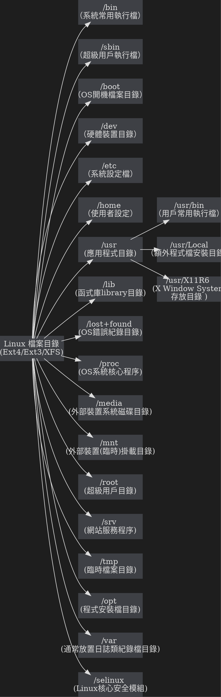

<style>


  /*--------------- view ---------------*/
  body[style],
  body[style*="background-color: white;"] {
    background-color: #444444 !important;

  }

  body {
    color: #abb2bf;
  }

}

  .ui-view-area,
  .markdown-body,
  .ui-content {
    background: #444444;
    color: #abb2bf;
  }


  h1,
  h2,
  h3,
  h4,
  h5,
  h6,
  p {
    color: #ddd;
  }

  hr {
    border-color: #6d6d6d;
  }

  /* form */
  .form-control {
    background: #333;
    color: #fff;

  }

  .form-control::placeholder,
  .form-control::-webkit-input-placeholder,
  .form-control:-moz-placeholder,
  .form-control::-moz-placeholder,
  .form-control:-ms-input-placeholder {
    color: #eee;
  }

  /*--------------- navbar ---------------*/
  .header {
    background-color: #0e0e0e;
    border-color: #0e0e0e;
  }

  .navbar {
    background-color: #0e0e0e;
    border-color: #0e0e0e;
  }

  .navbar a {
    color: #eee !important;
  }

  .navbar .btn-group label {
    background-color: #0e0e0e;
    color: #eee;
    border-color: #555;
  }

  .navbar .btn-group label.btn-default:focus,
  .navbar .btn-group label.btn-default:hover {
    background-color: #2a2a2a;
    color: #eee;
    border-color: #555;
  }


  .navbar .btn-group label.active {
    background-color: #555;
    color: #eee;
    border-color: #555;
  }

  .navbar .btn-group label.active:focus,
  .navbar .btn-group label.active:hover {
    background-color: #555;
    color: #eee;
    border-color: #555;
  }

  .navbar-default .btn-link:focus,
  .navbar-default .btn-link:hover {
    color: #eee;
  }

  .navbar-default .navbar-nav>.open>a,
  .navbar-default .navbar-nav>.open>a:focus,
  .navbar-default .navbar-nav>.open>a:hover {
    background-color: #555;
  }

  .dropdown-header {
    color: #aaa;
  }

  .dropdown-menu {
    background-color: #222;
    border: 1px solid #555;
    border-top: none;
  }

  .dropdown-menu>li>a {
    color: #eee;
  }

  .dropdown-menu>li>a:focus,
  .dropdown-menu>li>a:hover {
    background-color: #555555;
    color: #eee;
  }

  .dropdown-menu .divider {
    background-color: #555;
  }

  .header .open .dropdown-menu {
    background-color: #202020;
  }

  .navbar .announcement-popover {
    background: #4F4F4F;
  }

  .navbar .announcement-popover .announcement-popover-header {
    background: #2e2e2e;
    border-bottom: 1px solid #2e2e2e;
  }

  .navbar .announcement-popover .announcement-popover-body {
    background: #4F4F4F;
    color: #eee;
  }

  .navbar .announcement-popover .announcement-popover-footer {
    background: #4F4F4F;
  }

  .navbar .announcement-area .caption.inverse {
    color: #eee;
  }

  .label-warning {
    background-color: #ffc107;
    color: #212529;
  }

  /*--------------- history / recent ---------------*/
  .list.row-layout li .item {
    border-color: #696c7d;
  }

  .list.row-layout li:nth-last-of-type(1) .item {
    border-bottom: none;
  }

  .list li .item {
    background: #1c1c1c;
  }

  .list li:hover .item,
  .list li:focus .item {
    background: #404040;
  }

  .list li .item h4 {
    color: #fff;
  }

  .list li p {
    color: #ccc;
  }

  .list li p i {
    font-style: normal;
  }

  .list li .item .content .tags span {
    background: #555;
  }

  .list li .item.wide .content .title a,
  .list li .item.wide .content .title a:focus,
  .list li .item.wide .content .title a:hover {
    color: #ddd;
  }

  .ui-item {
    color: #fff;
    opacity: 0.7;
  }

  .ui-item:hover,
  .ui-item:focus {
    opacity: 1;
    color: #fff;
  }

  .list li .item.wide hr {
    border-color: #6d6d6d;
  }

  .overview-widget-group .btn,
  .multi-select-dropdown-menu .ui-dropdown-label,
  .multi-select-dropdown-menu .dropdown-options,
  .form-control {
    border-color: #6d6d6d;
  }

  .multi-select-dropdown-menu .dropdown-options .ui-option:hover {
    background-color: #4d4d4d;
    color: #eee;
  }

  #overview-control-form #overview-keyword-input-container .select2-container {
    background-color: #3e4045 !important;
  }

  #overview-control-form #overview-keyword-input-container .select2-container .select2-choices {
    background-color: #3e4045;
  }

  .search {
    background-color: #3e4045;
    color: #eee;
  }

  .btn.btn-gray {
    background: #1b1b1b;
  }

  .btn.btn-gray:hover {
    background: #4d4d4d;
    color: #eee;
  }

  .search::placeholder,
  .search::-webkit-input-placeholder,
  .search:-moz-placeholder,
  .search::-moz-placeholder,
  .search:-ms-input-placeholder {
    color: #eee;
  }

  .btn.btn-gray {
    border-color: #6d6d6d;
    background: #333;
    color: #eee;
  }

  .select2-default {
    color: #eee !important;
  }

  .select2-results .select2-highlighted {
    background: #4d4d4d;
    color: #eee;
  }

  .select2-container-multi .select2-choices {
    background: #3e4045;
  }

  .select2-container-multi .select2-choices .select2-search-choice {
    background: #131313;
    color: #eee;
    border-color: #555;
    box-shadow: none;
  }

  .btn-default,
  .btn-default:focus {
    color: #eee;
    background-color: #2e2e2e;
    border-color: #6a6a6a;
  }

  .btn-default.active.focus,
  .btn-default.active:focus,
  .btn-default.active:hover,
  .btn-default:active.focus,
  .btn-default:active:focus,
  .btn-default:active:hover,
  .open>.dropdown-toggle.btn-default.focus,
  .open>.dropdown-toggle.btn-default:focus,
  .open>.dropdown-toggle.btn-default:hover {
    background: #737373;
  }

  .btn-default:hover {
    color: #fff;
    background-color: #7d7d7d;
    border-color: #6a6a6a;
  }

  .overview-widget-group .btn.active {
    background-color: #6a6a6a;
    color: #eee;
  }

  .overview-widget-group .btn:hover {
    background-color: #7d7d7d;
    color: #eee;
    border-color: #636363;
  }

  .overview-widget-group .slider.round {
    border-color: #ccc;
  }

  .overview-widget-group .slider.round:before {
    border-color: #ccc;
  }

  .overview-widget-group input:checked+.slider {
    background-color: #ccc;
  }

  .ui-category-description-icon a {
    color: #eee;
  }

  .item .ui-history-pin.active {
    color: #f00;
  }

  .ui-history-close {
    color: #eee;
    opacity: 0.5;
  }

  .pagination>li>a,
  .pagination>li>span {
    color: #eee;
    background-color: #2e2e2e;
    border-color: #6a6a6a;
  }

  .pagination>li>a:hover {
    color: #fff;
    background-color: #7d7d7d;
    border-color: #6a6a6a;
  }

  .pagination>.disabled>a,
  .pagination>.disabled>a:focus,
  .pagination>.disabled>a:hover,
  .pagination>.disabled>span,
  .pagination>.disabled>span:focus,
  .pagination>.disabled>span:hover {
    color: #eee;
    background-color: #2e2e2e;
    border-color: #6a6a6a;
  }

  .pagination.dark>li>a,
  .pagination.dark>li>span {
    color: #aaa;
  }

  /*--------------- settings ---------------*/
  .section .form-horizontal .form-group .btn-default {
    font-size: 16px;
    border-color: #6d6d6d;
    background-color: #333;
    color: #FFF;
  }

  .section .form-horizontal .form-group .btn-default:hover,
  .section .form-horizontal .form-group .btn-default:focus {
    background-color: #737373;
    color: #FFF;
  }

  .section .form-horizontal .form-control:focus {
    border-color: #bbb;
  }

  /*--------------- share view ---------------*/
  #notificationLabel,
  .ui-infobar .btn.ui-edit {
    color: #eee;
    border-color: #6a6a6a;
  }

  .ui-infobar__user-info li {
    color: #bbb;
  }

  footer {
    background: #101010;
    color: #bbb;
    border-top: 1px solid #454545;
  }

  footer a {
    color: #bbb;
  }

  /*--------------- doc view ---------------*/
  .markdown-body h1,
  .markdown-body h2,
  .markdown-body h3,
  .markdown-body h4,
  .markdown-body h5,
  .markdown-body h6,
  .markdown-body hr,
  #doc>h1 {
    color: #ddd;
    border-color: #777 !important;
  }

  .h1 .small,
  .h1 small,
  .h2 .small,
  .h2 small,
  .h3 .small,
  .h3 small,
  .h4 .small,
  .h4 small,
  .h5 .small,
  .h5 small,
  .h6 .small,
  .h6 small,
  h1 .small,
  h1 small,
  h2 .small,
  h2 small,
  h3 .small,
  h3 small,
  h4 .small,
  h4 small,
  h5 .small,
  h5 small,
  h6 .small,
  h6 small {
    color: #ddd;
  }

  .markdown-body p {
    color: #ddd;
  }

  .markdown-body a {
    color: #7bf;
  }

  .markdown-body a code {
    color: #7bf !important;
  }

  .markdown-body ul li,
  .markdown-body ol li {
    color: #ddd;
  }

  .markdown-body blockquote {
    color: #ddd;
    border-left-color: #777;
    font-size: 16px;
  }

  <--.markdown-body code,
  code {
    color: #dfdfdf !important;
    background-color: #424a55;
  }-->

  .markdown-body pre {
    background-color: #1e1e1e;
    border: 1px solid #555 !important;
    color: #dfdfdf;
  }

  blockquote .small,
  blockquote footer,
  blockquote small {
    color: #bbb;
  }

  .mark,
  mark {
    background-color: rgba(255, 255, 0, 0.32) !important;
    color: #ddd;
    margin: .1em;
    padding: .1em .2em;
  }

  /* Todo list */
  .task-list-item-checkbox {
    margin: 0.18em 0 0.2em -1.3em !important;
  }

  .task-list-item input[type=checkbox] {
    -webkit-appearance: none;
    -moz-appearance: none;
    appearance: none;
    position: relative;
    top: -1px;
    margin: 0 1rem 0 0;
    cursor: pointer;
  }

  .task-list-item input[type=checkbox]::before {
    -webkit-transition: all 0.1s ease-in-out;
    -moz-transition: all 0.1s ease-in-out;
    transition: all 0.1s ease-in-out;
    content: "";
    position: absolute;
    left: 0;
    z-index: 1;
    width: 16px;
    height: 16px;
    border: 2px solid #F44336;
  }

  .task-list-item input[type=checkbox]:checked::before {
    -webkit-transform: rotate(-48deg);
    -moz-transform: rotate(-48deg);
    -ms-transform: rotate(-48deg);
    -o-transform: rotate(-48deg);
    transform: rotate(-48deg);
    height: 9px;
    border-color: #00E676;
    border-top-style: none;
    border-right-style: none;
  }

  .task-list-item input[type=checkbox]::after {
    content: "";
    position: absolute;
    top: -0.125rem;
    left: 0;
    width: 16px;
    height: 16px;
    background: #333;
    cursor: pointer;
  }

  /* table */
  .markdown-body table tr {
    background-color: #1e1e1e;
    border-top: none;
    border-bottom: 1px solid rgba(255, 255, 255, 0.3);
  }

  .markdown-body table tr:first-child {
    border-top: 1px solid rgba(255, 255, 255, 0.2);
  }

  .markdown-body table tr:nth-child(2n) {
    background-color: #333;
  }

  .markdown-body table tr th {
    color: #64B5F6;
  }

  .markdown-body table th,
  .markdown-body table td {
    border: none;
  }

  .markdown-body table tr th:first-child,
  .markdown-body table tr td:first-child {
    border-left: 1px solid rgba(255, 255, 255, 0.1);
  }

  .markdown-body table tr th:last-child,
  .markdown-body table tr td:last-child {
    border-right: 1px solid rgba(255, 255, 255, 0.1);
  }

  .markdown-body table tr td {
    color: #ddd;
  }


  .markdown-body pre.flow-chart,
  .markdown-body pre.sequence-diagram,
  .markdown-body pre.graphviz,
  .markdown-body pre.mermaid,
  .markdown-body pre.abc {
    background-color: #1e1e1e;
    color: #ddd;


  }
              .markdown-body pre.gri {
                stroke: lightgrey;
                opacity: 0.3;
                shape-rendering: crispEdges;
            }
            .markdown-body pre.grid path {
                stroke-width: 0;
            }
  


  /* alert */
  .alert h1,
  .alert h2,
  .alert h3,
  .alert h4,
  .alert h5,
  .alert h6,
  .alert p,
  .alert ul li,
  .alert ol li {
    color: #31708f;
  }

  .alert a {
    color: #002752;
    font-weight: 700;
  }

  .alert h1:first-child,
  .alert h2:first-child,
  .alert h3:first-child,
  .alert h4:first-child,
  .alert h5:first-child,
  .alert h6:first-child {
    margin-top: 0;
  }

  .markdown-body .alert>p {
    margin-top: 0px;
    margin-bottom: 10px;
  }

  .markdown-body .alert>ul,
  .markdown-body .alert>ol {
    margin-bottom: 16px;
  }

  .markdown-body .alert>*:last-child {
    margin-bottom: 0;
  }

  .alert-warning {
    background-color: #fff3cd;
    border-color: #ffeeba;
  }

  /* scroll bar */
  .ui-edit-area .ui-resizable-handle.ui-resizable-e {
    background-color: #303030;
    border: 1px solid #303030;
    box-shadow: none;
  }

  /* info bar */
  .ui-infobar {
    color: #999;
  }

  /* permission */
  .permission-popover-btn-group .btn.focus,
  .permission-popover-btn-group .btn:active,
  .permission-popover-btn-group .btn:focus,
  .permission-popover-btn-group .btn.active {
    background-color: #6a6a6a !important;
    color: #eee !important;
    border-color: #555 !important;
  }

  .permission-popover-btn-group .btn:hover,
  .permission-popover-btn-group .btn.active:hover {
    background-color: #7d7d7d !important;
    color: #eee !important;
    border-color: #636363 !important;
  }

  .ui-delete-note a:hover,
  .ui-delete-note a:focus,
  .ui-delete-note a:active {
    background-color: #dc3545 !important;
  }

  .ui-invitee-invite {
    border-color: #6a6a6a !important;
  }

  .ui-invitee-invite:hover,
  .ui-invitee-invite:focus {
    background-color: #737373;
    color: #eee !important;
  }

  .ui-invitee.ui-invitee-list .ui-invitee-remove,
  .ui-invitee.ui-invitee-list .ui-invitee-remove:hover,
  .ui-invitee.ui-invitee-list .ui-invitee-remove:focus,
  .ui-invitee.ui-invitee-list .ui-invitee-remove:active {
    background-color: #dc3545;
    border: 1px solid #dc3545;
  }

  .select2-container {
    background: #202020;
  }

  .select2-container-multi .select2-choices .select2-search-field input {
    color: #eee;
  }

  .select2-container-multi .select2-choices .select2-search-field input.select2-active {
    color: #000;
  }

  .select2-drop {
    background: #202020;
    color: #eee;
  }

  .select2-results .select2-no-results,
  .select2-results .select2-searching,
  .select2-results .select2-ajax-error,
  .select2-results .select2-selection-limit {
    background: #202020;
  }

  /* table of contents block*/
  .ui-toc-dropdown {
    width: 42vw;
    max-height: 90vh;
    overflow: auto;
    text-align: inherit;
  }

  /* table of contents text*/
  .ui-toc-dropdown .nav>li>a {
    font-size: 14px;
    font-weight: bold;
    color: #ddd;
  }

  /* table of contents text: active*/
  .ui-toc-dropdown .nav>.active:focus>a,
  .ui-toc-dropdown .nav>.active:hover>a,
  .ui-toc-dropdown .nav>.active>a {
    color: #7bf;
    border-left-color: #7bf;
  }

  /* table of contents text: focus, hover*/
  .ui-toc-dropdown .nav>li>a:focus,
  .ui-toc-dropdown .nav>li>a:hover {
    color: #7bf;
    border-left-color: #7bf;
  }

  /* drop down floating table of contents */
  .ui-toc-dropdown.dropdown-menu {
    background: #333;
  }

  .toc-menu a {
    color: #ddd;
  }

  .toc-menu a:focus,
  .toc-menu a:hover {
    color: #7bf;
  }


  /*--------------- editor ---------------*/
  .cm-m-markdown {
    color: #ddd;
  }

  .cm-s-one-dark .cm-header,
  .cm-m-xml.cm-attribute {
    color: #ffa653;
  }

  .cm-s-one-dark .cm-string,
  .cm-s-one-dark .cm-variable-2 {
    color: #7bf;
  }

  .cm-m-markdown.cm-variable-3 {
    color: #ff7e7e;
  }

  .cm-s-one-dark .cm-link {
    color: #b0ee83;
  }

  .cm-s-one-dark .CodeMirror-linenumber {
    color: #666;
  }

  .cm-strong {
    color: #f4511e;
  }

  .cm-s-one-dark .cm-comment {
    color: #a9a9a9;
  }

  .cm-matchhighlight {
    color: #ffea00;
  }

  .cm-positive {
    color: #11bf64;
  }

  .cm-negative {
    color: #ff3e3e;
  }

  .dropdown-menu.CodeMirror-other-cursor {
    border: 2px solid #4d4d4d;
    background-color: #202020;
  }

  .dropdown-menu.CodeMirror-other-cursor li a {
    color: #ececec;
  }

  /*--------------- book mode ---------------*/
  .topbar {
    background: #1e1e1e;
  }

  .btn.focus,
  .btn:focus,
  .btn:hover {
    color: #aaa;
  }

  .summary {
    background: #1e1e1e;
  }

  .summary,
  .toolbar {
    background: #1e1e1e !important;
    border-color: #4d4d4d !important;
  }

  .toolbar i {
    color: #fff;
  }

  .summary h1,
  .summary h2,
  .summary h3 .summary hr {
    color: #ddd;
    border-color: #777 !important;
  }

  .summary .nav>li>a {
    color: #7bf;
  }

  .summary .nav-pills>li.active>a,
  .summary .nav-pills>li.active>a:focus,
  .summary .nav-pills>li.active>a:hover {
    color: #ff9100;
  }

  .ui-summary-search {
    font-size: 16px;
    border: 1px solid #6D6D6D;
    background-color: #333;
    color: #FFF;
  }

  .summary h1,
  .summary h2,
  .summary h3,
  .summary h4,
  .summary h5,
  .summary h6 {
    border-color: #454545;
  }

  /* fix body background color to dark */
  div[class$=container-mask] {
    background: #1e1e1e;
    z-index: 1;
    display: block;
  }

  /* notification */
  .dropdown.ui-notification .ui-notification-label,
  .dropdown.ui-invitee .ui-invitee-label {
    color: #eee;
    border-color: #6a6a6a;
  }

  .ui-notification .dropdown-menu {
    border-top: 1px solid #555;
  }

  /*--------------- help ---------------*/
  .modal-header {
    background-color: #2a2a2a;
  }

  .panel-default {
    border-color: #6d6d6d;
  }

  .panel-default>.panel-heading {
    background-color: #2a2a2a;
    color: #eee;
    border-color: #6d6d6d;
  }

  .panel-body {
    background: #2e2e2e;
  }

  .panel-body a {
    color: #7bf;
  }

  .table>tbody>tr>td,
  .table>tbody>tr>th,
  .table>tfoot>tr>td,
  .table>tfoot>tr>th,
  .table>thead>tr>td,
  .table>thead>tr>th {
    border-color: #6d6d6d;
  }

  /*--------------- comment ---------------*/
  .ui-comment-container .ui-comment-header {
    background-color: #2a2a2a;
    color: #eee;
    border-color: #6d6d6d;
  }

  .ui-comment-container {
    background-color: #2e2e2e;
    border-color: #6d6d6d;
  }

  .ui-comment-container .ui-comments-container .ui-comment .comment-author {
    color: #eee;
  }

  .ui-comment-container .ui-comments-container .ui-comment .timestamp {
    color: #aaa;
  }

  .ui-comment-container .ui-comments-container .ui-comment .comment-content {
    color: #eee;
  }

  .ui-comment-container .ui-comments-container .ui-comment .comment-menu {
    color: #eee;
  }

  .ui-comment-container .ui-comments-container .ui-comment .comment-menu .comment-dropdown-menu {
    background: #222;
    color: #eee;
    border-color: #555;
  }

  .ui-comment-container .ui-comments-container .ui-comment .comment-menu .comment-dropdown-menu>div:hover {
    background-color: #555555;
    color: #eee;
  }

  .ui-comment-container .ui-comments-container .ui-comment .comment-menu:hover,
  .ui-comment-container .ui-comments-container .ui-comment .comment-menu:active,
  .ui-comment-container .ui-comments-container .ui-comment .comment-menu.active {
    background-color: #737373;
    color: #eee;
  }

  .ui-comment-container .ui-comment-input-container {
    background-color: #3c3c3c;
  }

  .ui-comment-container textarea {
    background-color: #3e4045;
    color: #eee;
    border: 1px solid #6d6d6d;
  }

  .ui-comment-container textarea::placeholder,
  .ui-comment-container textarea::-webkit-input-placeholder,
  .ui-comment-container textarea:-moz-placeholder,
  .ui-comment-container textarea::-moz-placeholder,
  .ui-comment-container textarea:-ms-input-placeholder {
    color: #eee;
  }

  @keyframes highlight {
    0% {
      background-color: #3c3c3c;
    }

    30% {
      background-color: #3c3c3c;
    }

    100% {
      background-color: transparent;
    }
  }

  /*--------------- template ---------------*/
  .template-content .modal-header {
    background: #2a2a2a;
  }

  .template-content .close {
    color: #fff;
  }

  .template-content .modal-title {
    color: #eee;
  }

  .template-content .ui-templates-container {
    border-color: #6d6d6d;
  }

  .ui-templates-container .ui-create-template-btn {
    background: #446fab;
    color: #fff;
  }

  .ui-template-list-filter .ui-template-list-filter-label,
  .ui-template-list-filter .ui-template-list-filter-label:hover {
    color: #eee;
  }

  .ui-template-list .list-group-item.active {
    background: #4d4d4d;
  }

  .ui-template-list .list-group-item.active:focus {
    background: #4d4d4d !important;
  }

  .list-group-item.active,
  .list-group-item.active:focus,
  .list-group-item.active:hover {
    color: #eee;
  }

  .ui-template-list .list-group-item .list-group-item-heading {
    color: #eee;
  }

  .ui-template-list .list-group-item.active .list-group-item-heading {
    color: #eee;
  }

  .ui-template-list .list-group-item:hover {
    background: #4d4d4d !important;
  }

  .ui-template-item-menu {
    color: #eee !important;
  }

  .ui-template-list .list-group-item {
    color: #fff;
  }

  .ui-template-list .list-group-item .dropdown-container.open {
    background-color: #2a2a2a;
  }

  .ui-template-list .list-group-item .dropdown-container:hover {
    background-color: #2a2a2a !important;
  }

  .template-menu .more-template {
    border-color: #6d6d6d;
  }

  .template-menu .more-template:hover {
    color: #eee;
    border-color: #6d6d6d;
  }

  /*--------------- code mirror ---------------*/
  .modal-content {
    background: #1f2226;
  }

  .modal-header {
    border-bottom: 1px solid #46484f;
  }

  .modal-footer {
    border-top: 1px solid #46484f;
  }

  a.list-group-item {
    background: #1f2226;
    color: #ddd;
    border: 1px solid #46484f;
  }

  a.list-group-item .list-group-item-heading {
    color: #ddd;
  }

  a.list-group-item:focus,
  a.list-group-item:hover {
    background: #434651;
    color: #ddd;
  }

  button.close {
    color: #ddd;
    opacity: .5;
  }

  .close:focus, .close:hover {
    color: #fff;
    opacity: .8;
  }

  .CodeMirror {
    background: #1f2226;
  }

  .CodeMirror-gutters {
    background: #1f2226;
    border-right: 1px solid rgba(204, 217, 255, 0.1);
  }

  .cm-s-default .cm-comment {
    color: #888;
  }

  .cm-s-default .cm-quote {
    color: #ddd;
  }

  .cm-s-default .cm-header {
    color: #ffa653;
  }

  .cm-s-default .cm-link {
    color: #b0ee83;
  }

  .cm-s-default .cm-string,
  .cm-s-default .cm-variable-2 {
    color: #7bf;
  }

  .cm-s-default .cm-def {
    color: #c678dd;
  }

  .cm-s-default .cm-number,
  .cm-s-default .cm-attribute,
  .cm-s-default .cm-qualifier,
  .cm-s-default .cm-plus,
  .cm-s-default .cm-atom {
    color: #eda35e;
  }

  .cm-s-default .cm-property,
  .cm-s-default .cm-variable,
  .cm-s-default .cm-variable-3,
  .cm-s-default .cm-operator,
  .cm-s-default .cm-bracket {
    color: #f76e79;
  }

  .cm-s-default .cm-keyword,
  .cm-s-default .cm-builtin,
  .cm-s-default .cm-tag {
    color: #98c379;
  }

  .modal-title {
    color: #ccc;
  }

  .modal-body {
    color: #ccc !important;
  }

  div[contenteditable]:empty:not(:focus):before {
    color: #aaa;
  }

  .CodeMirror pre {
    color: #ddd;
  }

  .CodeMirror pre span[style^="background-color: rgb(221, 251, 230)"] {
    background-color: #288c27 !important;
  }

  .CodeMirror pre span[style^="background-color: rgb(249, 215, 220)"] {
    background-color: #a52721 !important;
  }

  /*------- code highlight: Visual Stutdio Code theme for highlight.js -------*/
  .hljs {
    background: #1E1E1E;
    color: #DCDCDC;
  }

  .hljs-keyword,
  .hljs-literal,
  .hljs-symbol,
  .hljs-name {
    color: #569CD6;
  }

  .hljs-link {
    color: #569CD6;
    text-decoration: underline;
  }

  .hljs-built_in,
  .hljs-type {
    color: #4EC9B0;
  }

  .hljs-number,
  .hljs-class {
    color: #B8D7A3;
  }

  .hljs-string,
  .hljs-meta-string {
    color: #D69D85;
  }

  .hljs-regexp,
  .hljs-template-tag {
    color: #d16969;
  }

  .hljs-title {
    color: #dcdcaa;
  }

  .hljs-subst,
  .hljs-function,
  .hljs-formula {
    color: #DCDCDC;
  }

  .hljs-comment,
  .hljs-quote {
    color: #57A64A;
  }

  .hljs-doctag {
    color: #608B4E;
  }

  .hljs-meta,
  .hljs-meta-keyword,
  .hljs-tag {
    color: #9B9B9B;
  }

  .hljs-variable,
  .hljs-template-variable {
    color: #BD63C5;
  }

  .hljs-params,
  .hljs-attr,
  .hljs-attribute,
  .hljs-builtin-name {
    color: #9CDCFE;
  }

  .hljs-section {
    color: gold;
  }

  .hljs-emphasis {
    font-style: italic;
  }

  .hljs-strong {
    font-weight: bold;
  }

  /*
  .hljs-code {
    font-family:'Monospace';
  }
  */

  .hljs-bullet,
  .hljs-selector-tag,
  .hljs-selector-id,
  .hljs-selector-class,
  .hljs-selector-attr,
  .hljs-selector-pseudo {
    color: #D7BA7D;
  }

  .hljs-addition {
    background-color: #155a36;
    color: #dfdfdf;
    display: inline-block;
    width: 100%;
  }

  .hljs-deletion {
    background-color: #872e2e;
    color: #dfdfdf;
    display: inline-block;
    width: 100%;
  }

  /*---------- code highlight: Visual Stutdio Code theme for Prism.js ----------*/
  code[class*="language-"],
  pre[class*="language-"] {
    color: #DCDCDC;
  }

  :not(pre)>code[class*="language-"],
  pre[class*="language-"] {
    background: #1E1E1E;
  }

  .token.comment,
  .token.block-comment,
  .token.prolog,
  .token.cdata {
    color: #57A64A;
  }

  .token.doctype,
  .token.punctuation {
    color: #9B9B9B;
  }

  .token.tag,
  .token.entity {
    color: #569CD6;
  }

  .token.attr-name,
  .token.namespace,
  .token.deleted,
  .token.property,
  .token.builtin {
    color: #9CDCFE;
  }

  .token.function,
  .token.function-name {
    color: #dcdcaa;
  }

  .token.boolean,
  .token.keyword,
  .token.important {
    color: #569CD6;
  }

  .token.number {
    color: #B8D7A3;
  }

  .token.class-name,
  .token.constant {
    color: #4EC9B0;
  }

  .token.symbol {
    color: #f8c555;
  }

  .token.rule {
    color: #c586c0;
  }

  .token.selector {
    color: #D7BA7D;
  }

  .token.atrule {
    color: #cc99cd;
  }

  .token.string,
  .token.attr-value {
    color: #D69D85;
  }

  .token.char {
    color: #7ec699;
  }

  .token.variable {
    color: #BD63C5;
  }

  .token.regex {
    color: #d16969;
  }

  .token.operator {
    color: #DCDCDC;
    background: transparent;
  }

  .token.url {
    color: #67cdcc;
  }

  .token.important,
  .token.bold {
    font-weight: bold;
  }

  .token.italic {
    font-style: italic;
  }

  .token.entity {
    cursor: help;
  }

  .token.inserted {
    color: green;
  }

  /*---------- code highlight: dark theme for Gist ----------*/
  .gist .gist-file {
    border: 1px solid #555;
  }

  .gist .gist-data {
    background-color: #1e1e1e;
    border-bottom: 1px solid #555;
  }

  .gist .gist-meta {
    background-color: #424a55;
    color: #eee;
  }

  .gist .gist-meta a {
    color: #eee;
  }

  .gist .highlight {
    color: #eee;
    background-color: #1e1e1e;
  }

  .gist .blob-num {
    color: #afafaf;
  }

  .gist .blob-code-inner {
    color: #dfdfdf;
  }

  .pl-mb {
    color: #fff !important;
  }

  .pl-c {
    color: #57A64A !important;
  }

  /* comment */
  .pl-ent {
    color: #569CD6 !important;
  }

  /* entity */
  .pl-e {
    color: #9CDCFE !important;
  }

  .pl-en {
    color: #4EC9B0 !important;
  }

  /* entity attribute */
  .pl-smi {
    color: #9CDCFE !important;
  }

  .pl-k {
    color: #569cd6 !important;
  }

  .pl-c1,
  .pl-s .pl-v {
    color: #4EC9B0 !important;
  }

  .pl-pds,
  .pl-s,
  .pl-s .pl-pse .pl-s1,
  .pl-sr,
  .pl-sr .pl-cce,
  .pl-sr .pl-sra,
  .pl-sr .pl-sre,
  .pl-s .pl-s1 {
    color: #D69D85 !important;
  }

  .pl-s .pl-s1 .pl-pse {
    color: #c5dbff !important;
  }

  /* strings */
  .diff-table .pl-c,
  .diff-table .pl-ent,
  .diff-table .pl-e,
  .diff-table .pl-en,
  .diff-table .pl-pds,
  .diff-table .pl-s,
  .diff-table .pl-s .pl-s1,
  .diff-table .pl-s .pl-pse .pl-s1,
  .diff-table .pl-sr,
  .diff-table .pl-sr .pl-cce,
  .diff-table .pl-sr .pl-sra,
  .diff-table .pl-sr .pl-sre,
  .diff-table .pl-k,
  .diff-table .pl-smi,
  .diff-table .pl-c1,
  .diff-table .pl-v {
    color: #eee !important;
  }

 </style>


###### tags: `Plus` `Linux`

# Linux 入門基礎:

## CnetOS虛擬機架設筆記:

### VirtualBox 安裝CnetOS 6/7 說明

1.下載ISO鏡像並安裝至VM當中(建議設置RedHat Linux)
2.VirtualBox設定:顯示→圖型控制器→[VBoxVGA]
3.依據官方文檔安裝VirtualBox Guest Additions:
https://www.if-not-true-then-false.com/2010/install-virtualbox-guest-additions-on-fedora-centos-red-hat-rhel/


### Linux 檔案系統與磁碟目錄說明

```
/etc, /bin, /dev, /lib, /sbin 這五個次目錄都要與根目錄一起，不可為獨立的 partition。
```

### CentOS 遠端連線推薦軟體(XShell5+XFTP5)

> > CentOS主機端所需:
> > 主機端需打開sshd服務(Port 22)
> > 
> > 在客戶端上安裝XShell5+XFTP5 :　https://www.netsarang.com/en/xshell/#pll_switcher
> 
> **操作步驟(1) :**
> 系統工具 ➦ [終端機/Terminal] ➦ 「📥 setup ↵」  ➦ 系統服務 ➦ [☑sshd]
> 
> **操作步驟(2) :**
> 取得區域網路IP或網際網路IP
> 
> **操作步驟(3) :**
> 打開Xshell並輸入主機端帳密
> 
> **操作步驟(4) :**
> 測試終端機/Terminal指令是否正常運作，「📥 logout ↵」進行登出
> 
> **操作步驟(5) :**
> 打開Xftp並輸入主機端帳密
> 
> **操作步驟(6) :**
> 若遇主機端檔案編碼問題可由[選項]中修改
> 
> 
### Fedora/CentOS/RHEL 設定自動開機登入主機
> > 若因測試可設定自動登入主機
> > 
> **操作步驟(1) :** 以 root 的使用者編輯 ==`` /etc/gdm/custom.conf ``==
> **操作步驟(2) :** 在文檔中 ==`` [daemon] ``== 和 ==`` [security] ``== 寫入設定
> ``` inf
> [daemon]
>  AutomaticLoginEnable=true
>  AutomaticLogin=root
>  # 此處為自動登入的帳號
>  TimedLoginEnable=true
>  TimedLogin=root
>  TimedLoginDelay=7
> 
> [security]
>  AllowRoot=true
>  # 如果是 root 自動登入，則必須加入此行，設定為true
>  # 一般使用者帳戶，此行可以不用設定，預設為false
>  ```
>  
>  
### Fedora/CentOS/RHEL 設定自動開機連上網卡
> > 設定開機自動連上網卡rth0
> >
> **操作步驟(1) :** 以 root 的使用者編輯 ==`` /etc/sysconfig/network-scripts/ifcfg-eth0``==
> **操作步驟(2) :** 在文檔中的 ==`` ONBOOT = no``== 改成 ==`` ONBOOT = yes ``== 寫入設定
> 
> 
> 
<br>
<br>

## **Linux 終端機常用命令列:**

### 終端機啟動關閉命令列
> **關機、重啟、登出**
> > | **命令** | **說明** |
> > | --- | --- | --- |
> > | halt | 立即重關機 | 
> > | reboot | 立即重開機 | 
> > | sync | 將記憶體內的資料儲存在磁碟內 | 
> > | shutdown -h now| 立即重關機 | 
> > | shutdown -h 1| 1分鐘後關機 | 
> > | shutdown -r now| 立即重開機 | 
> > 

### 終端機基本命令列
> > | 命令˰˰˰˰˰˰˰˰˰˰˰˰˰˰˰˰˰˰˰˰˰˰˰˰˰˰˰˰˰˰˰˰˰˰˰˰˰˰˰˰˰˰˰|  說明 | 備註|
> > | --- | --- | --- |
> > | man ls| 顯示: ==`` ls ``== 指令說明 | |
> > | history| 查詢已經執行過的指令 | |
> > | history 10| 查詢已經執行過的前10個指令 | |
> > | !10| 執行已經執行過的第10號指令 | |
> > | echo "$HOME"| 顯示 ==`$HOME`== 變數字串 | |
> > | date | 顯示當前時間 | |
> > | date +"%Y%m%d-%H:%M:%S"| 顯示當前時間(格式為:20001224-23:59:59) | |
> > | cal | 顯示當前月曆 | |
> > | cal 2090| 顯示2090當年的月曆 | |
> > | iostat -t| 顯示CPU與磁碟使用狀況 | |
> > | ifconfig | 查看網路狀態 |
> > | service network restart | 重起網路連接 |

### 終端機用戶管理命令列

> > 
> **[創建/設置/刪除/查詢/切換]用戶指令**
> > | 命令˰˰˰˰˰˰˰˰˰˰˰˰˰˰˰˰˰˰˰˰˰˰˰˰˰˰˰˰˰˰˰˰˰˰˰|  說明 | 備註|
> > | --- | --- | --- |
> > | useradd newuser | 創建用戶ID: ==`` newuser ``== | 功能僅創建用戶，未設置密碼用戶將不能登入 |
> > | useradd newuser -d "/TTT" | 創建用戶並將設置該用戶目錄 ==`` /TTT ``== | 該指令不會自動創建子目錄 |
> > | useradd newuser -g Gr | 創建用戶與用戶群組 ==`` Gr ``== | 用戶群組可以是已經存在 |
> > | passwd newuser| 為用戶ID: ==`` newuser ``== 設定密碼| 若不輸入使用者ID，該指令為更改登入用戶密碼|
> > | userdel newuser| 刪除用戶ID: ==`` newuser ``== |僅刪除用戶帳號，其目錄資料仍保留|
> > | userdel newuser -r| 刪除用戶與用戶目錄 ||
> > | id newuser | 查詢用戶 ==`` uid、gid、group | 若無該ID則會返回提示|
> > | su - newuser | 切換用戶ID ==`` newuser ``== ||
> > | whoami | 查詢現在所登入帳號 ||
> > * 用戶與系統密碼資料放置於檔案 ==`` /etc/passwd ``== 當中
> > 
> 
> > 
> **修改用戶指令**
> > | 命令˰˰˰˰˰˰˰˰˰˰˰˰˰˰˰˰˰˰˰˰˰˰˰˰˰˰˰˰˰˰˰˰˰˰˰˰˰˰˰˰˰|  說明˰˰˰˰˰˰˰˰˰˰˰˰˰˰˰˰˰˰˰˰˰˰˰˰˰˰˰˰˰˰˰˰˰˰˰˰˰˰˰˰˰˰˰˰˰˰˰˰˰˰˰˰˰˰˰˰˰˰˰˰˰˰ |
> > | --- | --- | --- |
> > | usermod -s(new shell path)(username) | 修改用戶ID: ==`` username ``== Shell資訊 |
> > | usermod -d(new home directory)(username) | 修改用戶ID: ==`` username ``== 目錄 |
> > | usermod -e MM/DD/YY username | 修改用戶ID: ==`` username ``== 有效期 |
> > | usermod -g GGroup username | 修改用戶ID: ==`` username ``== 所在群組為 ==``GGroup``== |
> > | groupadd GGroup | 創建群組ID: ==`` GGroup ``== | |


### 終端機檔案管理命令列
> **常見檔案目錄指令**
> > | 命令˰˰˰˰˰˰˰˰˰˰˰˰˰˰˰˰˰˰˰˰˰˰˰˰˰˰˰˰˰˰˰˰˰˰˰˰˰˰˰˰˰˰˰˰|  說明 | 備註|
> > | --- | --- | --- |
> > | ==`` pwd ``== | 顯示當前目錄的絕對路徑 |  |
> > | ==`` ls ``== | 列出當前目錄的檔案訊息 |  |
> > | ==`` ls -l ``== | 列出當前目錄的檔案訊息包括隱藏檔案 |  |
> > | ==`` ls -a ``== | 列出當前目錄的檔案訊息(列表顯示) |  |
> > | ==`` ls -lh ``== | 列出當前目錄的檔案(顯示檔案大小) |  |
> > | ==`` ls -lt ``== | 列出當前目錄的檔案(以最新修改時間排列) |  |
> > | ==`` ls -lSr ``== | 列出當前目錄的檔案(以最大檔案排列) |  |
> > | ==`` cd .. ``== | 回到上一層目錄 |  |
> > | ==`` cd ../home ``== | 回到當前目錄上一層之下的/home目錄 |  |
> > | ==`` cd /usr/lib ``== | 直接進入 ==`` /usr/lib ``== 目錄 |  |
> > | ==`` cd /usr/lib ``== | 直接進入 ==`` /usr/lib ``== 目錄 |  |
> > | ==`` mkdir /home/123 ``== | 直接創建 ==`` /home/123 ``== 目錄 | 該指令僅能創建一層子目錄 |
> > | ==`` mkdir -p /home/123/ABCD ``== | 直接創建 ==`` /home/123/ABCD ``== 目錄 | 該指令可創建多層子目錄 |
> > | ==`` rmdir /home/123 ``== | 刪除 ==`` /home/123 ``== 目錄(必須為空) | 該指令僅能刪除無檔案目錄 |
> > | ==`` rm -rf /home/123/ABCD ``== | 刪除 ==`` /home/123 ``== 目錄與該目錄內所有檔案 |  |
> > | ==`` touch /home/test.txt``== | 直接創建 ==`` /home/test.txt ``== 空檔案 | 目錄必須存在 |
> > | ==`` cp s/test.txt d/copy.txt  ``== | 複製當前目錄檔案 ==`` a/test.txt ``== 到 ==`` d/copy.txt ``== | 目錄必須存在 |
> > | ==`` cp -r /home/s/ /home/d/ ``== | 複製目錄 ==`` /home/s/ ``== 內所有檔案到 ==`` /home/d/  ``== | 目錄必須存在 |
> > | ==`` \cp -r /home/s/ /home/d/ ``== | 複製目錄 ==`` /home/s/ ``== 內所有檔案到 ==`` /home/d/  ``==(過程中不產生提示直接覆蓋已存在檔案) | 目錄必須存在 |
> > | ==`` rm /home/test.txt ``== | 刪除 ==`` /home/test.txt ``== 檔案 |  |
> > | ==`` rm -r /home/123/ ``== | 刪除目錄 ==`` /home/123/ ``== 檔案(過程中檔案列表依序提示) |  |
> > | ==`` mv s/test.txt d/copy.txt  ``== | 移動當前目錄檔案 ==`` a/test.txt ``== 到並重新命名 ==`` d/copy.txt ``== | 目錄必須存在 |
> > | ==`` mv s/test.txt d/  ``== | 移動當前目錄檔案 ==`` a/test.txt ``== 到 ==`` d/ ``== | 目錄必須存在 |
> > | ==`` ln -s /home/test.txt TestLink  ``== | 創建一個連結檔 ==`` TestLink ``== 捷徑指向 ==`` /home/test ``== | 可以指向目錄，注意結尾 ==`/`== 符號的使用 |
> > 

> **常見檔案瀏覽指令**
> > | 命令˰˰˰˰˰˰˰˰˰˰˰˰˰˰˰˰˰˰˰˰˰˰˰˰˰˰˰˰˰˰˰˰˰˰˰˰˰˰˰˰|  說明˰˰˰˰˰˰˰˰˰˰˰˰˰˰˰˰˰˰˰˰˰˰˰˰˰˰˰˰˰˰˰˰˰˰˰ | 備註|
> > | --- | --- | --- |
> > | ==`` cat /home/test.txt ``== | 瀏覽檔案 ==`` /home/test.txt ``== |  |
> > | ==`` cat -n /home/test.txt ``== | 瀏覽檔案 ==`` /home/test.txt ``== (顯示行數) |  |
> > | ==` cat -n /home/test.txt|more`== | 瀏覽檔案 ==`` /home/test.txt ``== (顯示行數並分頁瀏覽) | 瀏覽中可按q離開 |
> > | ==`` less /home/test.txt ``== | 瀏覽檔案 ==`` /home/test.txt ``== (分頁顯示瀏覽檔案) | less指令是逐頁讀取檔案 |
> > | ==`` head -n5 /home/test.txt ``== | 顯示檔案 ==`` /home/test.txt ``== 最前 ==`5`== 行內容 |  |
> > | ==`` tail -n5 /home/test.txt ``== | 顯示檔案 ==`` /home/test.txt ``== 最後 ==`5`== 行內容 |  |
> > | ==`` tail -f /home/test.txt ``== | 監視檔案 ==`` /home/test.txt ``== 的寫入/更新內容 | [Ctrl]+[c]可退出 |

> **常見檔案尋找指令**
> > | 命令˰˰˰˰˰˰˰˰˰˰˰˰˰˰˰˰˰˰˰˰˰˰˰˰˰˰˰˰˰˰˰˰˰˰˰˰˰˰˰˰|  說明˰˰˰˰˰˰˰˰˰˰˰˰˰˰˰˰˰˰˰˰˰˰˰˰˰˰˰˰˰˰˰˰˰˰˰ | 備註|
> > | --- | --- | --- |
> > | ==`` find /home -name *txt ``== | 查詢目錄 ==`` /home ``== 中所有名稱包含 ==`*txt`== 的檔案(顯示絕對路徑) |  |
> > | ==`` find /root -user root ``== | 查詢目錄 ==`` /root ``== 中檔案所有者為 ==`root`== 的檔案(顯示絕對路徑) |  |
> > | ==`` find /home -size +20M ``== | 查詢目錄 ==`` /home ``== 中所有大於 ==`20M`== 的檔案(顯示絕對路徑) |  |
> > | ==`` find /home -size 20M ``== | 查詢目錄 ==`` /home ``== 中所有等於 ==`20M`== 的檔案(顯示絕對路徑) |  |
> > | ==`` find /home -size -20M ``== | 查詢目錄 ==`` /home ``== 中所有小於 ==`20M`== 的檔案(顯示絕對路徑) |  |
> > | ==`` updatedb ``== | 創建或更新檔案目錄查詢索引 | 系統管理原 |
> > | ==`` locate *.txt ``== | 查詢當前目錄中所有名稱包含 ==`*txt`== 的檔案(顯示絕對路徑) | 以updatedb做為查詢依據 |
> > | ==`` grep "文字" *.txt ``== | 查詢當前目錄中所包含 ==`` 文字 ``== 字串的檔案且檔名為 ==`*.txt`== 的檔案(顯示查詢檔名與字串) | |
> > | ==`` grep -n "文字" *.txt ``== | 查詢當前目錄中所包含 ==`` 文字 ``== 字串(顯示行數)的檔案且檔名為 ==`*.txt`== 的檔案(顯示查詢檔名與字串) | |
> > | ==`` grep -i "文字" *.txt ``== | 查詢當前目錄中所包含 ==`` 文字 ``== 字串(忽略大小寫)的檔案且檔名為 ==`*.txt`== 的檔案(顯示查詢檔名與字串) | |
> >  ls -l ==`/home`== ==`|grep "^d"`== | 列出 ==`/home`== 目錄中的所有資料夾  |

> **常見壓縮/解壓縮指令**
> > | 命令˰˰˰˰˰˰˰˰˰˰˰˰˰˰˰˰˰˰˰˰˰˰˰˰˰˰˰˰˰˰˰˰˰˰˰˰˰˰˰˰˰˰˰˰˰˰˰˰˰˰˰˰˰˰˰˰|  說明˰˰˰˰˰˰˰˰˰˰˰˰˰˰˰˰˰˰˰˰˰˰˰˰˰˰˰˰˰˰˰˰˰˰˰˰˰˰˰˰˰˰˰˰˰˰˰˰˰˰˰˰˰˰˰˰˰˰˰ | 備註|
> > | --- | --- | --- |
> > | gzip ==`` /home/text.txt ``== | 將 ==`` /home/text.txt ``== 檔案壓縮並輸出至 ==`/home/text.txt.gz`== (原始檔案將不保留) |  |
> > | gunzip ==`` /home/text.txt.gz ``== | 將 ==`` /home/text.txt.gz ``== 檔案解壓縮並輸出至 ==`/home`== 中 (原壓縮檔將不保留) |  |
> > | zip ==`` test.zip ``== ==`` /home/text.txt ``== | 將 ==`` /home/text.txt ``== 檔案壓縮至當前目錄並命名 ==`test.zip`== | 若zip已存在，壓縮檔案將會新增或更新 |
> > | zip -r ==`` test.zip ``== ==`` /home/Folder/ ``== | 將 ==`` /home/Folder/  ``== 內之檔案壓縮至當前目錄並命名 ==`test.zip`== | 若zip已存在，壓縮檔案將會新增或更新|
> > | unzip -d ==`` /home/Folder/``== ==`` /home/test.zip ``== | 將 ==`` /home/test.zip ``== 檔案解壓縮並輸出至 ==`/home/Folder/`== 中 | 解壓縮目錄必須存在 |
> > | tar -zcvf ==`` test.tar.gz ``== ==`` /home/Folder/ ``== | 將 ==`` /home/Folder/  ``== 內之檔案壓縮至當前目錄並命名 ==`test.tar.gz`== | 若壓縮檔已存在，壓縮檔案將會新增或更新|
> > | tar -zxvf ==`` test.tar.gz ``== -C ==`` /home/Folder/ ``== | 將 ==`` /home/test.zip ``== 檔案解壓縮並輸出至 ==`/home/Folder/`== 中 | 解壓縮目錄必須存在 |


### **終端機輸入與輸出重新導向**


### **修改 Linux root 用戶密碼**
> **Linux Runlevel**
> 過去的 systemV 使用的是一個稱為 runlevel (執行等級) 的概念來啟動系統。分為七種不同啟動模式，或七種不同執行等級，一般正常使用的系統多開啟為Level 3或5。
> 
> > | Runlevel |  說明 |
> > | --- | --- | --- |
> > | 0 | 關機狀態 |
> > | 1 | 單用戶，無網路連接，不執行守護行程，不允許非超級用戶登入 |
> > | 2 | 多用戶，無網路連接，不執行守護行程|
> > | 3 | 完整多用戶模式 |
> > | 4 | unused(用戶自訂) |
> > | 5 | 完整多用戶模式，xdm啟動(圖形Login畫面) |
> > | 6 | 重新開機(Reboot) |
>
> 眾多版本以GNU GRUB作為Linux開機選單管理程式，在主機端上可以藉由開機(輸入Enter)啟動，並利用修改啟動程序Runlevel 1 進入單人模式(Single User Mode)，即可直接進入系統直接修改root密碼。
> 
> 以CentOS為例子示範:
> 
> **操作步驟(1) :**
> 開機 ➦ 按下「enter」  : 進入GNU GRUB ➦ 找到正確的OS選項 ➦ 按下「e」
> 
> **操作步驟(2) :**
> 選擇kernel ➦ 按下「e」
> 
> **操作步驟(3) :**
> 在開機指令最後加入「1」 ➦ 按下「enter」 ➦ 按下「b」 : 系統將會重開機登入root帳戶
> 
> **操作步驟(4) :**
> 再利用指令「📥 passwd root ↵」➦ 修改密碼 ➦ 重開機「📥 reboot ↵」 : 完成修改
> 
> 
> 
> **其他修改root密碼方法**
> 
> 
> （一）Linux 系統密碼破解
> 
> 1. 在grub選項選單按e進入編輯模式
> 2. 編輯kernel那行 /init 1 (或/single)
> 3. 按B重啟
> 4. 進入後執行下列命令
> 
> #passwd root (配置root的密碼)
> Enter new unix password:輸入新的密碼
> #init 6
> 
> （二）Debian linux 系統密碼破解
> 
> 1. 在grub選項選單 ==`` Debian GNU/Linux,…(recovery mode) ``==,按e進入編輯模式
> 2. 編輯kernel那行面的 ==`` ro single 改成 rw single init=/bin/bash``==,按b執行重啟
> 3. 進入後執行下列命令
> ```
> #mount -a
> #passwd root
> #reboot
> ```
> （三）FreeBSD 系統密碼破解
> 
> 1. 開機進入引導選單
> 2. 選擇每項(按4)進入單使用者模式
> 3. 進入之後輸入一列命令
> ```
> #mount -a_
> #fsck -y_
> #passwd(修改密碼命令)
> #root(要破解密碼的使用者名稱)
> Enter **new** unix password:
> #init 6
> ```
> （四）Solaris 系統密碼破解 bitscn.com
> 
> 1. 在grub選項菜中選擇 ==`` solaris failasfe 項
> 2. 系統提示 ==`` Do you wish to have it mounted read-write on /a ?[y,n,?] ``== 選擇y
> 3. 就進入單使用者模式
> 4. 輸入下列命令
> ```
> #passwd
> #New passwd:輸入新的密碼
> #Re-enter New passwd:在次輸入新的密碼
> #init 6 (重啟) bitscn.com
> ```
> （五）NetBsd 系統密碼破解
> 
> 1.開機：當出現提示符號並開始倒數五秒時, 鍵入以下指令：
> 
> ``` 
> boot -s (進入單使用者模式命令) 
> ```
> 
> 2.在以下的提示符號中
> ```
> Enter pathname of shell or RETURN for sh:
> ```
> 按下 Enter.
> 3.鍵入以下指令：
> ```
> # mount -a
> # fsck -y
> ```
> 4.使用 passwd 更改 root 的密碼.
> 5.使用 exit 指令進入多人模式.
> 
> （六）debian linux系統密碼破解
> 
> 1. 在Grub的引導裝載程式選單上,選擇你要進入的條目,鍵入 &quot;e&quot; 來進入編輯模式；
> 2. 在第二行（類似於 ==`` kernel /vmlinuz-2.6.15 ro root=/dev/hda2 ``== ）,鍵入&quot;e&quot;進入編輯模式；
> 3. 在句末加上 ==`` init=/bin/bash ``== 回車；
> 4. 按&quot;b&quot;啟動系統.
> 
> 這樣我們即可獲得一個bash的Shell,進入shell後,根分割槽的掛載模式預設是隻讀,我們要將其改為可寫,否則不能更改root密碼:
> ```
> **mount** -no remount,rw /
> passwd root
> sync
> mount -no remount,ro /
> reboot
> ```
> 這樣即可成功更改debian的root使用者的密碼.
> 
> （七）
> 
> 1.在啟動linux的時候按Ctrl X,在bash#提示符下輸入linux single 或 linux 1,然後在bash# 輸入 passwd root 就可以更改密碼了! 設定完後#init 6 重啟 OK.
> 
> 2.在啟動linux的時候按Ctrl X,在bash#提示符下輸入 ==`` :vi etcpasswd ``==,找到root,把裡面的 ==`` root:x:… ``== 的x刪掉.就刪除了密碼!
> 
> （八）
> 
> 一、關於lilo
> 
> 1. 在出現 lilo: 提示時鍵入 linux single 畫面顯示 lilo: linux single
> 2. 回車可直接進入linux命令列
> 3. 用password命令修改密碼
> 
> 二、關於 grub
> 
> 1. 在出現grub畫面時,用上下鍵選中你平時啟動linux的那一項,然後按e鍵
> 2. 再次用上下鍵選中你平時啟動linux的那一項(類似於 ==`` kernel/boot/vmlinuz-2.4.18-14 ro root=LABEL=/ ``==),然後按e鍵
> 3. 修改你現在見到的命令列,加入single,結果如下： ==`` kernel /boot/vmlinuz-2.4.18-14 single ro root=LABEL=/ single ``==
> 4. 回車返回,然後按b鍵啟動,即可直接進入linux命令列
> 5. 用password命令修改密碼
> 
> （九）
> 
> 1. 把系統安裝光碟插入,重啟機器,啟動時迅速按下Del鍵,進入CMOS,把啟動順序改為光碟先啟動,這樣就啟動了Linux安裝程式,按F5,按提示打入Linuxrescue回車,進入救援模式,接下來是選擇語言及鍵盤,直接回車即可,程式提示已經把硬碟上的Linux系統安裝到了 ==`` /mnt/sysimage ``== 下,然後出現了超級使用者提示符#.
> 2. 進入到硬碟etc目錄下： ==`` cd/mnt/sysimage/etc ``==,先做備份防不測： ==`` cpshadowshadow.old ``== 修改shadow檔案的屬性為可寫： ==`` chmod wshadow ``== 然後用vi修改之：找到含root使用者資訊的那一行： ==`` root:….: ``== ,前兩個冒號之間就是加密的密碼,把它刪除掉（冒號不能刪）,存檔退出.這樣root的密碼就為空了.
> 3. 不會用vi的使用者可以採取如下方法：找一張DOS盤插入軟碟機,把Shadow拷貝到DOS盤上： ==`` mcopyshadowa:/ ``== 然後在Windows下用附件中的記事本修改之,注意開啟檔案型別一定要選所有檔案（\*.\*）,存檔退出.再拷回： ==`` mcopya:/shadowmnt/sysimage/etc ``==
> 4. 把Shadow的屬性改回只讀： ==`` chmod-wshadow ``==,輸入Exit退出,取出光碟.為安全起見,重啟後應在終端視窗中再給root加上密.


## VI與VIM文字編輯器操作筆記:

文章拷貝自: wylu.github.io/posts/706b7df8
vi 是 Unix 和 Linux 操作系統使用的終端文本編輯器，任何一台安裝了 Unix 或 Linux 的機器都會提供這套軟件，它是系統管理員手中的得力工具。vim 是 vi 的升級版，它不僅兼容 vi 的所有指令（命令），而且還具有一些新特性。[Vim](https://zh.wikipedia.org/wiki/Vim) 是從 vi 發展出來的一個文本編輯器，vim 可以用顏色或底線等方式來顯示一些特殊的資訊。


### **vi 的工作模式**
> 
> vi 有三種工作模式狀態：
> 
> > - 命令模式（Command mode）
> > - 插入模式（Insert mode）
> > - 末行模式（Last line mode）
> 
> 它們的功能如下：
> 
> > 1. 命令模式：當執行 vi 後，首先會進入命令模式（指令模式），此時輸入的任何字符都被視為命令。命令模式用於控制屏幕光標的移動，文本的刪除，移動複製某區段，進入插入模式下，或者進入末行模式。
> > 2. 插入模式：在命令模式下輸入相應的插入命令進入該模式。只有在插入模式下，才可做文字數據輸入和其它編輯操作，按 ESC 鍵可回到命令模式。
> > 3. 末行模式：在命令模式輸入某些特殊字符，如 &quot;/&quot;、&quot;?&quot; 和 &quot;:&quot;，可進入末行模式。在該模式下可存儲文件或離開編輯器，也可以設置編輯環境，如尋找字符串、列出行號等。
> 
> vi 三種工作模式的轉換如圖：
> 
> 
> 
> 
### **vi 的進入與退出**
> 
> > 開啟vi在[終端機/Terminal]中鍵入指令$ ==`` vi 路徑/檔名 ``== 
> > 若要退出可按下 ESC 鍵返回命令模式再使用進入末行模式鍵入指令:
> > 
> > - ==`` :q! ``== 離開 vi，並放棄剛才的修改。
> > - ==`` :wq ``== 保存退出。
> > - ==`` :ZZ ``== 保存退出。
> > - ==`` :x ``== 同 :wq
> > - ==`` :w ``== 保存但不退出。
> > - ==`` :q ``== 退出 vi，若文件被修改過，則會被要求確認是否放棄修改。此指令可以 w 配合使用。
> > 
> > **注意：如果不知道當前處於何種模式，可以多按幾次 ESC 鍵，以便確認進入命令模式。**
### **vi/vim 命令模式**
>> 在命令模式下可以進行文本的編輯工作。使用下列命令，配合一般鍵盤上的功能鍵，如方向鍵、Insert 鍵、Delete 鍵等，就可以利用 vi 來處理文本數據了。
> 
> #### **光標的移動**
> 
> > | **命令** | **說明** | **功能鍵** |
> > | --- | --- | --- |
> > | h | 向左移一個字符 | ←← |
> > | l | 向右移一個字符 | →→ |
> > | j | 向上移一個字符 | ↑↑ |
> > | k | 向下移一個字符 | ↓↓ |
> > | 0 | 移至該行之首 | Home |
> > | $ | 移至該行之末 | End |
> > | ^ | 移至該行的第一個非空白字符處 |   |
> > | H | 移至窗口的第一行 |   |
> > | M | 移至窗口的中間那行 |   |
> > | L | 移至窗口的最後一行 |   |
> > | G | 移至該文件的最後一行 |   |
> > | nG | 移至該文件的第 n 行 |   |
> > | gg | 移至該文件的第一行 |   |
> > | w | 跳到下一個單詞 |   |
> > | b | 跳到上一個單詞 |   |
> > | { | 按段移動，上移 |   |
> > | } | 按段移動，下移 |   |
> 
> #### **翻屏與滾屏**
> 
> > | **命令** | **說明** | **功能鍵** |
> > | --- | --- | --- |
> > | Ctrl+f | 向後翻一屏 | PageDown |
> > | Ctrl+b | 向前翻一屏 | PageUp |
> > | Ctrl+d | 向後翻半屏 |   |
> > | Ctrl+u | 向前翻半屏 |   |
> > | zt | 光標所在行移動到窗口頂端 |   |
> > | zz | 光標所在行移動到窗口中間 |   |
> > | zb | 光標所在行移動到窗口底部 |   |
> 
> #### **刪除（剪切）與修改**
> 
> > | **命令** | **說明** | **功能鍵** |
> > | --- | --- | --- |
> > | x | 刪除光標所在的字符 | Delete |
> > | X | 刪除光標的前一個字符 |   |
> > | dd | 刪除光標所在的行 |   |
> > | ndd | 刪除包括光標所在行的 n 行文本 |   |
> > | d0 | 刪除從光標前一個字符開始一直到行首的文本 |   |
> > | dw | 刪除從光標開始的一個單詞 |   |
> > | D | 刪除從光標開始一直到行末的文本 |   |
> > | s | 刪除光標所在字符並進入插入模式 |   |
> > | S | 刪除光標所在行並進入插入模式 |   |
> > | r | 替換光標所在字符 |   |
> > | R | 進入替換狀態，替換光標所在字符及以後的字符，按 ESC 退出替換狀態 |   |
> 
> #### **複製粘貼**
> 
> > | **命令** | **說明** |
> > | --- | --- |
> > | yy 或 Y | 複製光標所在行 |
> > | nyy 或 nY | 複製包括光標所在行開始的 n 行 |
> > | p （小寫） | 粘貼到光標的下一行 |
> > | P （大寫） | 粘貼到光標的上一行 |
> 
> #### **還原與重作**
> 
> > | **命令** | **說明** |
> > | --- | --- |
> > | u | 還原 |
> > | Ctrl+r | 重作 |
> 
> #### **可視**
> 
> > | **命令** | **說明** |
> > | --- | --- |
> > | v | 選中文本（按字符移動） |
> > | V | 選中文本（按行移動） |
> > 可視模式可以配合d和 y 實現對文本塊的刪除（剪切），複製。
> 
> 
> #### **文本行移動（縮進）**
> 
> > | **命令** | **說明** |
> > | --- | --- |
> > | ==`` << ``== | 向右移動（縮進） |
> > | ==`` >> ``== | 向左移動（縮進） |
> > | ==`` > ``==（vim 支持） | 向右移動（縮進） |
> > | ==`` < ``==（vim 支持） | 向左移動（縮進） |
> 
> #### **重複命令**
> 
> > | **命令** | **說明** |
> > | --- | --- |
> > | . | 重複執行上一次的命令 |
> 
> #### **退出命令**
> 
> > | **命令** | **說明** |
> > | --- | --- |
> > | ZZ | 退出保存，相當於末行模式下的 :wq |
> 
### **vi/vim 插入模式**
> 
> 以下命令都能從命令模式進入插入模式。
> 
> > | **命令** | **說明** |
> > | --- | --- |
> > | i | 從光標所在字符前面開始插入字符 |
> > | I | 從光標所在行的行首開始插入字符 |
> > | a | 從光標所在字符後面開始插入字符 |
> > | A | 從光標所在行的行末開始插入字符 |
> > | o | 光標所在行向下新增一行 |
> > | O | 光標所在行向上新增一行 |
> 
### **vi/vim 末行模式**
> 
> #### **查找命令**
> 
> > | **命令** | **說明** |
> > | --- | --- |
> > | /exp | 往前查找字符串 exp，n 下一個，N 上一個 |
> > | ?exp | 往後查找字符串 exp，n 下一個，N 上一個 |
> 
> #### **替換命令**
> 
> > | **命令** | **說明** |
> > | --- | --- |
> > | :%s/abc/123/g | 將當前文件中所有的 abc 替換成 123 |
> > | :1,10s/abc/123/g | 將 1 到 10 行的 abc 全部替換成 123 |
> 
> #### **退出命令**
> 
> > | **命令** | **說明** |
> > | --- | --- |
> > | :q | 退出程序 |
> > | :q! | 強制退出，不保存修改 |
> > | :w | 保存修改 |
> > | :w filename | 將編輯內容存為名為 filename 的文件 |
> > | :wq | 保存退出 |
> > | :x | 若有修改保存，退出程序 |
> > 
> > ==`` :wq ``== 使文件沒有被修改也強制寫入，並更新文件的修改時間。
> > ==`` :x ``== 僅當文件被修改時才寫入，否則不會更新文件修改時間。
> 
> #### **其它命令**
> 
> > | **命令** | **說明** |
> > | --- | --- |
> > | :set nu | 顯示行號 |
> > | :set nonu | 不顯示行號 |
> > | :noh | 取消搜索結果高亮 |
> 
> ### **vi/vim 鍵盤圖**
> 
> > 
> > 
> 

## Linux 檔案權限與使用者簡介:


系統預設創建該檔案者權限即為owner、group
一般我們可使用指令 ==`ls -l`== 做出以下觀察 :

** 目錄的檔案容量一般顯示4096 (https://www.itread01.com/p/1381438.html)


檔案類型: ==`-`== 一般檔案、==`1`== 捷徑、==`b`== 磁碟、==`c`== 鍵盤、滑鼠


- rwx權限於一般檔案:
==`r`== →可讀取內容
==`w`== →可寫入修改(無法刪除、命名)
==`x`== →可被執行

- rwx權限於目錄:
==`r`== →可列表檔案(ls)
==`w`== →可增刪及命名
==`x`== →可進入及讀取


### 檔案擁有者與群組修改

| 命令˰˰˰˰˰˰˰˰˰˰˰˰˰˰˰˰˰˰˰˰˰˰˰˰˰˰˰˰˰˰˰˰˰˰˰˰˰˰˰˰˰˰˰˰|  說明˰˰˰˰˰˰˰˰˰˰˰˰˰˰˰˰˰˰˰˰˰˰˰˰˰˰˰˰˰˰˰˰˰˰˰˰˰˰˰˰˰˰˰˰˰˰˰˰˰˰˰˰˰˰˰˰˰˰˰˰˰˰˰˰ | 備註|
| --- | --- | --- |
| ==`` chown User01 /home/test.txt``== | 將檔案 ==`/home/test/txt`== 擁有者設置成 ==`User01`== |  |
| ==`` chgrp GGroup /home/test.txt ``== | 將檔案 ==`/home/test/txt`== 群組設置成 ==`GGroup`== |  |


### 數字類型改變檔案權限

Linux檔案的基本權限就有九個，分別是 owner/group/others 三種身份各有自己的 read/write/execute 權限， 先複習一下剛剛上面提到的資料：檔案的權限字元為：『-rwxrwxrwx』， 這九個權限是三個三個一組的！其中，我們可以使用數字來代表各個權限，各權限的分數對照表如下：

| 權限 |字元 | 權限分數 |
| --- | --- | --- |
| 讀取 | r | 4 |
| 寫入 | w | 2 |
| 執行 | x | 1 |

權限組合: ==`7`== 讀寫執、==`6`== 讀寫、==`5`== 讀執、==`3`== 寫執、==`-`== 無任何權限


每種身份 (owner/group/others) 各自的三個權限 (r/w/x) 分數是需要累加的，例如當權限為： [-rwxrwx—] 分數則是：

| 身分 | 權限 | 分數 |
| --- | --- | --- |
| owner | rwx | 4+2+1=7 |
| group | rwx | 4+2+1=7 |
| others | — | 0+0+0=0 |


所以等一下我們設定權限的變更時，該檔案的權限數字就是770啦！變更權限的指令chmod的語法是這樣的：


| 命令˰˰˰˰˰˰˰˰˰˰˰˰˰˰˰˰˰˰˰˰˰˰˰˰˰˰˰˰˰˰˰˰˰˰˰˰˰˰˰˰˰˰˰˰˰˰˰˰˰|  說明˰˰˰˰˰˰˰˰˰˰˰˰˰˰˰˰˰˰˰˰˰˰˰˰˰˰˰˰˰˰˰˰˰˰˰˰˰˰˰˰˰˰˰˰˰˰˰˰˰˰˰˰˰˰˰˰˰˰˰˰˰˰˰˰|
| --- | --- |
| chmod 770 /home/test.txt| 將檔案 ==`/home/test/txt`== 權限設置成 ==`u=rwx`==、==`g=rwx`==、==`o=-`== |
| chmod -R 770 /home/Folder| 將目錄內 ==`/home/Folder`== 所有檔案權限設置成 ==`770`== |
| chmod u=rw,g=r,o=r /home/test.txt| 將檔案 ==`/home/test/txt`== 權限設置成 ==`owner可讀寫、group可讀、others可讀`== |


### 符號類型改變檔案權限

| chmod | 對象符號 | 修改符號 | 權限符號 | 檔案或目錄 |
| --- | --- | --- | --- | --- |
| chmod | u<div>g<div>o<div>a | + (加入)<div>- (除去)<div>= (設定) | rwx | ... |


| 命令˰˰˰˰˰˰˰˰˰˰˰˰˰˰˰˰˰˰˰˰˰˰˰˰˰˰˰˰˰˰˰˰˰˰˰˰˰˰˰˰˰˰˰˰˰˰˰˰˰|  說明˰˰˰˰˰˰˰˰˰˰˰˰˰˰˰˰˰˰˰˰˰˰˰˰˰˰˰˰˰˰˰˰˰˰˰˰˰˰˰˰˰˰˰˰˰˰˰˰˰˰˰˰˰˰˰˰˰˰˰˰˰˰˰˰|
| --- | --- |
|chmod go=rx /home/test.txt | 將檔案 ==`/home/test/txt`== 權限設置成 ==`g=rx`==、==`o=rx`== |
|chmod u+rx /home/Folder/ | 將目錄 ==`/home/test/txt`== 的owner加入權限 ==`rx`== |
|chmod a-x /home/Folder/ | 將目錄 ==`/home/test/txt`== 的owner/group/others 刪除權限 ==`x`== |
|chmod -R a-r /home/Folder/ | 將目錄 ==`/home/test/txt`== 中所有檔案的owner/group/others 刪除權限 ==`x`== |


## Linux 硬碟與磁區相關指令


### lsblk 指令介紹:
| 命令 ˰˰˰˰˰˰˰˰˰˰˰˰˰˰˰˰˰˰˰˰˰˰˰˰˰˰˰˰˰˰˰˰˰˰˰ |  說明˰˰˰˰˰˰˰˰˰˰˰˰˰˰˰˰˰˰˰˰˰˰˰˰˰˰˰˰˰˰˰˰˰˰˰˰˰˰˰˰˰˰˰˰˰˰˰˰˰˰˰˰˰˰˰˰˰˰˰˰˰˰˰˰˰˰˰˰˰˰˰˰˰˰˰˰˰|
| --- | --- |
| lsblk -d | 查看系統硬碟裝置資訊(磁碟、USB、CDROM...) |
| lsblk -a | 查看系統硬碟裝置資訊與分割資訊 |
| lsblk -f | 查看系統硬碟裝置資訊與UUID |
| lsblk -m | 查看系統硬碟裝置資訊與分割檔案權限 |

### fdisk 列出現有分割區

| 命令 ˰˰˰˰˰˰˰˰˰˰˰˰˰˰˰˰˰˰˰˰˰˰˰˰˰˰˰˰˰˰˰˰˰˰˰ |  說明˰˰˰˰˰˰˰˰˰˰˰˰˰˰˰˰˰˰˰˰˰˰˰˰˰˰˰˰˰˰˰˰˰˰˰˰˰˰˰˰˰˰˰˰˰˰˰˰˰˰˰˰˰˰˰˰˰˰˰˰˰˰˰˰˰˰˰˰˰˰˰˰˰˰˰˰˰|
| --- | --- |
| fdisk -l ==`/dev/sda1`== | 查看 ==`/dev/sda1`== 磁區的容量 |
| fdisk ==`/dev/sdb`== | 進入 ==`/dev/sdb`== 未分配磁區，並準備分割 |

```
#CentOS 7.6_1810 文檔說明如下:

a   toggle a bootable flag
b   back up GPT data to a file
c   change a partition's name
d   delete a partition           # 刪除一個分割
g   create a new empty GPT partition table
l   list known partition types
m   print this menu
n   add a new partition          # 增加一個分割
o   create a new empty GUID partition table (GPT)
p   print the partition table    # 主分區分割表 (常用)
q   quit without saving changes  # 不儲存分割就直接離開 gdisk
r   recovery and transformation options (experts only)
s   sort partitions
t   change a partition's type code
u   change display/entry units
v   verify disk
w   write table to disk and exit # 儲存分割操作後離開 gdisk
x   extra functionality (experts only)

```

### mount/umount 掛載磁區
| 命令 ˰˰˰˰˰˰˰˰˰˰˰˰˰˰˰˰˰˰˰˰˰˰˰˰˰˰˰˰˰˰˰˰˰˰˰˰˰˰˰˰˰˰˰˰˰˰˰˰˰˰˰˰ |  說明˰˰˰˰˰˰˰˰˰˰˰˰˰˰˰˰˰˰˰˰˰˰˰˰˰˰˰˰˰˰˰˰˰˰˰˰˰˰˰˰˰˰˰˰˰˰˰˰˰˰˰˰˰˰˰˰˰˰˰˰˰|
| --- | --- |
| mount ==`/dev/sdb1`== ==`/home/NewDisk`== | 將 ==`/dev/sdb1`== 磁區掛載至 ==`/home/NewDisk`== |
| umount ==`/dev/sdb1`== | 取消 ==`/dev/sdb1`== 磁區掛載 |


### **新磁碟分割步驟:**


### **已分割磁區格式化:**


### **設定開機自動掛載:**
==`vim /etc/fstab`==


### 磁碟查看指令 (df)
| 命令 ˰˰˰˰˰˰˰˰˰˰˰˰˰˰˰˰˰˰˰˰˰˰˰˰˰˰˰˰˰˰˰˰˰˰˰˰˰˰˰˰˰˰˰˰˰˰˰˰˰˰˰˰ |  說明˰˰˰˰˰˰˰˰˰˰˰˰˰˰˰˰˰˰˰˰˰˰˰˰˰˰˰˰˰˰˰˰˰˰˰˰˰˰˰˰˰˰˰˰˰˰˰˰˰˰˰˰˰˰˰˰˰˰˰˰˰|
| --- | --- |
| df | 檢查硬碟使用量 |
| df ==`/dev/sda1`== | 檢查 ==`/dev/sda1`== 磁區使用量 |
| df -h ==`/dev/sda1`== | 檢查 ==`/dev/sda1`== 磁區使用量(單位自動)|
| df -t ==`xfs`== | 檢查磁區格式化類型為 ==`xfs`== 磁區使用量  |
| df -t xfs ==`| awk { print $5 " " $1 }'`== | 檢查磁區格式化類型為 ==`xfs`== 磁區使用量  |


### 磁碟查看指令 (du)
| 命令 ˰˰˰˰˰˰˰˰˰˰˰˰˰˰˰˰˰˰˰˰˰˰˰˰˰˰˰˰˰˰˰˰˰˰˰˰˰˰˰˰˰˰˰˰˰˰˰˰˰˰˰˰ |  說明˰˰˰˰˰˰˰˰˰˰˰˰˰˰˰˰˰˰˰˰˰˰˰˰˰˰˰˰˰˰˰˰˰˰˰˰˰˰˰˰˰˰˰˰˰˰˰˰˰˰˰˰˰˰˰˰˰˰˰˰˰|
| --- | --- |
| du -a | 顯示目錄中個別檔案的大小
| du -b | 以bytes為單位顯示
| du -c | 顯示個別檔案大小與總和
| du -D | 顯示符號鏈結的來源檔大小
| du -h | Human readable
| du -H | 與-h類似, 但是以1000為k的單位而非1024 bytes為區塊的單位
| du -l | 重複計算鏈結黨所占空間
| du -L 符號鏈結 | 指定符號鏈結檔的大小
| du -m | 以 MB 為顯示單位
| du -s | 只顯示總和
| du -S | 顯示目錄內容時, 不包含子目錄大小.
| du -x | 若目錄中有不同的檔案系統, 不顯示相異的檔案系統
| du --exclude | 忽略指定的檔案或目錄
| du --max-depth | 僅搜尋指定的目錄層級

## Linux 程序與服務管理

### Linux 程序管理

| 命令 ˰˰˰˰˰˰˰˰˰˰˰˰˰˰˰˰˰˰˰˰˰˰˰˰˰˰˰˰˰˰˰˰˰˰˰˰˰˰˰˰˰˰˰˰˰˰˰˰˰˰˰˰ |  說明˰˰˰˰˰˰˰˰˰˰˰˰˰˰˰˰˰˰˰˰˰˰˰˰˰˰˰˰˰˰˰˰˰˰˰˰˰˰˰˰˰˰˰˰˰˰˰˰˰˰˰˰˰˰˰˰˰˰˰˰˰|
| --- | --- |
| ps -A | 顯示系統所有執行程序資料  |
| ps -T | 顯示當前終端機正在運行的程序  |
| ps -r | 顯示當前系統正在執行的程序  |
| ps -aux | 顯示系統所有的程序資料 |
| ps -axjf | 顯示系統部分樹程序狀態 |
| pstree -p | 顯示系統所有的程序資料與PID樹狀圖 |
| kill ==`1111`== | 關閉PID為 ==`1111`==  |
| kill -9 ==`1111`== | 強制關閉PID為 ==`1111`==  |
| killall ==`sshd`== | 強制關閉程序包含名稱為 ==`sshd`== 以及它所在的子程序 |
| killall -e ==`sshd`== | 強制關閉程序包含名稱 ==`sshd`== 的程序 |
| killall -u ==`user`== | 強制關閉使用者 ==`user`== 所執行的程序 |


| 欄位  |  說明˰˰˰˰˰˰˰˰˰˰˰˰˰˰˰˰˰˰˰˰˰˰˰˰˰˰˰˰˰˰˰˰˰˰˰˰˰˰˰˰˰˰˰˰˰˰˰˰˰˰˰˰˰˰˰˰˰˰˰˰˰|
| --- | --- |
|	USER	|	該行程之擁有者
|	PID	|	該行程之PID
|	%CPU	|	CPU使用率
|	%MEM	|	記憶體使用率
|	VSZ	|	虛擬記憶體使用量，以KB為單位
|	RSS	|	固定占用的記憶體，以KB為單位
|	TTY	|	終端機編號，系統服務均無終端機因為TTY欄為?
|	STAT	|	目前狀態。S:睡眠中，R:執行中，D:短暫等待，T:停止或被追踪，Z:殭屍程序，X:死掉的程序
|	START	|	啟動日期
|	TIME	|	實際使用CPU時間
|	COMMAND	|	該行程指令


### Linux 服務管理
| 命令 ˰˰˰˰˰˰˰˰˰˰˰˰˰˰˰˰˰˰˰˰˰˰˰˰˰˰˰˰˰˰˰˰˰˰˰˰˰˰˰˰˰˰˰˰˰˰˰˰˰˰˰˰˰˰˰˰˰˰˰˰˰˰˰˰˰˰ |  說明˰˰˰˰˰˰˰˰˰˰˰˰˰˰˰˰˰˰˰˰˰˰˰˰˰˰˰˰˰˰˰˰˰˰˰˰˰˰˰˰˰˰˰˰˰˰˰˰˰˰˰˰˰˰˰˰˰˰˰˰˰|
| --- | --- |
| systemctl start ==`httpd`== | 啟動 ==`httpd`== 服務 |
| systemctl stop ==`httpd`== | 停止 ==`httpd`== 服務 |
| systemctl enable ==`httpd`== | 開機啟用 ==`httpd`== 服務 |
| systemctl disable ==`httpd`== | 開機停用 ==`httpd`== 服務 |
| systemctl status ==`httpd`== | 檢查 ==`httpd`== 服務狀態 |
| systemctl reload ==`httpd.service`== | 開機重新啟用 ==`httpd`== 服務 |
| systemctl list-unit-files | 列出全部服務 |
| systemctl list-units --type service ==`| grep running `== | 列出正在執行的服務 |
| systemctl get-default  | 顯示目前系統預設運作層級 |


### Linux 監控服務
| 命令 ˰˰˰˰˰˰˰˰˰˰˰˰˰˰˰˰˰˰˰˰˰˰˰˰˰˰˰˰˰˰˰˰˰˰˰˰˰˰ |  說明˰˰˰˰˰˰˰˰˰˰˰˰˰˰˰˰˰˰˰˰˰˰˰˰˰˰˰˰˰˰˰˰˰˰˰˰˰˰˰˰˰˰˰˰˰˰˰˰˰˰˰˰˰˰˰˰˰˰˰˰˰|
| --- | --- |
| top -d ==`1`== | 顯示當前系統正在執行的程序與硬體狀態(每隔 ==`1`== 秒更新) |
| top -i | 顯示當前系統正在執行的程序與硬體狀態(忽略Z:殭屍程序&X:死掉的程序) |
| top -p ==`1111`== | 顯示當前系統正在執行的程序與硬體狀態(僅監控PID ==`1`== 的程序) |
| top -u ==`user`== | 顯示當前系統正在執行的程序與硬體狀態(僅監控用戶 ==`user`== 的程序) |
| top -i | 顯示當前系統正在執行的程序與硬體狀態(忽略Z:殭屍程序&X:死掉的程序) |
| netstat -anp | 查看系統的網路服務 |
| netstat -anp ==`|grep sshd`== | 查看系統的sshd的網路連接狀態(需root權限) | 

top:


## Linux 工作排程與腳本簡介:

資料拷貝自 : http://linux.vbird.org/linux_basic/0430cron.php#anacron_what

### crontab

**crontab 參數設置:**
| 命令˰˰˰˰˰˰˰˰˰˰˰˰˰˰˰˰˰˰˰˰˰˰|  說明˰˰˰˰˰˰˰˰˰˰˰˰˰˰˰˰˰˰˰˰˰˰˰˰˰˰˰˰˰˰˰˰˰˰˰˰˰˰˰˰˰˰˰˰˰˰˰˰˰˰˰˰˰˰˰˰˰˰˰˰˰˰˰˰|
| --- | --- |
|crontab -u | 必須為 root 權限才能使用可管理其他使用者crontab |
|crontab -l | 查閱 crontab 的工作內容 |
|crontab -r | 移除所有的 crontab 的工作內容 |
|crontab -e | 編輯 crontab 的工作內容 (使用vi界面編輯) |

**crontab 行指令格式:**

*week參數為0代表星期日
*week與day&month不可同時使用(會產生不可預期的觸發)


**crontab 指令符號:**


| 命令|  說明˰˰˰˰˰˰˰˰˰˰˰˰˰˰˰˰˰˰˰˰˰˰˰˰˰˰˰˰˰˰˰˰˰˰˰˰˰˰˰˰˰˰˰˰˰˰˰˰˰˰˰˰˰˰˰˰˰˰˰˰˰˰˰˰˰˰˰˰˰˰˰˰˰˰˰˰˰˰˰˰˰˰˰˰˰˰˰˰˰˰˰˰˰˰˰˰˰˰˰˰˰˰˰˰˰˰˰˰˰˰˰˰˰˰|
| --- | --- |
| * | 代表任何時刻都接受的意思！舉例來說，範例一內那個日、月、週都是 * ， 就代表著『不論何月、何日的禮拜幾的 12:00 都執行後續指令』的意思！|
| , | 代表分隔時段的意思。舉例來說，如果要下達的工作是 3:00 與 6:00 時，就會是：<div>==`0 3,6 * * * command`==<div>時間參數還是有五欄，不過第二欄是 3,6 ，代表 3 與 6 都適用！|
| - | 代表一段時間範圍內，舉例來說， 8 點到 12 點之間的每小時的 20 分都進行一項工作：<div>==`20 8-12 * * * command`==<div>仔細看到第二欄變成 8-12 喔！代表 8,9,10,11,12 都適用的意思！ |
| / | 那個 n 代表數字，亦即是『每隔 n 單位間隔』的意思，例如每五分鐘進行一次，則：<div>==`*/5 * * * * command`==<div>很簡單吧！用 * 與 /5 來搭配，也可以寫成 0-59/5 ，相同意思！ |


### Linux中執行Shell腳本

製作shell script的副檔名為 ==`.sh`==，使用者必須有該檔案的 ==`x`== 權限才能執行。

* 執行方法一: 
切換到Shell腳本所在的目錄 (此時，稱為工作目錄) 執行Shell腳本(/home/shell/hello.sh)
```
cd /home/shell
./hello.sh
```

* 執行方法二: 
以絕對路徑的方式去執行bash shell腳本(/home/shell/hello.sh)
```
/home/shell/hello.sh
```

* 執行方法三: 
直接使用 bash 或 sh 來執行 bash shell腳本(/home/shell/hello.sh)
```
cd /home/shell
sh ./hello.sh
```
```
bash /home/shell/hello.sh
```


## Linux 軟體安裝(RPM 與 DPKG)

| 系統代表 | 軟體管理機制 | 使用指令 | 線上升級機制(指令)|
| --- | --- | --- | --- |
| Red Hat/Fedora |	RPM	| rpm, rpmbuild | YUM (yum) |
| Debian/Ubuntu |	DPKG | dpkg | APT (apt-get) |


### RPM 預設安裝的路徑
| 命令 |  說明 |
| --- | --- |
| /etc | 一些設定檔放置的目錄，例如 /etc/crontab |
| /usr/bin | 一些可執行檔案 |
| /usr/lib | 一些程式使用的動態函式庫 |
| /usr/share/doc | 一些基本的軟體使用手冊與說明檔 |
| /usr/share/man | 一些 man page 檔案 |

### RPM 包的管理
| 命令 |  說明 |
| --- | --- |
| rpm -qa | 查詢所有已安裝軟體 |
| rpm -q ==`firefox`== | 查詢軟體名稱 ==`firefox`== 檔名 |
| rpm -ql ==`firefox`== | 查詢軟體名稱 ==`firefox`== 安裝目錄 |
| rpm -qi ==`firefox`== | 查詢軟體名稱 ==`firefox`== 資訊 |
| rpm -qi ==`firefox-60.2.2-1.el7.centos.x86_64.rpm`== | 查詢rpm安裝包 ==`firefox-60.2.2-1.el7.centos.x86_64.rpm`== 是否已安裝 |
| rpm -ivh ==`firefox-60.2.2-1.el7.centos.x86_64.rpm`== | 安裝rpm安裝包 ==`firefox-60.2.2-1.el7.centos.x86_64.rpm`==  |
| rpm -qf ==`/home`== | 查詢檔案或目錄 ==`/home`== 所屬軟體名稱 |
| rpm -e ==`firefox`== | 移除軟體名稱 ==`firefox`==  |
| rpm --nodeps ==`firefox`== | 強制移除軟體名稱 ==`firefox`==  |

### RPM&YUM自動管理

| 命令 |  說明 |
| --- | --- |
| yum list | 列出所有伺服器上可線上安裝的RPM格式軟體 |
| yum list ==`|grep gnote`== | 查詢伺服器線上軟體名稱為 ==`|grep chrome`== 的軟體 |
| yum install ==`gnote.x86_64 `== | 線上安裝軟體 ==`gnote.x86_64 `==  |


